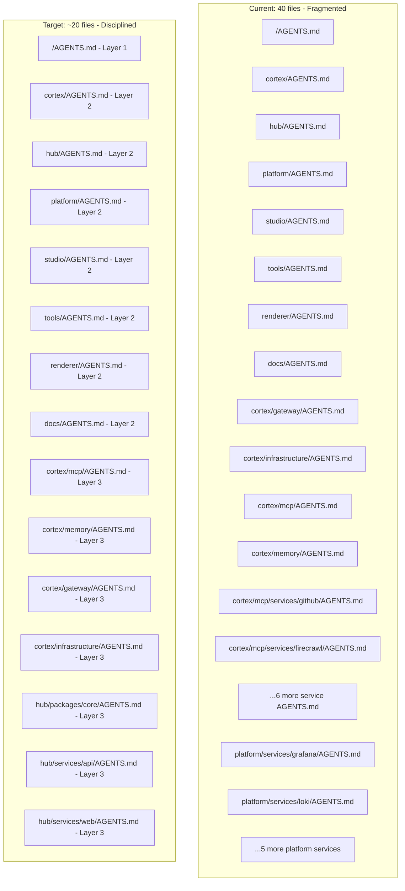

# AGENTS.md Context Architecture Refactoring Plan

This document is the authoritative Single Source of Truth (SSOT) for the `AGENTS.md` context
architecture refactoring initiative across the tupynambalucas.dev monorepo.

---

## 1. Executive Summary

The monorepo currently has **40 `AGENTS.md` files** distributed across all directory depths. While
the intent is to provide granular context, this volume creates three critical failure modes for CLI
agents (Antigravity, Claude Code):

- **Context myopia**: Agents reading only a leaf-node file lose global architectural constraints.
- **Token waste**: Loading 40+ files exhausts the context window before reaching the actual task.
- **Drift entropy**: Maintaining ubiquitous language and constraints in sync across 40 files is
  unsustainable.

The refactoring goal is to consolidate to a **disciplined 3-layer hierarchy** that maximizes
signal-to-noise ratio for AI agents while remaining maintainable by developers.

---

## 2. Current State Assessment

### 2.1. File Inventory (40 files)

See [INVENTORY.md](./INVENTORY.md) for a complete classification of all 40 files with their
current quality assessment, proposed action (keep / merge / consolidate), and target destination.

### 2.2. Identified Issues

| Issue                                                                     | Severity | Affected Files                             |
| :------------------------------------------------------------------------ | :------- | :----------------------------------------- |
| Micro-service AGENTS.md with no unique rules, duplicating parent content  | High     | cortex/mcp/services/\*/AGENTS.md (6 files) |
| Layer-3 files that repeat Layer-2 guardrails verbatim                     | High     | platform/services/\*/AGENTS.md (7 files)   |
| No context-hierarchy directive to force parent file reads                 | High     | All Layer-2 and Layer-3 files              |
| No Required Skills declarations in AGENTS.md files                        | High     | /AGENTS.md, docs/AGENTS.md                 |
| Missing Ubiquitous Language glossary sections in bounded contexts         | Medium   | hub, renderer, tools, docs                 |
| Root AGENTS.md lacks AI Interaction Persona section                       | Medium   | /AGENTS.md                                 |
| patterns.md reference template uses apps/ path but project uses services/ | Medium   | agent-router-expert/references/patterns.md |
| External URL present in root AGENTS.md (violates no-external-URLs rule)   | Medium   | /AGENTS.md (Documentation Site link)       |
| Missing concrete code snippet blocks in several files                     | Low      | cortex/memory, tools, renderer             |

### 2.3. Architecture Gap vs. 3-Layer Standard

---

## 3. Refactoring Strategy

### 3.1. The 3-Layer Hierarchy Contract

| Layer   | Scope                                                                       | File Location              | Line Budget   |
| :------ | :-------------------------------------------------------------------------- | :------------------------- | :------------ |
| Layer 1 | Global monorepo rules, bounded context map, global guardrails               | /AGENTS.md                 | Max 80 lines  |
| Layer 2 | Bounded context identity, ubiquitous language, architecture, local commands | /[context]/AGENTS.md       | Max 120 lines |
| Layer 3 | Technical sub-domain rules, patterns, concrete code snippets                | /[context]/[sub]/AGENTS.md | Max 100 lines |

Critical Rule: Layer-3 files MUST include a context-hierarchy directive at the top instructing
agents to read the parent Layer-2 file before proceeding.

### 3.2. Consolidation Actions

See [CONSOLIDATION.md](./CONSOLIDATION.md) for the complete merge and deletion log with file-by-file
instructions.

| Action         | Count    | Description                                   |
| :------------- | :------- | :-------------------------------------------- |
| **Delete**     | 13 files | Micro-service files with no unique rules      |
| **Merge**      | 7 files  | Content absorbed into parent context file     |
| **Refactor**   | 15 files | Existing files upgraded with missing sections |
| **Keep as-is** | 5 files  | Already compliant with the 3-layer standard   |

### 3.3. Content Migration Rules

1. **Never delete information**: Before removing a file, extract all unique rules and port them to
   the parent file under an appropriately named sub-section.
2. **No global rule duplication**: English-First, Zero Emojis, and Zero Placeholders constraints
   MUST remain exclusively in /AGENTS.md and MUST NOT appear in any Layer-2 or Layer-3 file.
3. **Ubiquitous language per context**: Every Layer-2 file MUST include a Ubiquitous Language
   glossary section defining domain-specific terms and forbidden synonyms.
4. **Imperative phrasing only**: All constraints use MUST, NEVER, ALWAYS. Passive and
   descriptive phrasing is forbidden.
5. **Relative links exclusively**: No absolute filesystem paths or external production URLs. Only
   relative markdown links and localhost development URLs inside command examples.

---

## 4. Skill Update Requirements

The [agent-router-expert skill](../../skills/agent-router-expert/SKILL.md) requires the following
updates to accurately reflect the new architecture:

| File                   | Required Change                                                              |
| :--------------------- | :--------------------------------------------------------------------------- |
| SKILL.md               | Add section on the context-hierarchy directive pattern                       |
| SKILL.md               | Add Required Skills Declaration Standard section (name-only resolution rule) |
| references/patterns.md | Fix apps/ path references to match actual services/ layout                   |
| references/patterns.md | Add Layer-3 sub-domain pattern template                                      |
| references/patterns.md | Add context-hierarchy directive to Bounded Context pattern                   |
| references/patterns.md | Add optional Required Skill section to Bounded Context pattern               |
| references/workflow.md | Add line budget validation step (max lines per layer)                        |
| references/workflow.md | Add skill declaration audit step                                             |
| references/syntax.md   | Document the context-hierarchy XML block syntax                              |

See [SKILL-UPDATES.md](./SKILL-UPDATES.md) for complete change specifications.

---

## 5. Handbook Documentation Assessment

The docs/handbook/ content does not currently document the AGENTS.md architecture or the
Bounded Context AI context model. The following additions are recommended:

| Document                         | Action     | Handbook Section      |
| :------------------------------- | :--------- | :-------------------- |
| AI Context Architecture guide    | Create new | handbook/explanation/ |
| AGENTS.md authoring how-to guide | Create new | handbook/guides/      |
| AGENTS.md file reference         | Create new | handbook/reference/   |

See [HANDBOOK-UPDATES.md](./HANDBOOK-UPDATES.md) for the complete documentation plan.

---

## 6. Execution Plan

Tasks are organized in sequential phases. Each phase builds on the previous.

| Phase   | Status | Description                                                                             | Documents                                                                         |
| :------ | :----- | :-------------------------------------------------------------------------------------- | :-------------------------------------------------------------------------------- |
| Phase 0 | Done   | Add Required Skills declarations to /AGENTS.md and docs/AGENTS.md; delete old plan file | This README                                                                       |
| Phase 1 | Done   | Audit and classify all 40 files                                                         | [INVENTORY.md](./INVENTORY.md)                                                    |
| Phase 2 | Done   | Consolidate and delete leaf-node files (25 files deleted/merged)                        | [CONSOLIDATION.md](./CONSOLIDATION.md)                                            |
| Phase 3 | Done   | Refactor Layer-2 and Layer-3 files with <context-hierarchy> and Ubiquitous Language     | [TEMPLATES.md](./TEMPLATES.md)                                                    |
| Phase 4 | Done   | Update the agent-router-expert skill and all reference files                            | [SKILL-UPDATES.md](./SKILL-UPDATES.md)                                            |
| Phase 5 | Done   | Run Prettier and validation workflow across all documentation                           | [references/workflow.md](../../skills/agent-router-expert/references/workflow.md) |
| Phase 6 | Done   | Add handbook documentation (Explanation, Guide, Reference in EN & pt-BR)                | [HANDBOOK-UPDATES.md](./HANDBOOK-UPDATES.md)                                      |

---

## 7. Specification Sitemap

- **[INVENTORY.md](./INVENTORY.md)**: Complete classification of all 40 AGENTS.md files with
  action decisions and quality scores.
- **[CONSOLIDATION.md](./CONSOLIDATION.md)**: Step-by-step merge and deletion instructions,
  including exact content to migrate between files.
- **[TEMPLATES.md](./TEMPLATES.md)**: Canonical templates for Layer 1, Layer 2, and Layer 3 files,
  including the context-hierarchy directive pattern.
- **[SKILL-UPDATES.md](./SKILL-UPDATES.md)**: Complete change specifications for the
  agent-router-expert skill and its reference documents.
- **[HANDBOOK-UPDATES.md](./HANDBOOK-UPDATES.md)**: Documentation plan for docs/handbook/
  additions covering AI context architecture and authoring guides.
