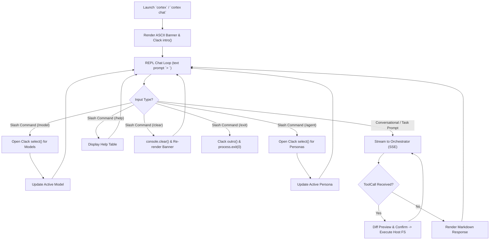

# Technical Specification: Cortex Visual CLI (`cortex/cli`)

This document defines the architectural design, continuous REPL chat lifecycle, slash commands engine, presentation components, Clack best practices, and host filesystem integration for the **Cortex Visual CLI** (`cortex/cli`).

---

## 1. Overview and Responsibility Boundaries

The Cortex CLI is a host-native, continuous interactive terminal application (REPL). It combines conversational AI chat capabilities, slash commands, and automated host filesystem mutations.

### Core Responsibilities

- **Continuous REPL Session**: Run a persistent interactive terminal session (similar to Antigravity CLI) allowing conversational chat, Q&A, and project task execution.
- **Slash Commands Engine**: Intercept slash commands (`/model`, `/agent`, `/help`, `/clear`, `/exit`) to change state dynamically on the fly using `@clack/prompts` selection components.
- **Interactive TUI Rendering**: Render terminal prompts (`@clack/prompts`), ASCII banners (`figlet`), formatted status spinners (`ora`), and colored logs (`picocolors`).
- **Markdown & Syntax Streamer**: Format real-time LLM responses with syntax highlighting using `marked` and `marked-terminal`.
- **Reverse Tool Calling Execution**: Intercept `ToolCall` events from the cluster Orchestrator, prompt the user for confirmation when required, render diffs, and mutate the host filesystem using Node.js native `fs` APIs.

---

## 2. Directory Layout & Layer Architecture

```
cortex/cli/
├── package.json
├── tsconfig.json
└── src/
    ├── application/
    │   ├── commands/
    │   │   ├── chat.command.ts         # 'cortex chat' / default REPL entrypoint
    │   │   ├── docs.command.ts         # 'cortex docs' command handler
    │   │   └── config.command.ts       # 'cortex config' setup handler
    │   └── repl/
    │       ├── repl-session-manager.ts # Continuous chat loop & state manager
    │       └── slash-command-registry.ts # Slash command parser (/model, /agent)
    ├── domain/
    │   ├── interfaces/
    │   │   ├── filesystem-provider.ts  # Host FS mutation interface
    │   │   ├── orchestrator-client.ts  # API & SSE streaming client interface
    │   │   └── ui-renderer.ts          # Terminal UI rendering interface
    │   └── models/
    │       ├── session-state.ts        # Persona, model, and history state
    │       └── tool-call-event.ts      # Incoming ToolCall schema definition
    ├── infrastructure/
    │   ├── api/
    │   │   └── orchestrator-sse-client.ts # EventSource / fetch stream implementation
    │   └── fs/
    │       └── host-filesystem-provider.ts# Node.js fs/promises implementation
    ├── presentation/
    │   ├── components/
    │   │   ├── banner.component.ts     # ASCII Art Header ("CORTEX")
    │   │   ├── diff-viewer.component.ts# Colored git-style diff renderer
    │   │   └── help-table.component.ts # Slash commands help renderer
    │   ├── menus/
    │   │   ├── agent-selector.menu.ts  # @clack/prompts agent selector (/agent)
    │   │   └── model-selector.menu.ts  # @clack/prompts model selector (/model)
    │   └── views/
    │       └── chat-stream.view.ts     # Real-time SSE response stream viewer
    └── index.ts                        # CLI Executable Entrypoint
```

---

## 3. Package Dependencies

```json
{
  "name": "@tupynambalucas/cortex-cli",
  "version": "1.0.0",
  "private": true,
  "bin": {
    "cortex": "./dist/index.js"
  },
  "scripts": {
    "build": "tsc",
    "dev": "tsx src/index.ts"
  },
  "dependencies": {
    "@clack/prompts": "^0.8.2",
    "commander": "^12.1.0",
    "figlet": "^1.7.0",
    "marked": "^13.0.0",
    "marked-terminal": "^7.0.0",
    "ora": "^8.0.1",
    "picocolors": "^1.0.1"
  },
  "devDependencies": {
    "@types/figlet": "^1.5.8",
    "@types/node": "^20.14.0",
    "typescript": "^5.4.5"
  }
}
```

---

## 4. Continuous REPL Chat Lifecycle & Slash Commands



### 4.1. Slash Commands Specification

| Slash Command | Aliases         | Description                 | UI Action                                                                                       |
| :------------ | :-------------- | :-------------------------- | :---------------------------------------------------------------------------------------------- |
| `/model`      | `/models`, `/m` | Select active LLM model     | Opens `@clack/prompts` `select()` with available models (`llama3:8b`, `qwen2.5-coder:7b`)       |
| `/agent`      | `/agents`, `/a` | Select active Agent Persona | Opens `@clack/prompts` `select()` with personas (`router-expert`, `docs-expert`, `code-expert`) |
| `/help`       | `/h`, `/?`      | Show slash commands help    | Displays a formatted summary table of available commands                                        |
| `/clear`      | `/c`            | Clear terminal screen       | Clears terminal history and re-renders top banner                                               |
| `/exit`       | `/quit`, `/q`   | Exit CLI chat session       | Triggers `@clack/prompts` `outro()` and exits process                                           |

---

## 5. Implementation Code Contracts

### 5.1. REPL Session Manager (`repl-session-manager.ts`)

```typescript
import { intro, isCancel, outro, select, text, spinner } from '@clack/prompts';
import picocolors from 'picocolors';

export interface SessionState {
  activePersona: string;
  activeModel: string;
  history: Array<{ role: 'user' | 'assistant'; content: string }>;
}

export class REPLSessionManager {
  private state: SessionState = {
    activePersona: 'router-expert',
    activeModel: 'qwen2.5-coder:7b',
    history: [],
  };

  async start(): Promise<void> {
    console.clear();
    intro(picocolors.cyan('Cortex AI Continuous Chat Terminal'));
    console.log(
      picocolors.dim(
        `Active Persona: ${this.state.activePersona} | Active Model: ${this.state.activeModel}\nType /help for slash commands, or /exit to quit.\n`,
      ),
    );

    while (true) {
      const input = await text({
        message: '>',
        placeholder: 'Ask a question, issue a slash command (/model), or request a task...',
      });

      if (isCancel(input)) {
        outro(picocolors.yellow('Cortex CLI session ended.'));
        process.exit(0);
      }

      const promptStr = String(input).trim();
      if (!promptStr) continue;

      if (promptStr.startsWith('/')) {
        const handled = await this.handleSlashCommand(promptStr);
        if (handled === 'exit') break;
        continue;
      }

      await this.processUserMessage(promptStr);
    }
  }

  private async handleSlashCommand(commandStr: string): Promise<'continue' | 'exit'> {
    const [cmd] = commandStr.toLowerCase().split(' ');

    switch (cmd) {
      case '/model':
      case '/models':
      case '/m': {
        const selectedModel = await select({
          message: 'Select active LLM Model:',
          options: [
            {
              value: 'qwen2.5-coder:7b',
              label: 'Qwen 2.5 Coder (7B)',
              hint: 'Best for code & docs',
            },
            { value: 'llama3:8b', label: 'Llama 3 (8B)', hint: 'Fast general routing' },
          ],
        });

        if (!isCancel(selectedModel)) {
          this.state.activeModel = String(selectedModel);
          console.log(picocolors.green(`Model switched to: ${this.state.activeModel}\n`));
        }
        return 'continue';
      }

      case '/agent':
      case '/agents':
      case '/a': {
        const selectedPersona = await select({
          message: 'Select active Agent Persona:',
          options: [
            { value: 'router-expert', label: 'Router Expert', hint: 'Auto-classify task intent' },
            {
              value: 'docs-expert',
              label: 'Docs Expert',
              hint: 'Diátaxis & Docusaurus specialist',
            },
            {
              value: 'code-expert',
              label: 'Code Expert',
              hint: 'TypeScript & Full-Stack developer',
            },
          ],
        });

        if (!isCancel(selectedPersona)) {
          this.state.activePersona = String(selectedPersona);
          console.log(picocolors.green(`Persona switched to: ${this.state.activePersona}\n`));
        }
        return 'continue';
      }

      case '/clear':
      case '/c': {
        console.clear();
        intro(picocolors.cyan('Cortex AI Continuous Chat Terminal'));
        console.log(
          picocolors.dim(
            `Active Persona: ${this.state.activePersona} | Active Model: ${this.state.activeModel}\n`,
          ),
        );
        return 'continue';
      }

      case '/help':
      case '/h': {
        console.log(picocolors.cyan('\nAvailable Slash Commands:'));
        console.log(`  ${picocolors.bold('/model')}  - Switch active LLM model`);
        console.log(`  ${picocolors.bold('/agent')}  - Switch active Agent Persona`);
        console.log(`  ${picocolors.bold('/clear')}  - Clear terminal screen`);
        console.log(`  ${picocolors.bold('/help')}   - Show this help message`);
        console.log(`  ${picocolors.bold('/exit')}   - Exit CLI session\n`);
        return 'continue';
      }

      case '/exit':
      case '/quit':
      case '/q': {
        outro(picocolors.yellow('Cortex CLI session ended.'));
        return 'exit';
      }

      default: {
        console.log(
          picocolors.red(`Unknown slash command: ${cmd}. Type /help for available commands.\n`),
        );
        return 'continue';
      }
    }
  }

  private async processUserMessage(message: string): Promise<void> {
    const s = spinner();
    s.start(`Thinking (${this.state.activePersona} via ${this.state.activeModel})...`);

    // Stream from Orchestrator SSE endpoint
    // Handle text chunks and Reverse Tool Calls
    s.stop('Response completed.');
  }
}
```

---

## 6. Host Filesystem Provider (`infrastructure/fs`)

Executes file mutations locally on developer machine when triggered by Reverse Tool Calling.

```typescript
import * as fs from 'node:fs/promises';
import * as path from 'node:path';

export interface IHostFilesystemProvider {
  readFile(relativePath: string): Promise<string>;
  writeFile(relativePath: string, content: string): Promise<void>;
  replaceContent(relativePath: string, target: string, replacement: string): Promise<void>;
  exists(relativePath: string): Promise<boolean>;
}

export class HostFilesystemProvider implements IHostFilesystemProvider {
  private readonly rootDir: string;

  constructor(rootDir: string = process.cwd()) {
    this.rootDir = rootDir;
  }

  private resolvePath(relativePath: string): string {
    const safePath = path.normalize(relativePath).replace(/^(\.\.[\/\\])+/, '');
    return path.join(this.rootDir, safePath);
  }

  async readFile(relativePath: string): Promise<string> {
    const fullPath = this.resolvePath(relativePath);
    return await fs.readFile(fullPath, 'utf-8');
  }

  async writeFile(relativePath: string, content: string): Promise<void> {
    const fullPath = this.resolvePath(relativePath);
    await fs.mkdir(path.dirname(fullPath), { recursive: true });
    await fs.writeFile(fullPath, content, 'utf-8');
  }

  async replaceContent(relativePath: string, target: string, replacement: string): Promise<void> {
    const currentContent = await this.readFile(relativePath);
    if (!currentContent.includes(target)) {
      throw new Error(`Target content not found in file: ${relativePath}`);
    }
    const updatedContent = currentContent.replace(target, replacement);
    await this.writeFile(relativePath, updatedContent);
  }

  async exists(relativePath: string): Promise<boolean> {
    try {
      const fullPath = this.resolvePath(relativePath);
      await fs.access(fullPath);
      return true;
    } catch {
      return false;
    }
  }
}
```
