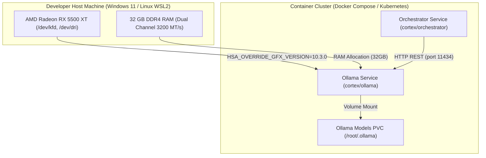

# Technical Specification: Infrastructure & Deployment Pipeline

This document defines the containerization, Kubernetes manifests, Docker Compose services, AMD ROCm GPU acceleration, PVC model persistence, and Skaffold developer pipeline for the **Cortex Agent Ecosystem**.

---

## 1. Host Hardware Specifications & Acceleration Strategy

The Cortex neural inference engine (Ollama) is tuned specifically for the target developer workstation hardware specs (`.agents/plans/cortex-agents/pc.LOG`):

### Target Host System Hardware Profile

- **Processor (CPU)**: Intel Core Rocket Lake-S (8 Physical Cores / 16 Logical Threads @ 1.80GHz Base / 4.50GHz Turbo).
- **System Memory (RAM)**: 32 GB Dual-Channel DDR4 SDRAM (2x 16GB Kingston HyperX @ 3200 MT/s).
- **Graphics Card (GPU)**: **AMD Radeon RX 5500 XT (Navi14 XTX architecture / RDNA 1)**.
- **Storage**: WD_BLACK SN770 500GB NVMe SSD (PCIe v1.4, 500 GB).

### AMD ROCm GPU Acceleration & Override Strategy

Ollama leverages AMD ROCm (Radeon Open Compute) for GPU offloading. Because ROCm natively targets RDNA 2/3 (`gfx1030`, `gfx1100`), running ROCm acceleration on the **AMD Radeon RX 5500 XT (Navi14 / `gfx1012`)** requires setting the GFX version override variable:

- **`HSA_OVERRIDE_GFX_VERSION="10.3.0"`**: Forces ROCm runtime to execute shaders against the compatible `gfx1030` LLVM target.
- **Host Device Forwarding**: Maps `/dev/kfd` (Kernel Fusion Driver) and `/dev/dri` (Direct Rendering Infrastructure) into container runtimes.



---

## 2. Docker Compose Specification (`cortex/infrastructure/docker/compose.yaml`)

```yaml
services:
  # ==========================================
  # CORTEX AGENT ORCHESTRATOR
  # ==========================================
  cortex-orchestrator:
    profiles: ['core', 'orchestrator']
    container_name: tupynambalucas-cortex-orchestrator
    build:
      context: ../../../
      dockerfile: cortex/orchestrator/Dockerfile
    environment:
      - PORT=3008
      - HOST=0.0.0.0
      - NODE_ENV=development
      - OLLAMA_URL=http://ollama:11434
      - MEMORY_API_URL=http://memory-api:3006
    ports:
      - '3008:3008'
    networks:
      cortex-net:
        aliases:
          - cortex-orchestrator
    depends_on:
      - ollama

  # ==========================================
  # OLLAMA NEURAL ENGINE (AMD ROCm ACCELERATED)
  # ==========================================
  ollama:
    profiles: ['core', 'ollama']
    container_name: tupynambalucas-cortex-ollama
    build:
      context: ../../ollama
      dockerfile: Dockerfile
    environment:
      - HSA_OVERRIDE_GFX_VERSION=10.3.0
      - ROCR_VISIBLE_DEVICES=0
      - OLLAMA_NUM_PARALLEL=2
      - OLLAMA_KEEP_ALIVE=24h
    devices:
      - /dev/kfd:/dev/kfd
      - /dev/dri:/dev/dri
    group_add:
      - video
      - render
    ports:
      - '11434:11434'
    volumes:
      - ollama_model_data:/root/.ollama
    networks:
      cortex-net:
        aliases:
          - ollama
    healthcheck:
      test: ['CMD', 'curl', '-f', 'http://localhost:11434/api/tags']
      interval: 10s
      timeout: 5s
      retries: 5

volumes:
  ollama_model_data:
    name: tupynambalucas-cortex-ollama-data
```

---

## 3. Kubernetes Deployment Specification

### 3.1. Ollama Deployment & PVC (`cortex/infrastructure/kubernetes/ollama.yaml`)

```yaml
apiVersion: v1
kind: PersistentVolumeClaim
metadata:
  name: ollama-models-pvc
  namespace: cortex
spec:
  accessModes:
    - ReadWriteOnce
  resources:
    requests:
      storage: 30Gi
---
apiVersion: apps/v1
kind: Deployment
metadata:
  name: ollama
  namespace: cortex
  labels:
    app: ollama
spec:
  replicas: 1
  selector:
    matchLabels:
      app: ollama
  template:
    metadata:
      labels:
        app: ollama
    spec:
      containers:
        - name: ollama
          image: ollama/ollama:rocm
          imagePullPolicy: IfNotPresent
          env:
            - name: HSA_OVERRIDE_GFX_VERSION
              value: '10.3.0'
            - name: ROCR_VISIBLE_DEVICES
              value: '0'
            - name: OLLAMA_NUM_PARALLEL
              value: '2'
          securityContext:
            privileged: true
          ports:
            - containerPort: 11434
          volumeMounts:
            - name: model-storage
              mountPath: /root/.ollama
            - name: kfd-device
              mountPath: /dev/kfd
            - name: dri-device
              mountPath: /dev/dri
      volumes:
        - name: model-storage
          persistentVolumeClaim:
            claimName: ollama-models-pvc
        - name: kfd-device
          hostPath:
            path: /dev/kfd
        - name: dri-device
          hostPath:
            path: /dev/dri
---
apiVersion: v1
kind: Service
metadata:
  name: ollama
  namespace: cortex
spec:
  ports:
    - port: 11434
      targetPort: 11434
  selector:
    app: ollama
```

---

## 4. Model Preloading Lifecycle Script (`cortex/ollama/init-models.sh`)

```bash
#!/usr/bin/env bash
set -euo pipefail

export HSA_OVERRIDE_GFX_VERSION=10.3.0

echo "Starting background Ollama server with AMD ROCm GFX override (10.3.0)..."
ollama serve &

echo "Waiting for Ollama service to become healthy..."
until curl -s http://localhost:11434/api/tags > /dev/null; do
    sleep 2
done

echo "Pulling required neural models for developer hardware (32GB RAM)..."
ollama pull llama3:8b
ollama pull qwen2.5-coder:7b

echo "Models preloaded successfully. Ready for inference."
wait
```
