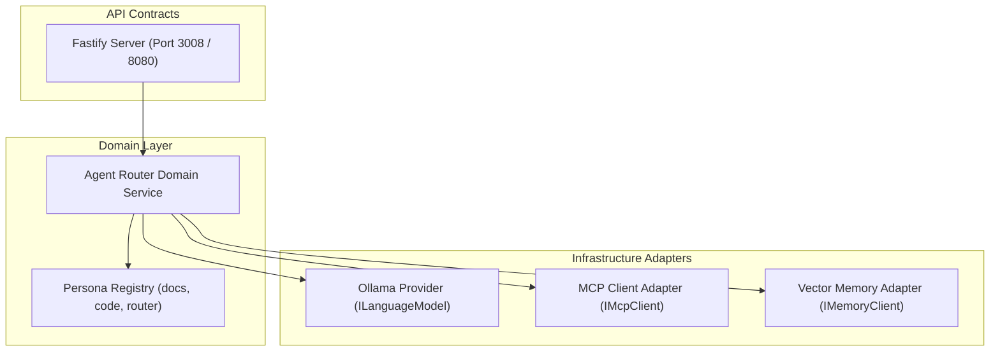

# Technical Specification: Cortex Agent Orchestrator (`cortex/orchestrator`)

This document defines the architecture, Fastify API routes, domain services, persona management, LLM abstraction layer, and MCP/Memory integrations for the **Cortex Agent Orchestrator** (`cortex/orchestrator`).

---

## 1. Overview & Architecture

The Agent Orchestrator serves as the central control plane inside the cluster. It receives task prompts from the host CLI, invokes the routing engine (`agent-router-expert`), injects relevant workspace context and personas, and orchestrates neural completions through Ollama or remote LLM providers.



---

## 2. Directory Layout & Bounded Contexts

```
cortex/orchestrator/
├── package.json
├── tsconfig.json
└── src/
    ├── application/
    │   └── orchestrator/
    │       ├── chat-session.usecase.ts  # Main task execution use case
    │       └── tool-callback.usecase.ts # Host tool result handler
    ├── domain/
    │   ├── agent/
    │   │   ├── agent-persona.ts        # Persona entity & prompt schema
    │   │   └── tool-call.ts            # ToolCall payload definitions
    │   ├── routing/
    │   │   └── agent-router.service.ts # Intelligent task classifier
    │   └── interfaces/
    │       ├── language-model.ts       # ILanguageModel abstraction
    │       ├── mcp-client.ts           # IMcpClient interface
    │       └── memory-client.ts        # IMemoryClient interface
    ├── infrastructure/
    │   ├── llm/
    │   │   └── ollama-provider.ts      # OpenAI-compatible Ollama client
    │   ├── mcp/
    │   │   └── mcp-data-plane.ts       # HTTP/JSON-RPC MCP client
    │   └── memory/
    │       └── cortex-memory-client.ts # Memory API HTTP adapter
    ├── personas/
    │   ├── router-expert/
    │   │   └── persona.json            # Task classifier prompt & rules
    │   ├── code-expert/
    │   │   └── persona.json            # Software development rules
    │   └── docs-expert/
    │       └── persona.json            # Diátaxis documentation rules
    └── index.ts                        # Fastify Server Entrypoint
```

---

## 3. Fastify API Contracts

### 3.1. `POST /api/v1/chat`

Executes an agent task. Supports Server-Sent Events (SSE) streaming.

#### Request Headers

- `Content-Type: application/json`
- `Accept: text/event-stream`

#### Request Body

```json
{
  "prompt": "Audit and update the API authentication guide in docs workspace",
  "persona": "auto",
  "model": "qwen2.5-coder:7b",
  "stream": true
}
```

#### Response Stream (Server-Sent Events)

```http
HTTP/1.1 200 OK
Content-Type: text/event-stream
Cache-Control: no-cache
Connection: keep-alive

event: persona_selected
data: {"persona": "docs-expert", "reason": "Task targets documentation update in docs/"}

event: text_chunk
data: {"chunk": "Analyzing documentation files in docs/..."}

event: tool_call
data: {"callId": "call_123", "tool": "ReadFile", "arguments": {"relativePath": "docs/guides/auth.md"}}

event: complete
data: {"status": "success", "totalTokens": 450}
```

### 3.2. `POST /api/v1/tool-result`

Receives execution results from the host CLI after a Reverse Tool Call.

#### Request Body

```json
{
  "callId": "call_123",
  "status": "success",
  "output": "File content loaded successfully..."
}
```

#### Response Body

```json
{
  "acknowledged": true
}
```

---

## 4. LLM Abstraction Layer (`ILanguageModel`)

To prevent vendor lock-in, the orchestrator consumes an `ILanguageModel` interface.

```typescript
export interface CompletionMessage {
  role: 'system' | 'user' | 'assistant' | 'tool';
  content: string;
  toolCalls?: Array<{
    id: string;
    type: 'function';
    function: {
      name: string;
      arguments: string;
    };
  }>;
}

export interface CompletionOptions {
  model: string;
  messages: CompletionMessage[];
  temperature?: number;
  tools?: Array<{
    type: 'function';
    function: {
      name: string;
      description: string;
      parameters: Record<string, unknown>;
    };
  }>;
}

export interface ILanguageModel {
  generateCompletion(options: CompletionOptions): Promise<CompletionMessage>;
  streamCompletion(
    options: CompletionOptions,
    onChunk: (chunk: string) => void,
  ): Promise<CompletionMessage>;
}
```

### Ollama Provider Implementation

```typescript
import {
  ILanguageModel,
  CompletionOptions,
  CompletionMessage,
} from '../../domain/interfaces/language-model';

export class OllamaLanguageModel implements ILanguageModel {
  private readonly baseUrl: string;

  constructor(baseUrl: string = process.env.OLLAMA_URL || 'http://ollama:11434') {
    this.baseUrl = baseUrl;
  }

  async generateCompletion(options: CompletionOptions): Promise<CompletionMessage> {
    const response = await fetch(`${this.baseUrl}/v1/chat/completions`, {
      method: 'POST',
      headers: { 'Content-Type': 'application/json' },
      body: JSON.stringify({
        model: options.model,
        messages: options.messages,
        temperature: options.temperature ?? 0.2,
        tools: options.tools,
      }),
    });

    if (!response.ok) {
      throw new Error(`Ollama API error: ${response.statusText}`);
    }

    const data = await response.json();
    return data.choices[0].message;
  }

  async streamCompletion(
    options: CompletionOptions,
    onChunk: (chunk: string) => void,
  ): Promise<CompletionMessage> {
    // Standard fetch event stream parser for Ollama /v1/chat/completions
    // Calls onChunk(token) as tokens arrive
    throw new Error('Method implementation handles readable stream decoding.');
  }
}
```

---

## 5. Agent Router Domain Service (`agent-router.service.ts`)

The Agent Router analyzes user intent and dynamically assigns the optimal persona and model.

```typescript
export class AgentRouterService {
  constructor(private readonly llm: ILanguageModel) {}

  async classifyTask(userPrompt: string): Promise<{ personaId: string; recommendedModel: string }> {
    const promptLower = userPrompt.toLowerCase();

    if (
      promptLower.includes('doc') ||
      promptLower.includes('readme') ||
      promptLower.includes('guide')
    ) {
      return { personaId: 'docs-expert', recommendedModel: 'qwen2.5-coder:7b' };
    }

    if (
      promptLower.includes('refactor') ||
      promptLower.includes('fix') ||
      promptLower.includes('test')
    ) {
      return { personaId: 'code-expert', recommendedModel: 'qwen2.5-coder:7b' };
    }

    return { personaId: 'router-expert', recommendedModel: 'llama3:8b' };
  }
}
```
