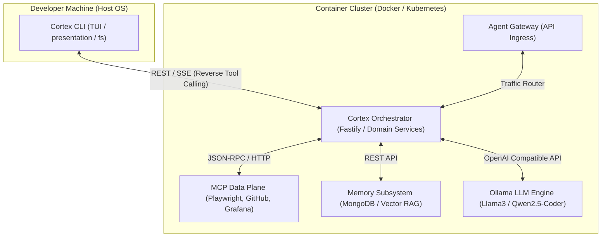
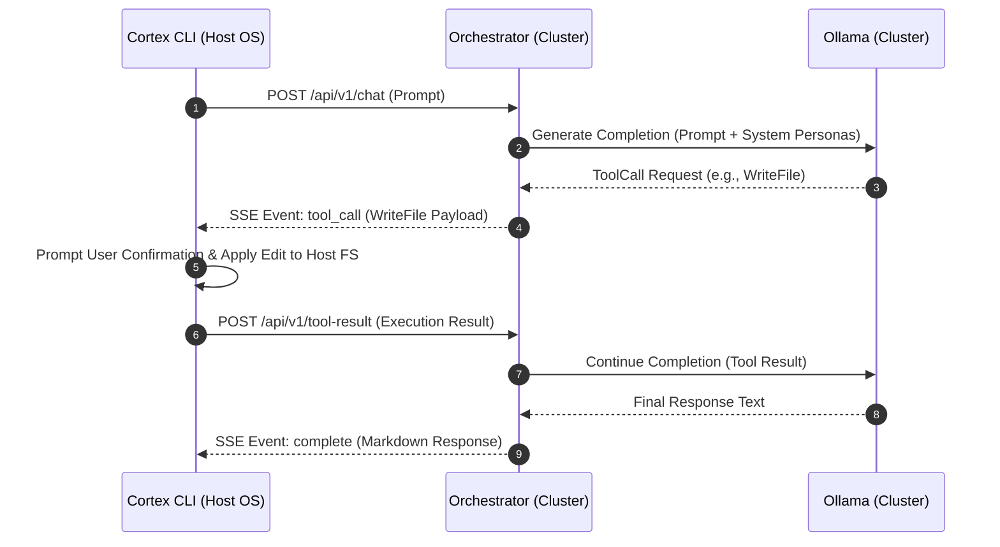

# Consolidated Master Plan: Unified Cortex AI Agents Architecture

This document serves as the authoritative Single Source of Truth (SSOT) for restructuring the AI agents ecosystem within the `cortex` bounded context of the **tupynambalucas** monorepo. It outlines the overall architecture, domain-driven directory structure, technology stack, reverse tool calling mechanism, and specialized agent runtimes.

---

## 1. Executive Summary and Architectural Principles

The primary objective is to migrate from monolithic agent wrappers to a distributed, layer-decoupled system. Processing load and neural model inference are shifted to the container cluster (Docker Compose / Kubernetes), while interactive user experience and host file system mutations remain isolated on the developer machine through a lightweight local CLI.



### 1.1. Backward Compatibility (.agents/)

The root `.agents/` directory in the monorepo remains strictly untouched to preserve compatibility with legacy tools and external integrations.

The `cortex/orchestrator` service reads persona definitions and prompt standards from standard persona registries within `cortex/orchestrator/src/personas/`, converting existing agent skills (such as `code-expert` and `docusaurus-expert`) into static system personas.

### 1.2. Technology Stack: End-to-End TypeScript

All components within `cortex/cli` and `cortex/orchestrator` are built using **TypeScript**. This guarantees strict type parity across shared workspace packages (e.g., `hub/packages/core`), eliminates duplicated Model Context Protocol (MCP) data definitions, and leverages a unified ecosystem for CLI rendering and backend routing.

### 1.3. Isolated Testing Mandate

When testing the CLI, Orchestrator, or Reverse Tool Calling implementations, test suites and manual validation MUST NEVER mutate production workspace files or critical repository assets. All end-to-end testing, file editing demonstrations, and host filesystem tool executions MUST operate strictly on isolated, disposable test files created specifically for validation purposes (e.g., inside temporary test directories or `.scratch/`).

---

## 2. Distributed Three-Pillar Architecture

The platform operates across three decoupled physical boundaries:

1. **The Presentation Layer (Cortex CLI)**: Runs natively on the host OS as a **continuous interactive REPL chat terminal** (similar to Antigravity CLI). Supports conversational prompts, project commands, and interactive **slash commands** (`/model`, `/agent`, `/help`, `/clear`, `/exit`). Manages terminal UI rendering (`@clack/prompts`, `ora`, `marked-terminal`), argument parsing (`commander`), and safe host filesystem edits (`infrastructure/fs`).
2. **The Intelligence Layer (Agent Orchestrator)**: Runs inside the cluster. Replaces legacy gateway logic by serving as the central agent router, prompt builder, persona coordinator, and MCP/Memory manager.
3. **The Inference Engine (Ollama)**: Runs inside the cluster with hardware acceleration tuned for the developer workstation (Intel Core 8c/16t, 32GB DDR4 RAM, and **AMD Radeon RX 5500 XT** with ROCm GFX override `HSA_OVERRIDE_GFX_VERSION=10.3.0`). Serves Open Source Large Language Models (`llama3:8b` for general routing, `qwen2.5-coder:7b` for code generation).

---

## 3. Directory Structure and Bounded Contexts

```
cortex/
├── cli/                                # Cortex Visual CLI (Developer Host OS)
│   ├── package.json
│   ├── tsconfig.json
│   └── src/
│       ├── application/                # CLI Command Handlers & Use Cases
│       │   └── commands/               # Commander CLI Commands (chat, docs, agent)
│       ├── domain/                     # CLI Domain Entities & Interfaces
│       ├── infrastructure/             # External Integrations (Host System)
│       │   ├── api/                    # HTTP / SSE Client for Orchestrator
│       │   └── fs/                     # Host Filesystem Mutations Provider
│       ├── presentation/               # Terminal User Interface (TUI)
│       │   ├── components/             # Visual Components & Headers
│       │   ├── menus/                  # Interactive Prompts (@clack/prompts)
│       │   └── views/                  # Streaming Views & Spinners (ora)
│       └── index.ts                    # Executable Entrypoint
│
├── orchestrator/                       # Central Orchestration Server (Cluster)
│   ├── package.json
│   └── src/
│       ├── application/                # Application Use Cases & Workflows
│       │   └── orchestrator/           # Task Dispatcher & Agent Loop
│       ├── domain/                     # Domain Entities & Business Rules
│       │   ├── agent/                  # Agent, Persona, and ToolCall Entities
│       │   └── routing/                # Agent Router Domain Service
│       ├── infrastructure/             # External System Connectors
│       │   ├── llm/                    # Ollama & OpenAI API Client
│       │   ├── mcp/                    # MCP Data Plane Adapter
│       │   └── memory/                 # Vector Memory Subsystem Adapter
│       ├── personas/                   # Static Persona Registries
│       │   ├── router-expert/          # Routing & Task Classification Persona
│       │   ├── code-expert/            # Software Engineering Persona
│       │   └── docs-expert/            # Diátaxis Documentation Persona
│       └── index.ts                    # Fastify Server Entrypoint
│
├── gateway/                            # Core Ingress Gateway (agentgateway)
├── ollama/                             # Local LLM Container & Setup Scripts
│   ├── Dockerfile                      # Custom Container with Preloaded Models
│   ├── init-models.sh                  # Automatic Model Downloader Script
│   └── README.md                       # Ollama Volume Persistence Documentation
├── infrastructure/                     # Deployment Configuration
│   ├── docker/
│   │   └── compose.yaml                # Updated Services Definition
│   └── kubernetes/
│       ├── kustomization.yaml          # Kustomize Manifest Registry
│       ├── orchestrator.yaml           # Orchestrator Deployment & Service
│       └── ollama.yaml                 # Ollama Deployment, Service, and PVC
└── skaffold.yaml                       # Port Forwarding & Local Cluster Dev Pipeline
```

---

## 4. Reverse Tool Calling Protocol

To allow a cluster-bound orchestrator to safely perform file edits and commands on the host machine without mounting host storage inside containers, the architecture uses **Reverse Tool Calling**.



1. **Invocation**: The user submits a prompt via `cortex cli`.
2. **Decision**: Ollama emits a `ToolCall` intent (e.g., `WriteFile`, `ReplaceContent`).
3. **Reverse Event**: The Orchestrator forwards the `ToolCall` payload over an SSE/HTTP stream to the local CLI.
4. **Host Execution**: The CLI prompts the developer for confirmation, renders a diff preview, and uses `cli/src/infrastructure/fs/` to execute the file change directly on host disk.
5. **Response Loop**: The CLI posts execution status back to the Orchestrator to complete the agent cycle.

---

## 5. Specification Sitemap

For exhaustive technical blueprints, implementation contracts, and configuration schemas, refer to the individual specification documents:

- **[CLI Specification](./CLI-SPECIFICATION.md)**: TUI layout, Commander setup, `@clack/prompts` integration, SSE streaming handler, and host filesystem provider.
- **[Orchestrator Specification](./ORCHESTRATOR-SPECIFICATION.md)**: Fastify server API contracts, `agent-router-expert` logic, `ILanguageModel` interfaces, and MCP/Memory integrations.
- **[Docs Agent Specification](./DOCS-AGENT-SPECIFICATION.md)**: Persona rules, Diátaxis framework engine, Docusaurus MDX parser, and automated documentation audit workflows.
- **[Reverse Tool Calling Protocol](./REVERSE-TOOL-CALLING-PROTOCOL.md)**: Event sequences, RPC payloads, JSON schemas, diff rendering, and security boundary enforcement.
- **[Infrastructure & Deployment](./INFRASTRUCTURE-AND-DEPLOYMENT.md)**: Docker Compose, Kubernetes manifests, PVC persistence for `/root/.ollama`, and Skaffold pipeline setup.
