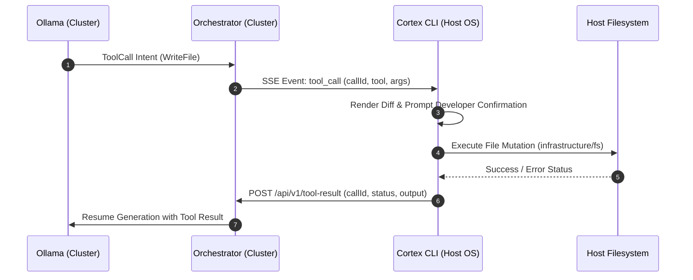

# Technical Specification: Reverse Tool Calling Protocol

This document defines the communication protocol, JSON payload schemas, security boundaries, and execution lifecycle for **Reverse Tool Calling** between the cluster-bound **Cortex Orchestrator** and the host-native **Cortex CLI**.

---

## 1. Rationale & Security Boundary

In a distributed agent architecture:

- The **Agent Orchestrator** runs inside a container cluster (Docker Compose / Kubernetes) without direct volume mounts to the developer's host disk.
- The **Cortex CLI** runs directly on the developer's host OS with user privileges.

To mutate host files or execute developer commands safely, the Orchestrator does NOT execute local system actions. Instead, it transmits a **Reverse ToolCall Event** to the host CLI over a streaming HTTP/SSE connection. The host CLI validates the request, renders a diff preview for developer confirmation, executes the mutation locally, and returns the result to the Orchestrator.



---

## 2. Protocol Schemas & Tool Definitions

### 2.1. Tool Call Event Payload (`tool_call`)

Transmitted from Orchestrator to CLI over SSE.

```json
{
  "eventId": "evt_987654",
  "callId": "call_456789",
  "tool": "WriteFile",
  "arguments": {
    "relativePath": "docs/guides/getting-started.md",
    "content": "# Getting Started\n\nThis guide explains how to configure Cortex CLI..."
  },
  "requiresConfirmation": true
}
```

### 2.2. Tool Result Callback Payload (`POST /api/v1/tool-result`)

Transmitted from CLI back to Orchestrator HTTP endpoint.

```json
{
  "callId": "call_456789",
  "status": "success",
  "output": "File docs/guides/getting-started.md written successfully (1420 bytes).",
  "error": null
}
```

---

## 3. Supported Tool Schemas

### 3.1. `ReadFile`

Reads the text content of a file on the host filesystem.

```json
{
  "name": "ReadFile",
  "description": "Reads text content from a file relative to workspace root.",
  "parameters": {
    "type": "object",
    "properties": {
      "relativePath": { "type": "string" }
    },
    "required": ["relativePath"]
  }
}
```

### 3.2. `WriteFile`

Creates or overwrites a file on the host filesystem.

```json
{
  "name": "WriteFile",
  "description": "Writes text content to a specified relative file path on the host.",
  "parameters": {
    "type": "object",
    "properties": {
      "relativePath": { "type": "string" },
      "content": { "type": "string" }
    },
    "required": ["relativePath", "content"]
  }
}
```

### 3.3. `ReplaceContent`

Replaces a target substring in an existing host file.

```json
{
  "name": "ReplaceContent",
  "description": "Replaces exact target content with replacement text in a host file.",
  "parameters": {
    "type": "object",
    "properties": {
      "relativePath": { "type": "string" },
      "target": { "type": "string" },
      "replacement": { "type": "string" }
    },
    "required": ["relativePath", "target", "replacement"]
  }
}
```

---

## 4. Security & Path Sanitization Rules

To prevent malicious directory traversal or unauthorized host operations, the Cortex CLI enforces strict security rules before executing any tool call:

1. **Path Normalization**: All relative paths are passed through `path.normalize()` and stripped of leading `../` traversal sequences.
2. **Workspace Enclosure**: The resolved path MUST remain strictly inside `process.cwd()`. Attempts to reference `/etc/`, `C:\Windows\`, or external user home folders are rejected immediately with a `SecurityViolation` error.
3. **Interactive Confirmation**: Destructive tools (`WriteFile`, `ReplaceContent`, `RunHostCommand`) require explicit user confirmation in the terminal via `@clack/prompts`.
4. **Isolated Testing Rule**: During end-to-end testing and integration validation of Reverse Tool Calling, developers and automated test harnesses MUST NOT target core repository source files or production documentation. All tool execution tests MUST target disposable test files created specifically for testing (e.g., inside `.scratch/` or dedicated fixture directories).
