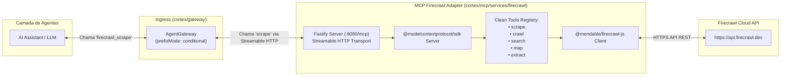

# Plan: Refatoração do Serviço Firecrawl MCP (Enterprise TypeScript Adapter)

## 1. Contexto e Diagnóstico do Problema

Atualmente, o serviço `mcp-firecrawl` executa o pacote binário global `firecrawl-mcp@3.23.7` via Dockerfile. Esse pacote hardcodeia o prefixo `firecrawl_` em todos os nomes internos de suas ferramentas (`firecrawl_scrape`, `firecrawl_crawl`, `firecrawl_search`, `firecrawl_map`, `firecrawl_extract`).

Quando o **AgentGateway** multiplexa os alvos sob `prefixMode: conditional`, ele anexa o namespace do alvo (`${target.name}_`) a todas as ferramentas expostas, resultando na duplicação:
$$\text{"firecrawl"} + \text{"\_"} + \text{"firecrawl\_scrape"} = \text{"firecrawl\_firecrawl\_scrape"}$$

### Objetivo

Transformar o [`cortex/mcp/services/firecrawl`](file:///D:/projects/tupynambalucas/cortex/mcp/services/firecrawl) em um serviço TypeScript de primeira classe nativo do monorepo, espelhando a arquitetura enterprise já utilizada pelo [`cortex/mcp/services/memory`](file:///D:/projects/tupynambalucas/cortex/mcp/services/memory). O serviço expõe verbos puros (`scrape`, `crawl`, `search`, `map`, `extract`) para que o AgentGateway gere o namespace limpo `firecrawl_scrape`.

---

## 2. Análise de Manutenção e Ciclo de Vida

### Precisaremos fazer manutenções/atualizações constantes?

**Não.** A manutenção será mínima, previsível e consideravelmente inferior ao modelo atual de container CLI.

#### Por que a manutenção é baixa e previsível?

1. **Estabilidade da API Firecrawl**: A API REST da Firecrawl (`/v1/scrape`, `/v1/crawl`, `/v1/map`, `/v1/search`, `/v1/extract`) e o SDK oficial `@mendable/firecrawl-js` possuem contratos semânticos maduros e estáveis.
2. **Estabilidade do Protocolo MCP**: O `@modelcontextprotocol/sdk` utiliza JSON-RPC 2.0 e Streamable HTTP sob padrões consolidados.
3. **Isolamento de Dependências**: As dependências são travadas via `pnpm-lock.yaml` e gerenciadas nos `catalogs` do monorepo, evitando quebras inesperadas no build.
4. **Fim da Caixa-Preta (Upstream Drift)**: No modelo anterior (`firecrawl-mcp@latest`), qualquer alteração no CLI upstream quebrava a inicialização ou a sintaxe de flags do container. Com o adapter TypeScript, temos 100% de controle sobre o código e os schemas.

#### Quando intervenções serão necessárias?

- **Novas Features da Firecrawl**: Se a Firecrawl lançar novos endpoints (ex: novos modos de crawling com IA) e quisermos disponibilizá-los como novas ferramentas para os agentes.
- **Atualizações Periódicas de Segurança**: Executadas via pipeline padrão do monorepo (`pnpm up`, Renovate ou Dependabot).

---

## 3. Arquitetura Alvo



---

## 4. Estrutura de Arquivos

```text
cortex/mcp/services/firecrawl/
├── Dockerfile                  # Multi-stage build com pnpm
├── package.json                # @monorepo/cortex-mcp-firecrawl
├── tsconfig.json               # Extends @monorepo/shared-config
├── tsconfig.build.json         # Build configuration
├── README.md                   # Documentação técnica do serviço
├── instructions.md             # Instruções de contexto para agentes
└── src/
    ├── index.ts                # Fastify bootstrap & Streamable HTTP endpoint (/mcp)
    ├── config.ts               # Validação de variáveis de ambiente com Zod (PORT, FIRECRAWL_API_KEY)
    ├── client.ts               # Instância singleton tipada do FirecrawlClient
    └── tools/
        ├── index.ts            # Registro e dispatcher de ferramentas
        ├── scrape.tool.ts      # Definição e handler para scraping de páginas únicas
        ├── crawl.tool.ts       # Definição e handler para crawl de sites inteiros
        ├── search.tool.ts      # Definição e handler para busca na web
        ├── map.tool.ts         # Definição e handler para mapeamento de links/sitemaps
        └── extract.tool.ts     # Definição e handler para extração estruturada via LLM
```

---

## 5. Especificação Técnica dos Módulos

### 5.1. `package.json`

```json
{
  "name": "@monorepo/cortex-mcp-firecrawl",
  "version": "0.1.0",
  "private": true,
  "type": "module",
  "main": "dist/index.js",
  "scripts": {
    "clean": "rimraf dist tsconfig.tsbuildinfo",
    "dev": "tsx watch --env-file=../../../infrastructure/docker/.env src/index.ts",
    "build": "tsc -p tsconfig.build.json",
    "start": "node dist/index.js",
    "typecheck": "tsc --noEmit",
    "lint": "eslint ."
  },
  "dependencies": {
    "@mendable/firecrawl-js": "^1.18.0",
    "@modelcontextprotocol/sdk": "catalog:mcp-stack",
    "dotenv": "catalog:shared-stack",
    "fastify": "catalog:api-stack",
    "zod": "catalog:shared-stack"
  },
  "devDependencies": {
    "@monorepo/shared-config": "workspace:*",
    "@types/node": "catalog:",
    "rimraf": "catalog:",
    "tsx": "catalog:",
    "typescript": "catalog:"
  }
}
```

### 5.2. Definição das Ferramentas MCP (`src/tools/*`)

Cada ferramenta expõe nomes limpos (sem `firecrawl_`), schemas Zod para argumentos e tratamento seguro de erros:

1. **`scrape`**:
   - Parâmetros: `url` (string, required), `formats` (array: `markdown`, `html`, `rawHtml`, `links`), `onlyMainContent` (boolean), `includeTags`, `excludeTags`, `waitFor` (number).
   - Retorno: Markdown/HTML limpo da página.
2. **`crawl`**:
   - Parâmetros: `url` (string, required), `limit` (number), `maxDepth` (number), `scrapeOptions`, `allowBackwardLinks` (boolean).
   - Retorno: Páginas extraídas ou Job ID.
3. **`search`**:
   - Parâmetros: `query` (string, required), `limit` (number), `scrapeOptions` (opcional).
   - Retorno: Resultados de busca com títulos, URLs e snippets.
4. **`map`**:
   - Parâmetros: `url` (string, required), `search` (string, optional), `limit` (number).
   - Retorno: Lista de URLs indexadas no domínio.
5. **`extract`**:
   - Parâmetros: `urls` (array of strings, required), `prompt` (string), `schema` (JSON object).
   - Retorno: JSON estruturado extraído conforme o schema solicitado.

### 5.3. Multi-Stage `Dockerfile`

```dockerfile
FROM node:22-alpine AS builder
WORKDIR /workspace
ENV CI=true

COPY pnpm-lock.yaml pnpm-workspace.yaml package.json ./
COPY shared/config/package.json ./shared/config/
COPY cortex/mcp/services/firecrawl/package.json ./cortex/mcp/services/firecrawl/

RUN npm install -g pnpm && pnpm install --frozen-lockfile

COPY shared/config ./shared/config
COPY cortex/mcp/services/firecrawl ./cortex/mcp/services/firecrawl

RUN pnpm --filter @monorepo/cortex-mcp-firecrawl build
RUN pnpm --filter @monorepo/cortex-mcp-firecrawl deploy --legacy --prod /out

FROM node:22-alpine AS runner
WORKDIR /app

ENV NODE_ENV=production
ENV PORT=8080

COPY --from=builder /out ./

EXPOSE 8080

CMD ["node", "dist/index.js"]
```

---

## 6. Plano de Execução Passo a Passo

1. **Configuração de Dependências no Monorepo**:
   - Criar `package.json`, `tsconfig.json` e `tsconfig.build.json` em `cortex/mcp/services/firecrawl/`.
   - Adicionar `@mendable/firecrawl-js` e rodar `pnpm install`.
2. **Implementação do Core do Serviço**:
   - Implementar `config.ts` e `client.ts` com validação de API Key.
   - Implementar `tools/scrape.tool.ts`, `tools/crawl.tool.ts`, `tools/search.tool.ts`, `tools/map.tool.ts` e `tools/extract.tool.ts`.
   - Implementar `tools/index.ts` e `index.ts` com Fastify e `StreamableHTTPServerTransport`.
3. **Atualização do Dockerfile e Configurações**:
   - Atualizar `cortex/mcp/services/firecrawl/Dockerfile` para o build multi-stage padronizado.
   - Verificar sincronização no `cortex/skaffold.yaml` e `cortex/infrastructure/docker/compose.yaml`.
4. **Atualização da Documentação e Regras de Agentes**:
   - Atualizar `cortex/mcp/services/firecrawl/README.md` e `instructions.md`.
   - Garantir que `.agents/plugins/cortex/rules/AGENTS.md` reflita as ferramentas padronizadas.
5. **Build, Validação de Tipagem e Testes**:
   - Executar `pnpm cortex:typecheck` e `pnpm --filter @monorepo/cortex-mcp-firecrawl build`.
   - Testar o handshake MCP localmente ou via `pnpm cortex:dev`.
