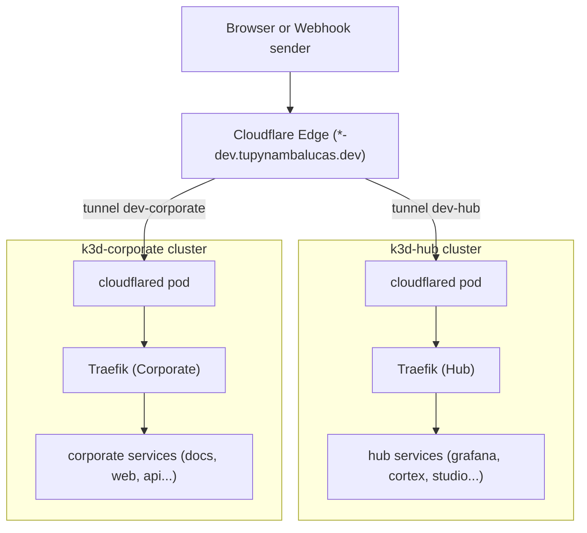

# Cloudflared Tunnels

Defines how Cloudflare Tunnel exposes Traefik in each environment, with focus on running Skaffold
in `dev`.

## 1. Model

Cloudflare Tunnel is outbound only. The `cloudflared` pod opens a connection to Cloudflare and
Cloudflare forwards requests for configured hostnames through it. No public IP, port forward, or
router change is required.

Use remotely managed tunnels. Hostnames and their targets are configured in the Cloudflare
dashboard, and the pod needs only a token.

## 2. One Tunnel per Cluster

Each cluster runs its own dedicated Cloudflare Tunnel connector pod. This cleanly isolates traffic
and allows internal tools and public products to have completely independent ingress lifecycles:

| Environment | Tunnel                             | Runs in                 | Token secret                                     |
| :---------- | :--------------------------------- | :---------------------- | :----------------------------------------------- |
| `dev`       | `dev-hub`                          | `k3d-hub` (local)       | `CLOUDFLARE_TUNNEL_TOKEN_HUB` from local `.env`  |
| `dev`       | `dev-corporate`                    | `k3d-corporate` (local) | `CLOUDFLARE_TUNNEL_TOKEN_CORP` from local `.env` |
| `staging`   | `staging-hub`, `staging-corporate` | One per cloud cluster   | Cluster secret store                             |
| `prod`      | `prod-hub`, `prod-corporate`       | One per cloud cluster   | Cluster secret store                             |

Rules:

- A tunnel is never shared between environments or clusters. Each cluster has its own tunnel token.
- A hostname maps to exactly one tunnel. The `-dev`, `-stg`, and clean hostnames keep this
  unambiguous.
- Both local dev tunnels register under `tupynambalucas.dev` without conflict, as Cloudflare routes
  by exact hostname.

## 3. Dev Configuration

In local development, the two tunnels run concurrently inside `k3d-hub` and `k3d-corporate`.

### Tunnel `dev-hub` Hostnames (Targeting Traefik in `k3d-hub`)

All target the in-cluster Traefik service on HTTP (`http://traefik.platform.svc.cluster.local:80`):

| Hostname                            | Target Service                                 |
| :---------------------------------- | :--------------------------------------------- |
| `grafana-dev.tupynambalucas.dev`    | `http://traefik.platform.svc.cluster.local:80` |
| `headlamp-dev.tupynambalucas.dev`   | same                                           |
| `penpot-dev.tupynambalucas.dev`     | same                                           |
| `memos-dev.tupynambalucas.dev`      | same                                           |
| `memory-dev.tupynambalucas.dev`     | same                                           |
| `memory-api-dev.tupynambalucas.dev` | same                                           |
| `turbocache-dev.tupynambalucas.dev` | same                                           |
| `traefik-dev.tupynambalucas.dev`    | same                                           |

### Tunnel `dev-corporate` Hostnames (Targeting Traefik in `k3d-corporate`)

All target the in-cluster Traefik service in the corporate cluster (`http://traefik.docs.svc.cluster.local:80` or `corporate` namespace):

| Hostname                      | Target Service               |
| :---------------------------- | :--------------------------- |
| `docs-dev.tupynambalucas.dev` | in-cluster corporate Traefik |
| `web-dev.tupynambalucas.dev`  | in-cluster corporate Traefik |
| `api-dev.tupynambalucas.dev`  | in-cluster corporate Traefik |

Traefik routes by `Host` header inside each cluster, so every hostname points at its respective
in-cluster Traefik service, and Ingress resources determine the backend pod.

The `cloudflared` deployment in `manifests/hub/network/cloudflared.yaml` reads its token from
`platform-secrets`. A parallel deployment in the corporate overlay reads from `corporate-secrets`.

## 4. Behavior with Skaffold

- `skaffold dev` deploys the `dev` overlay, which includes the `cloudflared` Deployment. The pod
  connects when the cluster starts and the hostnames become reachable from the internet.
- Skaffold does not manage the tunnel. It only applies and updates the Deployment.
- When the cluster is stopped, hostnames return a Cloudflare error. This is expected and cheap.
- Webhooks from external services reach local code through the `-dev` hostnames, with real
  hostnames, cookies, and CORS behavior.
- **Architectural Win (Multi-Cluster Port Contention)**: Running multiple clusters (`k3d-hub` and `k3d-corporate`) typically causes port binding conflicts on the host (e.g., both wanting `localhost:80`). Because Cloudflare tunnels establish outbound connections, _neither_ cluster requires port 80 or 443 to be mapped to the WSL2 host. Traefik remains purely internal, elegantly side-stepping a well-known k3d/WSL networking limitation.
- With the tunnel present, local access through ports 80 and 443 is entirely bypassed. Skaffold `portForward` entries for specific services (`agentgateway`, `memory-api`, and `penpot-frontend`) can remain for direct debugging.
- The dev tunnel exposes internal tools such as Grafana and Headlamp to the internet. Protect every
  `hub` hostname in `dev` with a Cloudflare Access policy that requires the team identity
  provider. Public `corporate` hostnames in `dev` can use a looser policy.

## 5. Staging and Prod

Decision: Cloudflare Tunnel in every cluster across all environments (`dev`, `staging`, and `prod`),
for both `hub` and `corporate`. cert-manager and public cloud LoadBalancers are completely
eliminated from the infrastructure and repository.

Reasons:

- Parity: dev, staging, and prod share the same ingress path, so tunnel, Access, and routing
  behavior are tested before prod.
- The domain, DNS, and R2 already live in Cloudflare, so there is no extra vendor.
- No public IP or load balancer on the clusters. Origins are not reachable except through the
  tunnel, which removes direct-to-origin attacks.
- Cloudflare terminates TLS and provides DDoS protection, WAF, and caching in front of the site.
- No certificate issuance or renewal to operate. cert-manager is eliminated entirely, removing
  CRDs, controller overhead, and Let's Encrypt rate-limit concerns.
- Cloudflare Access protects every `hub` hostname with the same mechanism used in dev.

Production requirements:

- Run `cloudflared` with at least 2 replicas per cluster, spread across nodes, so a pod or node
  restart does not drop the tunnel.
- Use one tunnel per cluster, with its own token in the cluster secret store.
- Traefik runs with `ClusterIP`, not `LoadBalancer`.
- Review the Cloudflare plan limits for request body size and websockets against the workloads
  that use them.

Accepted trade-off: Cloudflare becomes a hard dependency for ingress. A Cloudflare outage makes the
sites unreachable. All ingress TLS terminates directly at Cloudflare Edge.

## 6. Validation

1. `kubectl --context k3d-dev -n platform logs deploy/cloudflared` shows registered tunnel
   connections.
2. `curl -I https://grafana-dev.tupynambalucas.dev` returns a response from Traefik, then the Access
   login when protected.
3. Stopping the cluster makes the hostname unreachable, and starting it restores access without
   configuration changes.
