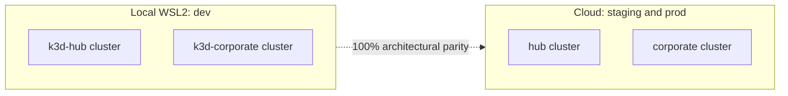

# Enterprise Structure

Defines the bounded contexts, environments, clusters, domains, and deployment tooling for
Tupynambalucas.

## 1. Bounded Contexts

| Context     | Audience      | Contains                                                |
| :---------- | :------------ | :------------------------------------------------------ |
| `hub`       | Internal team | `observability`, `network`, `tools`, `studio`, `cortex` |
| `corporate` | Public        | Website, API, documentation portal                      |

### Hub services

| Area            | Services                                                                                  |
| :-------------- | :---------------------------------------------------------------------------------------- |
| `observability` | Grafana, Prometheus, Loki, Tempo, OpenTelemetry Collector, Fluent Bit, kube-state-metrics |
| `network`       | Traefik, Cloudflared                                                                      |
| `tools`         | Headlamp, Turbocache                                                                      |
| `studio`        | Penpot, Memos, design assets, bucket sync                                                 |
| `cortex`        | AgentGateway, MCP services, Memory API and web                                            |

### Corporate services

| Service  | Description                        |
| :------- | :--------------------------------- |
| `web`    | Company website (React).           |
| `api`    | Company API (Fastify).             |
| `portal` | Documentation portal (Docusaurus). |

## 2. Environments and Clusters

| Environment | Where it runs     | Clusters                                                                | Deployed by     |
| :---------- | :---------------- | :---------------------------------------------------------------------- | :-------------- |
| `dev`       | Local k3d on WSL2 | Two isolated clusters (`k3d-hub` and `k3d-corporate`) on shared network | Skaffold        |
| `staging`   | Cloud             | Two isolated clusters (`hub` and `corporate`)                           | GitOps (ArgoCD) |
| `prod`      | Cloud             | Two isolated clusters (`hub` and `corporate`)                           | GitOps (ArgoCD) |

Running two isolated clusters in dev achieves **full architectural parity with production**.
Internal tooling (Hub) and customer-facing products (Corporate) stay strictly isolated across all
lifecycle stages. Skaffold dispatches workloads to `k3d-hub` and `k3d-corporate` via `kubeContext`.

## 3. Domains

Cloudflare Universal SSL covers one subdomain level, so environments use a suffix instead of a
nested subdomain.

| Environment | Pattern                       | Example                          |
| :---------- | :---------------------------- | :------------------------------- |
| `dev`       | `NAME-dev.tupynambalucas.dev` | `grafana-dev.tupynambalucas.dev` |
| `staging`   | `NAME-stg.tupynambalucas.dev` | `grafana-stg.tupynambalucas.dev` |
| `prod`      | `NAME.tupynambalucas.dev`     | `grafana.tupynambalucas.dev`     |

Hostnames are removed from the base manifests and injected by each overlay. Current manifests
hard-code `-dev` hosts. Only `cortex-memory.yaml` already declares both dev and prod hosts.

## 4. Ingress

Each cluster runs its own Traefik configured as `ClusterIP`. A central ingress for several clusters
would be a single point of failure and would couple environments.

Cloudflare Tunnel is the unified ingress mechanism across all environments (`dev`, `staging`,
and `prod`). TLS terminates at Cloudflare edge with automatic DDoS protection and WAF. No public
IPs, cloud LoadBalancers, or cert-manager are required in any environment. See
[Cloudflared tunnels](./cloudflared-tunnels.md) for architecture, configuration, and security rules.

## 5. Tooling by Stage

| Stage                | Tool               | Role                                                          |
| :------------------- | :----------------- | :------------------------------------------------------------ |
| Local loop           | Skaffold           | Build, push to the k3d registry, deploy, and sync files.      |
| Manifests            | Kustomize and Helm | Base manifests plus per-environment overlays.                 |
| Cloud delivery       | ArgoCD             | Pulls from git and applies the `staging` and `prod` overlays. |
| Cloud infrastructure | Terraform          | Creates the cloud clusters and networking.                    |
| Cluster inspection   | Freelens           | Desktop client for every cluster context.                     |
| Team dashboard       | Headlamp           | In-cluster web dashboard, deployed from `hub`.                |

Kustomize overlays are consumed by both Skaffold and ArgoCD, so one manifest tree serves every
stage. Terraform lives outside `k8s`, in its own top-level folder, because it provisions
the clusters that the manifests are applied to.

## 6. Cross-Context Dependency

`hub/studio/assets` holds design tokens and brand assets that `corporate` consumes. This is an
accepted dependency. Rules:

- `corporate` may import only packages published from `hub/studio/assets` through the workspace
  package boundary.
- `corporate` must not import anything else from `hub`.
- `hub` must not import from `corporate`.
