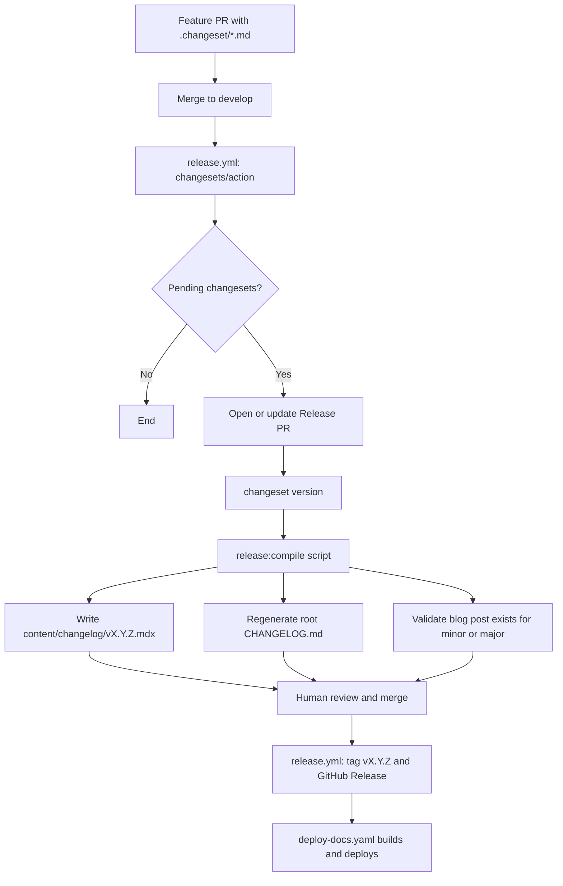

# Release, Versioning, Blog, and Changelog Architecture

Status: proposal. Scope: `knowledge-base/`, `.github/`, root `package.json`, Changesets.

Goal: a separate `/changelog` route listing every release including patches (`1.0.0`, `1.0.1`),
and a `/blog` route listing only curated minor and major releases (`1.0`), both fed from the
`collections` namespace, versioned by a single trustworthy pipeline.

---

## 1. Audit of the Current State

### 1.1 Findings

| #   | Finding                                                | Evidence                                                                                                                                                                                                          | Impact                                                                                |
| --- | ------------------------------------------------------ | ----------------------------------------------------------------------------------------------------------------------------------------------------------------------------------------------------------------- | ------------------------------------------------------------------------------------- |
| 1   | Changesets is not initialized                          | No `.changeset/` directory or `config.json`; `pnpm version:changeset` has nothing to run against                                                                                                                  | The documented release flow cannot execute                                            |
| 2   | Documentation describes a pipeline that does not exist | `docs/guides/github-workflow.mdx` (Release PR section) and `community/4-release-process.mdx` describe a Release PR action; `.github/workflows/` only has `deploy-docs`, `renderer-generate`, `renovate`           | Documentation drift; contributors are told to create changesets that nothing consumes |
| 3   | No git tags, no GitHub Releases                        | `git tag` is empty                                                                                                                                                                                                | No anchor for versions, no compare links, no rollback reference                       |
| 4   | Version fields are incoherent                          | Workspaces are at `0.1.0` and `1.0.0` with no policy; `@monorepo/infrastructure` has no `private` flag                                                                                                            | Unclear product version; accidental `changeset publish` risk                          |
| 5   | Changelog direction is inverted                        | `generate-changelog.ts` compiles `blog/releases/*.mdx` into root `CHANGELOG.md`; the custom plugin then re-parses `CHANGELOG.md` back into `services/portal/changelog/source/*.md` and a synthetic `authors.json` | Two parsers, lossy round trip, MDX turned into plain Markdown, `authors.yml` ignored  |
| 6   | Generated output lives inside the service              | `services/portal/changelog/source/` is a build artifact of the plugin                                                                                                                                             | Violates the rule that content lives in `collections`                                 |
| 7   | Release note data is inconsistent                      | `blog/releases/2026-08-17-v2.8.4.mdx` has frontmatter `title: v0.1.0`, `date: 2026-05-05`, `slug: /releases/v0.1.0`                                                                                               | File name, title, date, and slug disagree                                             |
| 8   | CI pushes generated files to `develop`                 | `deploy-docs.yaml` commits `CHANGELOG.md` and `ROADMAP.md` on every docs push; `git:ignore-compiled-docs` skip-worktree scripts exist to hide the churn                                                           | Race conditions, branch protection conflicts, noisy history                           |
| 9   | No commit or PR title enforcement                      | Husky has `pre-commit` and `prepare-commit-msg` only; no commitlint or PR title check                                                                                                                             | Conventional Commits is documented but not enforced                                   |
| 10  | i18n of the changelog plugin is non-standard           | Plugin sets `name: 'changelog-plugin'`, producing `messages/changelog-plugin/options.json`                                                                                                                        | Non-standard i18n folder; the Crowdin plugin mapping does not know it                 |

### 1.2 What the Docusaurus Repository Actually Does

Analysis of `knowledge-base/docusaurus/references/docusaurus-main` and
`https://docusaurus.io/changelog`:

| Aspect          | Docusaurus                                                                                     | Notes                                                                                          |
| --------------- | ---------------------------------------------------------------------------------------------- | ---------------------------------------------------------------------------------------------- |
| Version source  | `lerna.json` (lockstep version for all packages)                                               | One product version, many packages                                                             |
| Changelog tool  | `lerna-changelog`, driven by PR labels (`pr: new feature`, `pr: bug fix`, ...)                 | Labels map to sections such as Breaking Change, New Feature, Bug Fix                           |
| Changelog file  | `CHANGELOG.md` at repository root, one `## X.Y.Z (date)` section per release including patches | Patches are listed; patch notes are sometimes a plain cherry-pick list (see 3.10.2)            |
| Changelog route | Custom plugin at `/changelog`, a second blog plugin instance reading the root `CHANGELOG.md`   | The reverse-parse design our plugin copied; it fits them because the file is machine generated |
| Blog route      | `blog/releases/<major.minor>/index.mdx` (for example `releases/3.10`)                          | One hand-written post per minor or major, tagged `release`, never per patch                    |
| Announcement    | Announcement bar links to `blog/releases/<announcedVersion>`                                   | Decoupled from the changelog                                                                   |

Key insight: Docusaurus separates two artifacts with different audiences and authorship.

- Blog: narrative, curated, one per `MAJOR.MINOR`, written by a human.
- Changelog: exhaustive, generated, one per `MAJOR.MINOR.PATCH`.

Their plugin parses `CHANGELOG.md` because their source of truth is the generated file. Ours
is the opposite (collections), so copying the plugin copied the wrong direction.

Note: the scrape of `https://docusaurus.io/changelog` returned only the shell (the list is
client-rendered); the structure above was confirmed from the reference clone
(`website/docusaurus.config.ts`, `CHANGELOG.md`, `lerna.json`, `website/blog/releases/`).

---

## 2. Decision: Release Tooling

### 2.1 Options Evaluated

| Criterion                                                | Changesets                                    | release-please                   | semantic-release             | lerna-changelog        |
| -------------------------------------------------------- | --------------------------------------------- | -------------------------------- | ---------------------------- | ---------------------- |
| Already in repo (dependency, scripts, docs, PR template) | Yes                                           | No                               | No                           | No                     |
| Source of release intent                                 | Explicit `.changeset/*.md` written by authors | Conventional Commit messages     | Conventional Commit messages | PR labels              |
| Human-curated release notes                              | Strong                                        | Weak (derived from commit text)  | Weak                         | Medium                 |
| Lockstep version across packages                         | `fixed` groups                                | Manifest, linked versions plugin | Poor in monorepos            | N/A (pairs with Lerna) |
| Private (unpublished) packages                           | `privatePackages.version/tag`                 | Supported                        | Poor                         | N/A                    |
| Release PR workflow                                      | `changesets/action`                           | Native                           | None (publishes directly)    | None                   |
| GitHub Release and tag creation                          | `createGithubReleases`                        | Native                           | Native                       | Manual                 |
| Migration cost                                           | Low                                           | Medium                           | High                         | Medium                 |

### 2.2 Recommendation

Keep and complete Changesets, configured as a single lockstep product version.

Reasons:

1. It is already the documented standard (scripts, PR template, three documentation pages).
2. Authors write the release note at PR time, when context is fresh. Commit-derived tools
   cannot produce the narrative quality the blog needs.
3. `fixed` groups plus `privatePackages` give one product version without publishing to npm
   (confirmed against the Changesets documentation).
4. The Release PR is the natural gate to run compilation scripts and a human review before
   anything lands on `develop`.

Fallback: if the team later decides every PR is squash-merged with a Conventional Commit
title and wants zero authoring friction, release-please in manifest mode is the cleanest
replacement. The content model in section 3 does not change.

---

## 3. Target Content Model

### 3.1 Two Collections, Two Audiences

```text
knowledge-base/collections/namespaces/portal/content/
├── blog/
│   ├── authors.yml
│   ├── tags.yml
│   ├── 2026/...                      # regular posts
│   └── releases/
│       ├── 0.1/index.mdx             # minor and major only, hand-written
│       └── 1.0/index.mdx
└── changelog/                        # NEW: generated, one file per version
    ├── v0.1.0.mdx
    ├── v0.1.1.mdx
    └── v1.0.0.mdx
```

| Surface             | Route        | Contains                                  | Authorship          | Source of truth       |
| ------------------- | ------------ | ----------------------------------------- | ------------------- | --------------------- |
| Blog                | `/blog`      | Posts plus `releases/X.Y` highlight posts | Human               | `content/blog/`       |
| Changelog           | `/changelog` | Every `X.Y.Z`, patches included           | Generated by script | `content/changelog/`  |
| Root `CHANGELOG.md` | GitHub       | Concatenation of `content/changelog/`     | Generated           | Derived, never edited |

Rule: `content/changelog/` is the single source of truth for per-version history. The root
`CHANGELOG.md` becomes a derived artifact (inverting finding 5).

### 3.2 Versioning Policy

One product version, SemVer, lockstep across all `@monorepo/*` workspaces.

| Bump          | Trigger                                  | Blog post required   | Changelog entry |
| ------------- | ---------------------------------------- | -------------------- | --------------- |
| Major `X.0.0` | Breaking architecture or contract change | Yes (`releases/X.0`) | Yes             |
| Minor `X.Y.0` | New capability, backward compatible      | Yes (`releases/X.Y`) | Yes             |
| Patch `X.Y.Z` | Fix, dependency update, internal change  | No                   | Yes             |

Pre-1.0 policy: `0.MINOR.PATCH`; a minor may contain breaking changes and is announced in
the blog like a major.

Enforcement: a CI check on the Release PR fails when the computed bump is minor or major and
`content/blog/releases/<X.Y>/index.mdx` does not exist.

### 3.3 Release Note File Contracts

Blog highlight post (`blog/releases/1.0/index.mdx`):

```mdx
---
title: Tupynambalucas 1.0
authors: [tupynambalucas]
tags: [release]
date: 2026-10-20
---

Narrative introduction.

{/* truncate */}

## Highlights

## Breaking changes and migration

## Upgrade notes
```

Changelog entry (`changelog/v1.0.0.mdx`, generated; never hand-edited):

```mdx
---
title: v1.0.0
slug: /v1.0.0
date: 2026-10-20T12:00
authors: [tupynambalucas]
tags: [major]
---

{/* truncate */}

## Breaking Changes

## Features

## Fixes

## Maintenance
```

The `tags` value (`major`, `minor`, `patch`) enables filtering on the changelog route. Minor
and major entries end with a line linking to their blog post
(`Read the announcement: /blog/releases/1.0`).

---

## 4. Changesets Configuration

### 4.1 Initialization

Create `.changeset/config.json`:

```json
{
  "$schema": "https://unpkg.com/@changesets/config@3.1.1/schema.json",
  "changelog": ["@changesets/changelog-github", { "repo": "tupynambalucas/tupynambalucas" }],
  "commit": false,
  "access": "restricted",
  "baseBranch": "develop",
  "fixed": [["@monorepo/*"]],
  "privatePackages": { "version": true, "tag": true },
  "updateInternalDependencies": "patch",
  "ignore": []
}
```

Notes:

- `repo` must resolve from `@monorepo/shared-config/project.config.json` (`GITHUB_ORG`,
  `REPOSITORY_NAME`) when the file is generated by a setup script; it must not be hardcoded
  in a committed template.
- `fixed` with the `@monorepo/*` glob keeps one version across all workspaces.
- `privatePackages.version/tag` is mandatory because every workspace is private; without it,
  `changeset version` skips them.
- Tags are created per package (`@monorepo/pkg@x.y.z`) by default. A root script (section 5)
  creates the single product tag `vX.Y.Z` and the GitHub Release.

### 4.2 Hygiene Fixes

1. Set `"private": true` on `@monorepo/infrastructure` and any other manifest missing it.
2. Normalize all workspace versions to the genesis version (`0.1.0`) before the first
   release so the `fixed` group starts aligned.
3. Add `@changesets/changelog-github` to the pnpm catalog and root devDependencies.

### 4.3 Author Experience

```bash
pnpm version:changeset     # pick bump type and write the human release note
```

The changeset text becomes the changelog line. It must be written for users of the monorepo,
in English, in the imperative mood, and may carry a scope prefix (`hub:`, `cortex:`).

---

## 5. Release Pipeline



### 5.1 New Workflow: `.github/workflows/release.yml`

- Trigger: `push` to `develop`.
- Steps: checkout, `setup-pnpm-env`, `changesets/action` with `version: pnpm release:version`
  and `publish: pnpm release:tag`.
- Permissions: `contents: write`, `pull-requests: write`.

### 5.2 New Root Scripts

| Script            | Responsibility                                                                        |
| ----------------- | ------------------------------------------------------------------------------------- |
| `release:version` | `changeset version && pnpm release:compile`                                           |
| `release:compile` | Run `tooling/compile-release.ts` (below)                                              |
| `release:tag`     | Create the single `vX.Y.Z` tag and GitHub Release from `content/changelog/vX.Y.Z.mdx` |
| `release:check`   | Fail if a minor or major bump lacks `blog/releases/<X.Y>/index.mdx`                   |

### 5.3 `compile-release.ts` Contract

Lives in `knowledge-base/docusaurus/services/portal/tooling/`, next to the existing
generators.

1. Read the new product version from the `@monorepo/shared-config` package manifest.
2. Read the new section from each workspace `CHANGELOG.md` produced by `changeset version`.
3. Group lines by category (Breaking, Features, Fixes, Maintenance) and by scope.
4. Write `content/changelog/vX.Y.Z.mdx` with the frontmatter contract of section 3.3.
5. Rebuild root `CHANGELOG.md` by concatenating all `content/changelog/*.mdx`, newest first,
   stripping frontmatter. Output is deterministic, so reruns produce no diff.

### 5.4 Remove CI Writes to `develop`

Delete the "Commit and Push Compiled Documents" step from `deploy-docs.yaml`. Root
`CHANGELOG.md` is produced inside the Release PR, which is reviewed and merged normally.
`ROADMAP.md` should follow the same rule (compiled in a PR, not pushed by CI). The
`git:ignore-compiled-docs` and `git:track-compiled-docs` scripts then become unnecessary and
should be removed.

---

## 6. Docusaurus Integration

### 6.1 Replace the Custom Plugin

Current wiring to remove or change:

- `preset/src/plugins/changelog/index.ts` and `utils.ts` (reverse parser): delete.
- `preset/src/index.ts` (imports `pluginChangelog`): register a native blog instance instead.
- `preset/package.json` export `./plugins/changelog`: remove.
- `services/portal/changelog/`: delete (generated artifact).

Kept as is: theme components `ChangelogList`, `ChangelogPage`, `ChangelogItem`,
`ChangelogPaginator`, the sidebar link in `preset/src/sidebars/index.ts` (`/changelog`), and
the navbar target in `preset/src/themeConfig.ts`.

Register a second `@docusaurus/plugin-content-blog` instance in the preset:

```ts
[
  '@docusaurus/plugin-content-blog',
  {
    id: 'changelog',
    path: path.join(collectionsRoot, 'namespaces/portal/content/changelog'),
    routeBasePath: 'changelog',
    blogTitle: `${projectConfig.PROJECT_NAME} Changelog`,
    blogDescription: 'Every release, including patches.',
    blogSidebarCount: 'ALL',
    blogSidebarTitle: 'Changelog',
    postsPerPage: 20,
    showReadingTime: false,
    archiveBasePath: null,
    authorsMapPath: '../blog/authors.yml',
    blogListComponent: '@theme/ChangelogList',
    blogPostComponent: '@theme/ChangelogPage',
    feedOptions: { type: 'all' },
  },
];
```

Result: `authors.yml` is shared, there is no regex parsing, MDX is preserved, files are plain
collection content, and the dev server hot-reloads them. Because the plugin no longer carries
its own `name`, remove the `changelog` key from `MonorepoPresetOptions` and from
`docusaurus.config.ts`, moving its options into the instance above.

### 6.2 Blog Release Filter

The blog already includes `blog/releases/<X.Y>/index.mdx` because it lives under the blog
path. No filtering is needed: patches never exist there by policy (section 3.2).

### 6.3 Navigation

- Navbar: `Blog` (`/blog`) as is.
- Community sidebar: keep the `Changelog` button pointing to `/changelog`.
- Optional announcement bar: link to `/blog/releases/<latest X.Y>`, fed by a small generated
  JSON file written by `release:compile`.

### 6.4 Changelog Entry Footer

Each changelog entry links to:

- The blog post for its `X.Y` when one exists.
- The GitHub compare URL `vPREVIOUS...vCURRENT`.

Both are produced by `compile-release.ts`.

---

## 7. Internationalization and Crowdin

Decision: translate the narrative, not the machine output.

| Content                              | Translate in Crowdin | Reason                                                                                |
| ------------------------------------ | -------------------- | ------------------------------------------------------------------------------------- |
| `blog/releases/X.Y/index.mdx`        | Yes                  | Curated, user-facing, low volume                                                      |
| `changelog/vX.Y.Z.mdx`               | No                   | Generated technical English; high volume; PR references do not translate meaningfully |
| Blog and changelog plugin UI strings | Yes                  | Titles, sidebar labels                                                                |

Required changes:

1. `crowdin.yml`: add an `ignore` entry for
   `/knowledge-base/collections/namespaces/portal/content/changelog/**` on the MDX source.
2. Crowdin plugin `I18N_MAPPING`: add
   `changelog: 'docusaurus-plugin-content-blog-changelog'` only if translation of entries is
   ever enabled. Otherwise untranslated entries fall back to English automatically.
3. Regenerate `content/messages/` with `docusaurus write-translations`. The folder
   `messages/changelog-plugin/` is replaced by
   `messages/docusaurus-plugin-content-blog-changelog/options.json` because a native blog
   instance with `id: 'changelog'` uses that i18n folder name.

---

## 8. Governance and Enforcement

| Control                | Mechanism                                                                                                     | Rationale                                                                                         |
| ---------------------- | ------------------------------------------------------------------------------------------------------------- | ------------------------------------------------------------------------------------------------- |
| PR title format        | `amannn/action-semantic-pull-request` in a `pr-title.yml` workflow                                            | Enforces Conventional Commits where it matters (squash-merge title) without slowing local commits |
| Changeset presence     | `changeset status --since=origin/develop` in PR CI for changes under workspaces                               | Backs the PR template checkbox with automation                                                    |
| Blog post presence     | `pnpm release:check` on the Release PR                                                                        | Guarantees minor and major releases are announced                                                 |
| Documentation accuracy | Update `github-workflow.mdx`, `4-release-process.mdx`, `commands.mdx`, `first-contribution.mdx` after rollout | Removes drift (finding 2)                                                                         |

Local commit-msg linting (commitlint) is optional; PR title enforcement is sufficient when
the repository squash-merges.

---

## 9. Migration Plan

| Phase | Work                                                                                                                                       | Verification                                                                                      |
| ----- | ------------------------------------------------------------------------------------------------------------------------------------------ | ------------------------------------------------------------------------------------------------- |
| 0     | Fix hygiene: `private` flags, normalize versions to `0.1.0`, correct the `blog/releases` sample file metadata                              | `pnpm install` clean; manifests consistent                                                        |
| 1     | Initialize Changesets (`.changeset/config.json`, catalog entry, scripts)                                                                   | `pnpm version:changeset` runs; `changeset status` works                                           |
| 2     | Create `content/changelog/` with a seed `v0.1.0.mdx` from the genesis release; move the genesis blog post to `blog/releases/0.1/index.mdx` | Both routes render locally                                                                        |
| 3     | Register the native `changelog` blog instance; remove the custom plugin, `services/portal/changelog/`, and the reverse parser              | `docusaurus build` succeeds for `en` and `pt-BR`; `/changelog` shows entries with correct authors |
| 4     | Write `compile-release.ts`; repoint `generate-changelog.ts` to read `content/changelog/`                                                   | Running twice produces no diff                                                                    |
| 5     | Add `release.yml`; remove the CI commit step from `deploy-docs.yaml`; remove skip-worktree scripts                                         | Dry run on a feature branch opens a Release PR                                                    |
| 6     | Crowdin: add `ignore`, regenerate `messages/`, update plugin mapping if needed                                                             | Crowdin lists no changelog files; UI strings resolve in `pt-BR`                                   |
| 7     | Add `pr-title.yml` and the `changeset status` CI check; update the four documentation pages                                                | CI fails correctly on a bad PR title or a missing changeset                                       |
| 8     | Cut `v0.1.0`: merge the Release PR, confirm tag and GitHub Release                                                                         | Tag exists; `/changelog` and root `CHANGELOG.md` agree                                            |

---

## 10. Risks and Mitigations

| Risk                                                                                      | Mitigation                                                                                                               |
| ----------------------------------------------------------------------------------------- | ------------------------------------------------------------------------------------------------------------------------ |
| `fixed` group bumps every workspace for any change, creating noisy per-package changelogs | Accept for lockstep; the compiled `content/changelog` entry is the user-facing view                                      |
| Per-package tags (`@monorepo/pkg@x.y.z`) clutter the tag list                             | Filter by prefix in the release job or disable once the single `vX.Y.Z` tag script is in place                           |
| Changeset authors skip notes for minor changes                                            | `release:check` and PR CI make omissions visible before release                                                          |
| Release PR conflicts with docs deployment concurrency                                     | Keep `deploy-docs.yaml` triggered only by merged content; merging the Release PR is the single trigger for a new version |
| Crowdin picks up generated files                                                          | Explicit `ignore` pattern and a CI assertion that `crowdin.yml` excludes `content/changelog/**`                          |

---

## 11. Open Decisions for the Owner

1. Confirm Changesets (recommended) versus release-please.
2. Confirm lockstep versioning (`fixed`) versus independent package versions.
3. Confirm that changelog entries are not translated.
4. Confirm that Release PRs target `develop`, matching the documented branch model.
