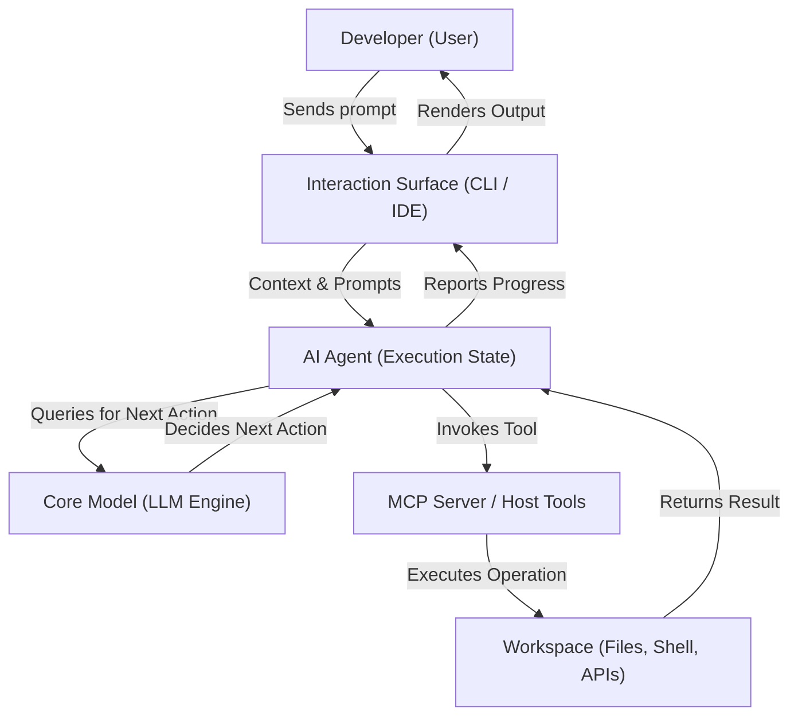

# AI Systems Architecture: Models, Agents, Interfaces, and Protocols

This document establishes the official definitions, architectural distinctions, and relationships
between Large Language Models (LLMs), AI Agents, Command Line Interfaces (CLIs), and the Model
Context Protocol (MCP) as implemented within the **tupynambalucas** monorepo.

---

## 1. Large Language Models (LLMs / Core Models)

A **Large Language Model** is the core mathematical and cognitive engine of the system.

### Definition

An LLM is a deep neural network (e.g., Gemini 3.5 Flash) trained on vast datasets to perform
statistical next-token prediction based on an input prompt (Inference).

### Architectural Characteristics

- **Stateless**: The model has no memory of past requests. Each API call is mathematically
  isolated and evaluated independently.
- **Passive**: It only executes when prompted and produces a single response per request (Input
  $\rightarrow$ Output).
- **Execution Constraints**: An LLM, in its raw form, has no direct access to the filesystem,
  network, shell, or third-party APIs. It only manipulates token representations.

---

## 2. AI Agents

An **AI Agent** is an autonomous, goal-oriented system wrapped around an LLM.

### Definition

An agent is an execution loop that leverages the LLM as its decision-making core ("brain") but is
equipped with state, memory, and specialized tools to interact with its environment.

### Architectural Characteristics

- **Autonomy**: It translates high-level user instructions into a sequence of concrete steps.
- **The Planning Loop**: It operates on an iterative cycle of _Reasoning $\rightarrow$ Action
  $\rightarrow$ Observation_. It decides what to do, runs a tool, analyzes the result, and adjusts
  its plan dynamically.
- **State and Memory**: It retains state across multiple turns, tracks current goals, and maintains
  logs of completed subtasks.
- **Tool Exposing**: It can read/write files, execute shell commands, perform web searches, and
  spawn subagents.

---

## 3. Interaction Surfaces (CLI & IDE)

Interfaces are the physical or visual applications that bridge the user, the agent, and the local
workspace.

### The CLI (`agy`)

The **Antigravity CLI** is a lightweight, terminal-based User Interface (TUI). It is **not** an
agent or a model. Instead, it serves as:

- **The Host**: The visual shell where the user converses with the agent.
- **The Sandbox Provider**: The execution environment that exposes shell commands, filesystem
  operations, and background task management safely.

### The IDE

An **Integrated Development Environment** (IDE) is a graphical developer workspace. Like the CLI, it
is not an agent. It provides:

- Rich visual context (file tree, editor, cursor location, active tabs).
- Inline integration points (lenses, sidebar chat panels, hover actions) that let agents suggest
  and perform edits directly inside the file editor.

---

## 4. Model Context Protocol (MCP)

The **Model Context Protocol** is an open-standard communication protocol that decouples tools from
agents.

### Definition

MCP defines a standardized way for an AI agent to securely connect to external data sources,
developer tools, and APIs.

### Architectural Characteristics

- **Decoupling**: Instead of hardcoding tools into the agent or the CLI, MCP servers run as separate
  processes exposing JSON-RPC endpoints.
- **Interoperability**: Any MCP-compliant client (like the Antigravity CLI) can connect to any MCP
  server, immediately granting the hosted agent access to its exposed resources and tools.
- **Security**: It ensures explicit user consent and isolation for system operations.

---

## 5. Architectural Comparison Matrix

| Aspect            | Core Model (LLM)           | AI Agent                       | Interface (CLI / IDE)         | Protocol (MCP)                |
| :---------------- | :------------------------- | :----------------------------- | :---------------------------- | :---------------------------- |
| **Role**          | Cognitive/Reasoning Engine | Autonomous Execution System    | User Presentation & Host      | Universal Tool/Data Bridge    |
| **State**         | Stateless                  | Stateful (tracks goals/memory) | Stateful (UI/session state)   | Stateless/Stateful Transport  |
| **Autonomy**      | Zero (passive generator)   | High (self-directing loop)     | Zero (user/agent driven)      | Zero (communication channel)  |
| **Actionability** | None (produces text/JSON)  | High (modifies files/commands) | High (local environment host) | Moderate (exposes tools/APIs) |
| **Example**       | Gemini 3.5 Flash           | Antigravity AI Coding Agent    | `agy` Terminal Interface      | Dockerhub/Grafana MCP Server  |

---

## 6. Conceptual Flow

The following diagram illustrates how these components interact during a developer workflow:

