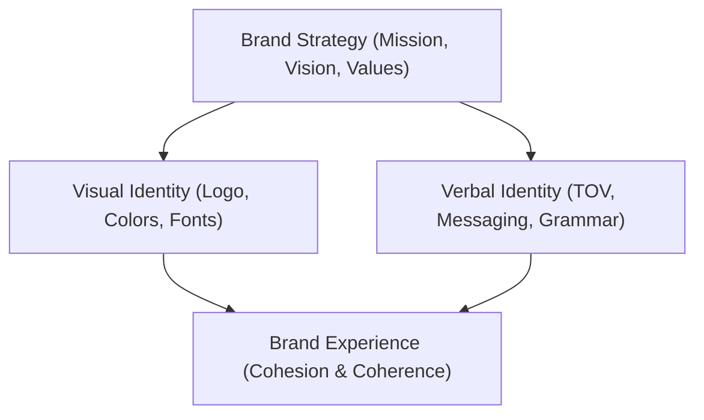

# Brand Visual and Verbal Identity Reference

This reference documentation describes the core frameworks, methodologies, and components
required to construct and maintain a unified brand identity. It details the connection between
inner brand strategy, outer visual elements, and verbal communication style.

---

## 1. Conceptual Overview

A cohesive brand identity consists of two fundamental pillars:

- **Visual Identity**: The external visual elements (logos, color palettes, typography, imagery,
  and layout grids) that establish immediate recognition and set the visual tone.
- **Verbal Identity**: The communication style (tone of voice, language register, messaging
  pillars, and grammar) that speaks to target audiences and conveys core values.

---

## 2. Directory Reference Index

The documentation is organized using the Diátaxis framework:

- [Tutorials](./tutorials.md): Step-by-step instructions for beginners to design and build visual
  and verbal brand identity systems from the ground up.
- [How-To Guides](./guides.md): Goal-oriented instructions to solve specific branding challenges,
  such as creating style guides, running audits, and scaling identities.
- [Reference](./reference.md): Technical definitions, checklists, case studies, and grammatical
  standards for visual and verbal brand elements.
- [Explanation](./explanation.md): Deep-dive discussions on the architectural relationship between
  brand strategy, visual identity, verbal identity, and psychological coherence.
