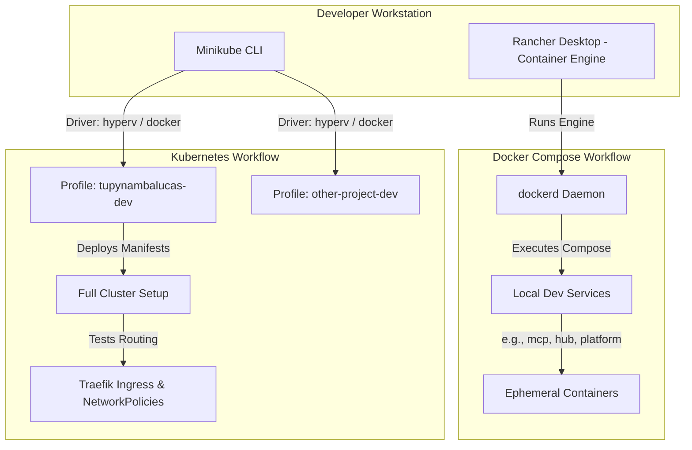

# Dual-Orchestration Local Development Strategy

This documentation hub describes the dual-orchestration workflow for the `tupynambalucas.dev` monorepo. It details the coexistence of Rancher Desktop (for rapid Docker Compose services) and Minikube (for robust, multi-cluster Kubernetes infrastructure testing).

---

## 1. Architectural Overview

To support multi-project engineering and high-fidelity Kubernetes verification, local orchestration is split into two specialized pipelines:

- **Docker Compose (Rancher Desktop)**: Provides a lightweight container runtime utilizing the `dockerd` engine. Workspaces leverage Compose to execute microservices instantly without the scheduling, routing, and resource management overhead of Kubernetes.
- **Kubernetes (Minikube)**: Orchestrates local clusters across multiple isolated profiles. Used to validate Kubernetes manifests, namespace routing, Traefik ingress rules, resource quotas, and security network policies.

---

## 2. Directory Reference Index

Refer to the specific guides below for detailed instructions, commands, and configuration strategies:

- [Docker Compose Development](./rancher_desktop_compose_workflow.md): Setup, configuration, and commands for utilizing Rancher Desktop to run workspace-specific compose suites.
- [Minikube Multi-Cluster Workflow](./minikube_multi_cluster_workflow.md): Managing multiple isolated clusters, configuring drivers, setting up ingress, and deploying workloads in Minikube profiles.
- [Manifest Migration and Sync](./migration_and_sync_guide.md): Code hot-reloading with Skaffold, translating Docker Compose setups to Kubernetes objects, and syncing local source code files into cluster environments.

### Related Global Configurations

- [Kubernetes Namespace Architecture](../kubernetes_namespaces_architecture.md): Global namespace map, network policies, and domain isolation boundaries.
- [Kubernetes Development and Production Workflow](../kubernetes_workflow.md): Baseline local orchestration and production GitOps delivery pipelines.
