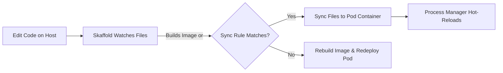

# Manifest Migration and Code Synchronization Guide

This guide details the processes for translating Docker Compose definitions to Kubernetes manifests and syncing source files dynamically to running pods in Minikube.

---

## 1. Translating Docker Compose to Kubernetes Manifests

When transitioning a service from a Docker Compose development configuration to a Kubernetes infrastructure environment, Compose objects must be mapped to their declarative Kubernetes equivalents.

### Mapping Scheme

| Docker Compose Object | Kubernetes Equivalent                | Purpose                                                          |
| :-------------------- | :----------------------------------- | :--------------------------------------------------------------- |
| `service`             | `Deployment` (or `StatefulSet`)      | Defines replica count, container images, and lifecycle settings. |
| `ports` (exposed)     | `Service` (ClusterIP / LoadBalancer) | Configures intra-cluster networking and external endpoints.      |
| `environment`         | `ConfigMap` or `Secret`              | Injects runtime parameters and sensitive access credentials.     |
| `volumes`             | `PersistentVolumeClaim` (PVC)        | Manages persistent block storage or ephemeral mounts.            |
| `networks`            | `NetworkPolicy`                      | Enforces structural traffic isolation rules between namespaces.  |

### Automating Translation with Kompose

You can generate initial Kubernetes manifests using **Kompose**:

```bash
# Generate Kubernetes manifests from a compose file
kompose convert -f tools/mcp/infrastructure/docker/compose.yaml -o k8s/manifests/
```

> [!WARNING]
> Automatically generated manifests usually require editing. You must update namespace targets, refine Service port configurations, and implement proper domain ingress objects.

---

## 2. Direct Container Builds (Minikube Docker Daemon)

To avoid building images on the host and pushing them to an external registry, you can configure your terminal to use Minikube's internal Docker daemon.

### Environment Redirection

Run the environment command in your terminal session before starting a build:

- **PowerShell (Windows)**:
  ```powershell
  minikube -p tupynambalucas docker-env | Invoke-Expression
  ```
- **Bash / Git Bash**:
  ```bash
  eval $(minikube -p tupynambalucas docker-env)
  ```

### Build Workflow

1. Configure the terminal env as shown above.
2. Run your Docker build commands (e.g., `docker build -t mcp-github:latest .`).
3. Set the image in your Kubernetes manifest to `mcp-github:latest`.
4. Configure `imagePullPolicy: IfNotPresent` in the manifest deployment spec. Kubernetes will resolve the image directly from the internal registry rather than trying to fetch it online.

---

## 3. Hot-Reloading Code (Skaffold Integration)

To support active programming inside a live Minikube cluster, the monorepo uses **Skaffold** to automatically sync local files to running containers.

### Skaffold Pipeline Flow



### Reference Configuration (`skaffold.yaml`)

Create a `skaffold.yaml` file in your workspace to map local project paths to pod targets:

```yaml
apiVersion: skaffold/v4beta11
kind: Config
metadata:
  name: mcp-services
build:
  artifacts:
    - image: mcp-github
      context: .
      docker:
        dockerfile: tools/mcp/services/github/Dockerfile
      sync:
        manual:
          - src: 'tools/mcp/services/github/src/**/*.ts'
            dest: '/app/src'
manifests:
  rawYaml:
    - k8s/mcp-github-deployment.yaml
```

Run Skaffold to launch the hot-reloading development cycle:

```bash
skaffold dev -p tupynambalucas
```

> [!WARNING]
> **ConfigMap Sync Restriction**: You cannot use Skaffold `sync` on files that are mounted into the pod via a Kubernetes `ConfigMap` or `Secret`. Kubernetes mounts these as read-only symlinks, causing file syncs to fail with "Read-only file system" errors. Instead, rely on `configMapGenerator` in your `kustomization.yaml` so Kustomize can re-generate the ConfigMap and restart the pod on file changes.

---

## 4. Environment Variables and Secrets Migration

Convert local Compose `.env` values into Kubernetes `Secret` resources to preserve configuration parity:

```yaml
apiVersion: v1
kind: Secret
metadata:
  name: mcp-github-secrets
  namespace: mcp
type: Opaque
stringData:
  GITHUB_PERSONAL_ACCESS_TOKEN: 'your_token_here'
```

Map this secret into your Deployment manifest:

```yaml
spec:
  containers:
    - name: github-service
      image: mcp-github:latest
      env:
        - name: GITHUB_PERSONAL_ACCESS_TOKEN
          valueFrom:
            secretKeyRef:
              name: mcp-github-secrets
              key: GITHUB_PERSONAL_ACCESS_TOKEN
```
