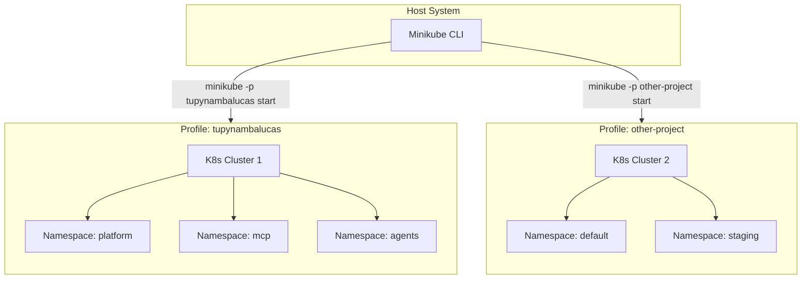

# Minikube Multi-Cluster Workflow

This guide details how to leverage Minikube to test full Kubernetes configurations, orchestrate multiple isolated clusters, and configure network routing on a Windows environment.

---

## 1. Development Role and Purpose

While Docker Compose (Rancher Desktop) handles lightweight developer runtimes, Minikube is reserved for verifying the system's actual production-equivalent Kubernetes structures.

### Key Use Cases

- **Namespace Segregation**: Testing isolation boundaries between `platform`, `mcp`, `agents`, `hub`, and `studio` namespaces.
- **Service Discovery**: Testing Fully Qualified Domain Name (FQDN) cross-namespace routing (e.g., resolving `http://agentgateway.platform.svc.cluster.local:8080`).
- **Ingress and Routing Rules**: Verifying Traefik or Nginx ingress annotations and domain mapping.
- **Security Validation**: Validating NetworkPolicies, PodSecurityStandards, and ResourceQuotas.

---

## 2. Multi-Cluster Architecture (Profiles)

Minikube supports running multiple isolated Kubernetes clusters on a single workstation using **Profiles**. This prevents configuration clashes when switching between different projects.



### Profile Management Commands

- **Create/Start a specific cluster**:
  ```bash
  minikube start -p tupynambalucas --driver=docker
  ```
- **List all profiles and their status**:
  ```bash
  minikube profile list
  ```
- **Set a default active profile for the CLI**:
  ```bash
  minikube profile tupynambalucas
  ```
- **Stop a specific cluster profile**:
  ```bash
  minikube stop -p tupynambalucas
  ```
- **Delete a cluster profile and its associated virtual resources**:
  ```bash
  minikube delete -p tupynambalucas
  ```

---

## 3. Windows Drivers and Hypervisor Setup

On Windows, Minikube supports multiple drivers to run the cluster's virtual machine or container node:

### A. Docker Driver (Recommended for Speed)

Runs the Kubernetes node as a Docker container. Highly efficient and fast startup.

- **Prerequisite**: Rancher Desktop must be active with the `moby (dockerd)` container engine.
- **Execution**:
  ```bash
  minikube start -p tupynambalucas --driver=docker
  ```

### B. Hyper-V Driver (Recommended for Deep Isolation)

Runs the cluster inside a native Windows Hyper-V virtual machine. Completely isolated from Rancher Desktop's docker daemon.

- **Prerequisite**: Hyper-V feature must be enabled in Windows (requires Administrator powershell):
  ```powershell
  Enable-WindowsOptionalFeature -Online -FeatureName Microsoft-Hyper-V -All
  ```
- **Execution**:
  ```bash
  minikube start -p tupynambalucas --driver=hyperv
  ```

---

## 4. Ingress Configuration and Local Domain Routing

Because Minikube runs inside a container or VM, its services (and the Ingress controller) are not automatically exposed on the host loopback network (`127.0.0.1`).

### Step 1: Enable the Ingress Addon

Enable the cluster's ingress controller (defaulting to Nginx Ingress Controller):

```bash
minikube addons enable ingress -p tupynambalucas
```

### Step 2: Establish the Network Tunnel (Windows Critical Step)

On Windows, you must run `minikube tunnel` in a separate terminal session. This processes network routing rules to map cluster-level LoadBalancer and Ingress IPs to the host network interface.

```bash
minikube tunnel -p tupynambalucas
```

> [!IMPORTANT]
> Keep this command running. If the tunnel terminal is closed, you will not be able to access `.localhost` subdomains or direct service ingress routes from your browser or host CLI.

### Step 3: Domain Mapping

Verify that your ingress configurations use the `.localhost` suffix. For example:

- `http://gateway.localhost` or `http://gateway.docker.localhost`

Browsers automatically resolve `*.localhost` to `127.0.0.1`. The tunnel will then map the traffic on ports `80` and `443` into the Minikube cluster's Ingress controller.
