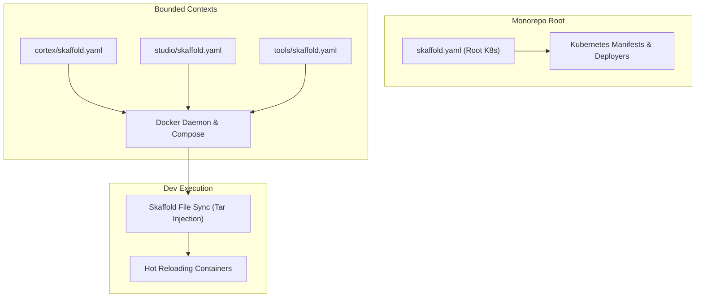

# Skaffold Development Architecture & Hot Reload Reference

This reference documentation describes the architecture, design, and implementation strategies for
using Skaffold across the monorepo. It details how to separate root-level Kubernetes cluster
deployment from individual workspace Docker Compose development configurations with near-instant hot
reloading.

---

## 1. Executive Summary

In a multi-workspace monorepo, containerized development requires two distinct execution modes:

- **Root Kubernetes Cluster Mode**: Managed by the root `skaffold.yaml` file, this mode builds
  all monorepo container artifacts and deploys full manifests to a Kubernetes cluster (e.g.
  Minikube, k3d, or remote staging).
- **Workspace Local Docker Compose Mode**: Managed by individual sub-workspace configurations (such
  as `cortex/skaffold.yaml`, `studio/skaffold.yaml`, or `tools/skaffold.yaml`), this mode utilizes
  the local Docker daemon and Docker Compose (`compose.yaml`) to deliver rapid feedback loops via
  in-container file synchronization.

---

## 2. Directory Reference Index

This documentation follows the Diátaxis framework structure:

- [Tutorials](./tutorials.md): Step-by-step guides for initializing local Docker Compose Skaffold
  workflows and executing live hot reload cycles across workspaces.
- [How-To Guides](./guides.md): Problem-solving recipes for creating workspace configs, defining
  file sync rules, configuring Docker Compose deployers, and resolving sync issues.
- [Reference](./reference.md): Production-ready YAML configurations, field specs, CLI command
  cheat sheets, and feature matrices.
- [Explanation](./explanation.md): Architectural deep dives into file sync mechanics, Docker daemon
  bypassing, multi-module dependency graphs (`requires`), and context isolation.
