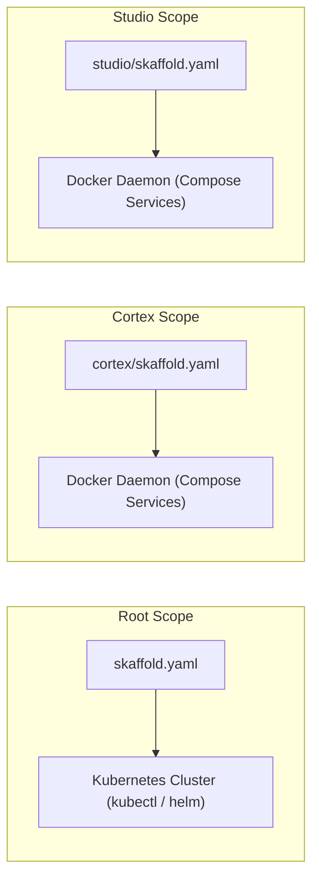
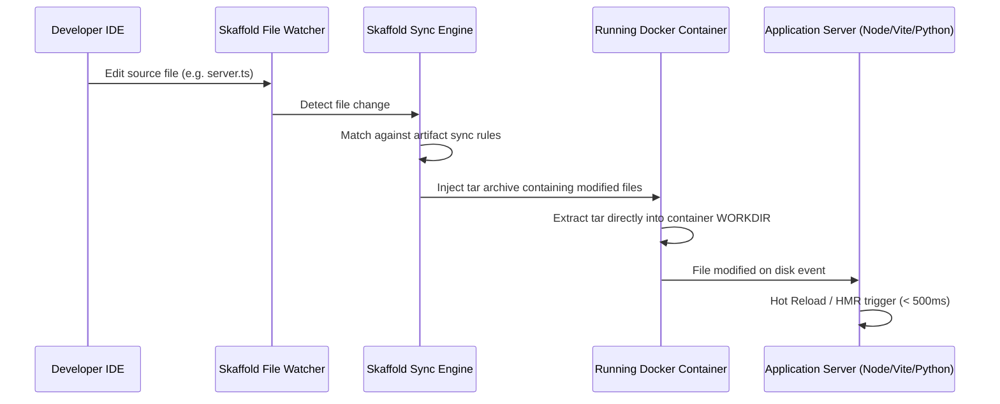

# Architectural Rationale & Mechanics: Skaffold in a Monorepo

This document explains the underlying concepts, execution models, and architectural decisions
behind integrating Skaffold for local Docker container development and near-instant hot reloading
in a multi-workspace monorepo.

---

## 1. Architectural Separation: Root vs Workspace Configurations

In a production-ready monorepo, developers encounter two distinct operational requirements:

1. **Full-System Integration Verification (Kubernetes)**:
   - Root `skaffold.yaml` targets cluster environments (Minikube, k3d, GKE, EKS).
   - Deploys full declarative Kubernetes manifests (`namespace.yaml`, `ingress.yaml`,
     `deployment.yaml`).
   - Ensures production topology alignment, network policy validation, and end-to-end integration
     testing.

2. **Isolated Bounded-Context Development (Docker Compose)**:
   - Individual workspace files (`cortex/skaffold.yaml`, `studio/skaffold.yaml`,
     `tools/skaffold.yaml`) target local Docker environments.
   - Bypasses Kubernetes cluster overhead (kubelet, etcd, network overlays, ingress controllers).
   - Utilizes Docker Compose files (`cortex/infrastructure/docker/compose.yaml`) to start service
     dependencies quickly.
   - Enables sub-second file synchronization directly into running containers.



---

## 2. In-Container File Sync Mechanics

When running `skaffold dev`, Skaffold monitors source code directories for changes. Traditional
container workflows trigger a complete image build (`docker build`), image push/tagging, and container
re-creation upon every code edit. This introduces a 15-60 second delay per iteration.

Skaffold eliminates this delay using the **File Sync Engine**:



### Sync Rule Types

- **Manual Sync (`sync.manual`)**: Explicitly pairs local file source patterns (`src`) with absolute
  or relative target locations in the container (`dest`). Option `strip` removes root path prefixes.
- **Inferred Sync (`sync.infer`)**: Inspects the `Dockerfile` instructions (`COPY` and `ADD`) to
  automatically infer container destination directories for matched source globs.
- **Auto Sync (`sync.auto`)**: Native integration with Buildpacks or Jib for automated file
  tracking.

---

## 3. Docker Deployer & Compose Integration

Skaffold v4 supports the native `docker` deployer (`deploy.docker`), allowing containers to run
directly on the local Docker daemon without a Kubernetes control plane.

Key capabilities:

- **`useCompose: true`**: Tells Skaffold to deploy container artifacts via Docker Compose.
- **Image Overrides**: Skaffold injects newly built or synced container images into matching service
  definitions declared in `compose.yaml`.
- **Resource Efficiency**: Reduces RAM and CPU consumption by omitting cluster control plane pods.

### Docker Compose Profiles Interaction (`COMPOSE_PROFILES`)

Services in `compose.yaml` configured with Compose `profiles` (e.g. `profiles: ['core']`, `profiles: ['memory']`,
`profiles: ['agents']`) are disabled by default in Docker Compose v2 unless activated.

When Skaffold executes `deploy.docker.useCompose: true`, active profiles are determined via:

1. **`COMPOSE_PROFILES` in `.env`**: Adding `COMPOSE_PROFILES=core,memory,agents` to `compose.yaml`'s `.env`
   file instructs Docker Compose to launch all profiled services automatically.
2. **Environment Variable Injection**: Executing `COMPOSE_PROFILES=core,memory skaffold dev --module cortex-dev`
   activates target profile groups during Skaffold execution.
3. **Skaffold Profile Mapping**: Mapping Skaffold `--profile` flags to set `COMPOSE_PROFILES` dynamically.

---

## 4. PNPM Monorepo Build Context & Path Resolution

In a pnpm workspace monorepo, container builds often require shared files located at the root of the
repository (such as root `package.json`, `pnpm-lock.yaml`, `pnpm-workspace.yaml`, or shared libraries).

For this reason, service build definitions in `cortex/infrastructure/docker/compose.yaml` define:

```yaml
build:
  context: ../../../
  dockerfile: cortex/memory/services/web/Dockerfile
```

Because `cortex/infrastructure/docker/compose.yaml` is nested three levels deep, `../../../` points
to the monorepo root.

When defining individual workspace Skaffold files (such as `cortex/skaffold.yaml`), the `context`
property must similarly point to the monorepo root:

```yaml
# Located at: cortex/skaffold.yaml
artifacts:
  - image: tupynambalucas-cortex-memory-web
    context: .. # Points 1 level up from cortex/ to monorepo root
    docker:
      dockerfile: cortex/memory/services/web/Dockerfile
    sync:
      manual:
        - src: 'cortex/memory/services/web/src/**/*'
          dest: /app/src
          strip: 'cortex/memory/services/web/src/'
```

### Path Resolution Summary

- **Skaffold Context (`context: ..`)**: Evaluated relative to `cortex/skaffold.yaml`, resolving to
  the monorepo root directory.
- **Dockerfile Path (`dockerfile: ...`)**: Evaluated relative to the Skaffold `context` (monorepo
  root).
- **File Sync Globs (`src: ...`)**: Evaluated relative to the Skaffold `context` (monorepo root).
- **Sync Strip Prefix (`strip: ...`)**: Matches the relative directory structure under the monorepo
  root to correctly map files to container `dest`.

---

## 5. Multi-Module Composition (`requires`)

To prevent duplicate configuration while keeping workspace isolation intact, Skaffold provides the
`requires` stanza.

A top-level configuration can import individual workspace configs:

```yaml
apiVersion: skaffold/v4beta11
kind: Config
metadata:
  name: monorepo-main
requires:
  - path: cortex/skaffold.yaml
    configs: ['cortex-dev']
  - path: studio/skaffold.yaml
    configs: ['studio-dev']
```

Benefits:

- Workspaces remain self-contained (`cd cortex && skaffold dev`).
- Monorepo leads can launch all or selected workspaces together (`skaffold dev --module cortex-dev`).
- Multi-repo or multi-directory dependency graphs are resolved automatically in execution order.

---

## 6. Root Execution with `--module` & Environment Isolation

When executing Skaffold from the monorepo root directory, developers often ask how Skaffold
handles root Kubernetes manifests vs sub-workspace Docker Compose modules.

### How `--module` Filtering Works

When you run:

```bash
skaffold dev --module cortex-dev
```

1. **Graph Filtering**: Skaffold inspects root `skaffold.yaml`, loads `requires.path: cortex/skaffold.yaml`,
   and selects **ONLY** the `cortex-dev` module.
2. **Selective Execution**: Skaffold skips root-level Kubernetes manifests (`manifests.rawYaml` /
   `deploy.kubectl`) because the root config (`tupynambalucas-root`) is not included in the target module
   filter.
3. **Automatic Path Preservation**: For required sub-configs (`requires`), Skaffold evaluates paths
   relative to the imported `skaffold.yaml` file (`cortex/skaffold.yaml`). Thus, `context: ..` points
   to the monorepo root whether executed from the root directory or inside `cortex/`.

### Environment Execution Modes Matrix

| `cd cortex && skaffold dev` | `cortex-dev` only | Local Docker Daemon | `cortex` Docker Compose services |

---

## 7. Environment Variables, Ports & Volume Injection Strategies

When separating Docker Compose development environments from Kubernetes cluster deployments,
environment variables, secrets, ports, and volumes are managed according to the target runtime.

### 1. Docker Compose Local Mode (`compose.yaml` + `.env`)

In local development, service configurations (such as database URIs, API keys, and exposed ports)
are declared inside `cortex/infrastructure/docker/compose.yaml` and loaded from `cortex/infrastructure/docker/.env`.

- **Orchestration**: `podman compose` / `docker compose` initializes service containers, networks,
  volumes, and environment variables.
- **Skaffold Dev Loop**: Skaffold builds image artifacts and streams modified source files into
  running containers via in-container File Sync (`tar` extraction).

### 2. Kubernetes Cluster Mode (`manifests.rawYaml`)

When deploying to a Kubernetes cluster (`skaffold run` or `skaffold dev`), configuration is derived
from declarative Kubernetes manifests in `cortex/infrastructure/kubernetes/`:

- **ConfigMaps & Secrets**: Environment variables (`MONGODB_URI`, `GITHUB_TOKEN`, `FIRECRAWL_API_KEY`)
  are injected via Kubernetes `ConfigMap` and `Secret` resources (`mcp-secrets`, `agentgateway-config`).
- **Services & Ingress**: Port exposure and network routing are managed by Kubernetes `Service`
  and `Ingress` controllers (Traefik).
- **Persistent Volumes**: Storage persistence is provided by `PersistentVolumeClaim` (PVC) objects.
