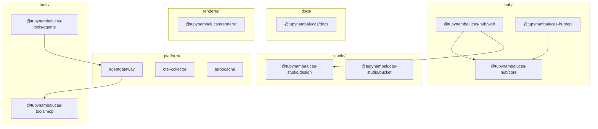

# tupynambalucas Monorepo

This repository is a monorepo containing a developer profile generator, design system, personal developer website (hub), core cluster platform, developer tools, and documentation.

---

## Workspace Structure

The project is organized into bounded contexts:

### 1. [@tupynambalucas-hub/](./hub/README.md) (`hub/`)

This is the personal developer portal. It serves as the primary website, hosting:

- Developer portfolio and project showcases.
- Technical skills inventory and experience timeline.
- Blog engine for publishing articles.
- Contact forms and integration services.

- **`@tupynambalucas-hub/web`**: React web client (`hub/services/web`).
- **`@tupynambalucas-hub/api`**: Fastify API (`hub/services/api`).
- **`@tupynambalucas-hub/core`**: Shared core library (`hub/packages/core`).

### 2. [@tupynambalucas/renderer](./renderer/README.md) (`renderer/`)

A generic dynamic asset generator and document compilation engine that supports Tailwind CSS design tokens and compiles custom repository READMEs.

### 3. [@tupynambalucas-studio/](./studio/README.md) (`studio/`)

Manages design resources, brand identity assets, and design-to-code pipelines.

- **`@tupynambalucas-studio/design`**: Brand colors, icons, tokens, assets, and Penpot editor docker configuration.
- **`@tupynambalucas-studio/bucket`**: Command-line asset synchronization script for Cloudflare R2 object storage.

### 4. [@tupynambalucas/platform](./platform/README.md) (`platform/`)

Core cluster platform services orchestrating API gateways, telemetry aggregation, and build caching.

- **`agentgateway`**: Central proxy routing LLM queries to downstream tools.
- **`monitor`**: OpenTelemetry Collector aggregating metrics, logs, and distributed traces.
- **`turbocache`**: Turborepo build caching service optimizing compilation workflows.

### 5. [@tupynambalucas-tools/](./tools/README.md) (`tools/`)

Developer automation scripts, Model Context Protocol adapters, and containerized AI engines.

- **`@tupynambalucas-tools/agents`**: Containerized terminal workspaces (Google Antigravity CLI and GitHub Copilot).
- **`@tupynambalucas-tools/github`**: Local git hooks and automated repository sanity checkers.
- **`@tupynambalucas-tools/mcp`**: Model Context Protocol (MCP) tool integration servers (GitHub, Firecrawl, Grafana, Context7, and DockerHub).

### 6. [@tupynambalucas/docs](./docs/README.md) (`docs/`)

Centralized technical reference manual and project handbook, built with Docusaurus v3.

---

## Global Commands

All major tasks are orchestrated from the monorepo root using `pnpm`.

### Core Development Lifecycle

| Command             | Action                                            |
| :------------------ | :------------------------------------------------ |
| `pnpm build`        | Compiles all packages and applications            |
| `pnpm lint`         | Runs ESLint verification across all workspaces    |
| `pnpm typecheck`    | Validates TypeScript type safety globally         |
| `pnpm format:check` | Verifies code formatting via Prettier             |
| `pnpm format:write` | Formats all source files using Prettier standards |

### Context Operations

| Context      | Launch Command         | Shutdown Command         | Description                                             |
| :----------- | :--------------------- | :----------------------- | :------------------------------------------------------ |
| **Hub**      | `pnpm hub:dev`         | `pnpm hub:down`          | Start/Stop web client, api, and database containers     |
| **Studio**   | `pnpm penpot:dev:up`   | `pnpm penpot:dev:down`   | Spin up/down collaborative design services              |
| **Platform** | `pnpm platform:dev:up` | `pnpm platform:dev:down` | Start/Stop core gateways, telemetry, and remote caching |
| **MCP**      | `pnpm mcp:dev:up`      | `pnpm mcp:dev:down`      | Spin up/down Model Context Protocol tools in dev mode   |
| **Agents**   | `pnpm agents:up`       | `pnpm agents:down`       | Launch/terminate containerized terminal clients         |

---

## Bounded Context Architecture

