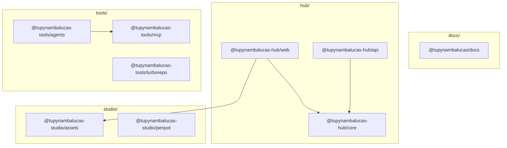

# tupynambalucas.dev Monorepo

This repository is a monorepo containing a developer profile generator, design systems, personal developer website (hub), developer tools, and documentation.

---

## Workspace Structure

The project is organized into bounded contexts:

### 1. [@tupynambalucas-hub/](./hub/README.md) (`hub/`)

This is the personal developer portal. It serves as the primary website, hosting:

- Developer portfolio and project showcases.
- Technical skills inventory and experience timeline.
- Blog engine for publishing articles.
- Contact forms and integration services.

- **`@tupynambalucas-hub/web`**: React web client (`services/web`).
- **`@tupynambalucas-hub/api`**: Fastify API (`services/api`).
- **`@tupynambalucas-hub/core`**: Shared core library (`packages/core`).

### 2. [@tupynambalucas/profile](./profile/README.md) (`profile/`)

A custom TypeScript-based automation tool that generates visualizations of GitHub user statistics and dynamically updates the GitHub profile [README.md](./README.md).

### 3. [@tupynambalucas-studio/](./studio/README.md) (`studio/`)

Manages design resources, brand identity assets, and design-to-code pipelines.

- **`@tupynambalucas-studio/assets`**: Brand colors, icons, tokens, and asset synchronization via S3/Cloudflare R2.
- **`@tupynambalucas-studio/penpot`**: Self-hosted Docker configuration for the Penpot collaborative design editor.

### 4. [@tupynambalucas-tools/](./tools/README.md) (`tools/`)

Infrastructure for workflow automation, Turborepo caching, and containerized AI environments.

- **`@tupynambalucas-tools/agents`**: Long-running containerized developer terminal sessions (Google Antigravity CLI and GitHub Copilot).
- **`@tupynambalucas-tools/github`**: Local automation scripts and git hooks.
- **`@tupynambalucas-tools/mcp`**: Model Context Protocol (MCP) gateway adapters (GitHub, Playwright Browser, Context7, Docker Hub) running as Fastify Server-Sent Events (SSE) services.
- **`@tupynambalucas-tools/turborepo`**: Self-hosted Remote Cache for optimizing build times.

### 5. [@tupynambalucas/docs](./docs/README.md) (`docs/`)

Centralized technical reference manual and project handbook, built with Docusaurus v3.

---

## Global Commands

All major tasks are orchestrated from the monorepo root using `pnpm`.

### Core Development Lifecycle

| Command             | Action                                            |
| :------------------ | :------------------------------------------------ |
| `pnpm build`        | Compiles all packages and applications            |
| `pnpm lint`         | Runs ESLint verification across all workspaces    |
| `pnpm typecheck`    | Validates TypeScript type safety globally         |
| `pnpm format:check` | Verifies code formatting via Prettier             |
| `pnpm format:write` | Formats all source files using Prettier standards |

### Context Operations

| Context    | Launch Command      | Shutdown Command      | Description                                                   |
| :--------- | :------------------ | :-------------------- | :------------------------------------------------------------ |
| **Hub**    | `pnpm hub:dev`      | `pnpm hub:down`       | Start/Stop developer web client, api, and database containers |
| **Studio** | `pnpm penpot:up`    | `pnpm penpot:down`    | Spin up/down collaborative design services                    |
| **MCP**    | `pnpm mcp:dev:up`   | `pnpm mcp:dev:down`   | Spin up/down Model Context Protocol adapters in dev mode      |
| **Agents** | `pnpm agents:up`    | `pnpm agents:down`    | Launch/terminate containerized terminal clients               |
| **Cache**  | `pnpm turborepo:up` | `pnpm turborepo:down` | Run/Stop self-hosted Remote Cache server                      |

---

## Bounded Context Architecture

