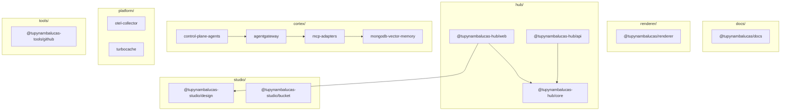

# tupynambalucas Monorepo

This repository is a monorepo containing a developer profile generator, design system,
personal developer website (hub), unified AI cortex, core cluster platform, developer tools,
and documentation.

---

## Workspace Structure

The project is organized into bounded contexts:

### 1. [@tupynambalucas-hub/](./hub/README.md) (`hub/`)

This is the personal developer portal. It serves as the primary website, hosting:

- Developer portfolio and project showcases.
- Technical skills inventory and experience timeline.
- Blog engine for publishing articles.
- Contact forms and integration services.

- **`@tupynambalucas-hub/web`**: React web client (`hub/services/web`).
- **`@tupynambalucas-hub/api`**: Fastify API (`hub/services/api`).
- **`@tupynambalucas-hub/core`**: Shared core library (`hub/packages/core`).

### 2. [@tupynambalucas/renderer](./renderer/README.md) (`renderer/`)

A generic dynamic asset generator and document compilation engine that supports Tailwind CSS design
tokens and compiles custom repository READMEs.

### 3. [@tupynambalucas-studio/](./studio/README.md) (`studio/`)

Manages design resources, brand identity assets, and design-to-code pipelines.

- **`@tupynambalucas-studio/design`**: Brand colors, icons, tokens, assets, and Penpot editor
  docker configuration.
- **`@tupynambalucas-studio/bucket`**: Command-line asset synchronization script for Cloudflare
  R2 object storage.

### 4. [@tupynambalucas/cortex](./cortex/README.md) (`cortex/`)

Unified Bounded Context for the artificial intelligence architecture, consolidating the gateway
ingress, persistent memory databases, Model Context Protocol (MCP) data plane integrations, and
control plane agent runtimes.

- **`gateway/`**: System API Ingress Gateway configuration and playground.
- **`memory/`**: Self-hosted MongoDB Vector RAG memory subsystem (core, api, web).
- **`mcp/`**: Model Context Protocol server specifications and service Dockerfiles.
- **`agents/`**: Control plane agent CLI installation scripts and state folders.

### 5. [@tupynambalucas/platform](./platform/README.md) (`platform/`)

Core cluster platform services orchestrating telemetry aggregation and build caching.

- **`monitor`**: OpenTelemetry Collector aggregating metrics, logs, and distributed traces.
- **`turbocache`**: Turborepo build caching service optimizing compilation workflows.

### 6. [@tupynambalucas-tools/](./tools/README.md) (`tools/`)

Developer automation scripts and git version control hooks.

- **`@tupynambalucas-tools/github`**: Local git hooks and automated repository sanity checkers.

### 7. [@tupynambalucas/docs](./docs/README.md) (`docs/`)

Centralized technical reference manual and project handbook, built with Docusaurus v3.

---

## Global Commands

All major tasks are orchestrated from the monorepo root using `pnpm`.

### Core Development Lifecycle

| Command             | Action                                            |
| :------------------ | :------------------------------------------------ |
| `pnpm build`        | Compiles all packages and applications            |
| `pnpm lint`         | Runs ESLint verification across all workspaces    |
| `pnpm typecheck`    | Validates TypeScript type safety globally         |
| `pnpm format:check` | Verifies code formatting via Prettier             |
| `pnpm format:write` | Formats all source files using Prettier standards |

### Context Operations

| Context         | Launch Command            | Shutdown Command            | Description                                     |
| :-------------- | :------------------------ | :-------------------------- | :---------------------------------------------- |
| **Hub**         | `pnpm hub:dev`            | `pnpm hub:down`             | Start/Stop client, api, and db containers       |
| **Studio**      | `pnpm penpot:up`          | `pnpm penpot:down`          | Spin up/down collaborative design services      |
| **Cortex Core** | `pnpm cortex:core:up`     | `pnpm cortex:core:down`     | Start/Stop AI gateways and memory containers    |
| **Cortex MCP**  | `pnpm cortex:mcp:up`      | `pnpm cortex:mcp:down`      | Spin up/down MCP tools in dev mode              |
| **Cortex Agt**  | `pnpm cortex:agents:up`   | `pnpm cortex:agents:down`   | Launch/terminate containerized terminal clients |
| **Platform**    | `pnpm platform:up`        | `pnpm platform:down`        | Start/Stop telemetry and caching services       |
| **Tools Git**   | `pnpm github:services:up` | `pnpm github:services:down` | Start/Stop Git version control CLI containers   |

---

## Bounded Context Architecture

