# tupynambalucas.dev Monorepo

High-performance, domain-driven monorepo powering the tupynambalucas.dev developer platform.
Built on TypeScript, PNPM Workspaces, and Turborepo with dual-mode orchestration across
Docker Compose and Kubernetes via Skaffold.

**Documentation**: [docs.tupynambalucas.dev](https://docs.tupynambalucas.dev)

---

## Architecture Overview

The codebase is organized into seven isolated **Bounded Contexts**, each owning its own
infrastructure manifests, Kubernetes namespace, and lifecycle scripts.
Three Skaffold modules (`platform-dev`, `cortex-dev`, `studio-dev`) compose the full local
Kubernetes development cluster, with `platform-dev` serving as the required infrastructure
foundation for all downstream modules.

```mermaid
graph TD
  direction TB

  subgraph IngressLayer ["Ingress Layer (platform namespace)"]
    Cloudflared["cloudflared Tunnel"]
    Traefik["Traefik v3.1 Ingress Controller"]
    CertManager["cert-manager (DNS-01 ACME)"]
    Cloudflared --> Traefik
  end

  subgraph PlatformServices ["Platform Services (platform namespace)"]
    OtelCol["OpenTelemetry Collector"]
    Prometheus["Prometheus"]
    Loki["Grafana Loki"]
    Tempo["Grafana Tempo"]
    Grafana["Grafana Dashboards"]
    Headlamp["Headlamp K8s UI"]
    TurboCache["Turbocache Remote Cache"]

    OtelCol -->|metrics| Prometheus
    OtelCol -->|logs| Loki
    OtelCol -->|traces| Tempo
    Grafana --> Prometheus
    Grafana --> Loki
    Grafana --> Tempo
  end

  subgraph CortexServices ["Cortex AI Services (cortex namespace)"]
    AgentGateway["AgentGateway MCP Proxy"]
    Guardrails["MCP Guardrails (CEL)"]
    MemoryAPI["Memory API (Fastify)"]
    MemoryWeb["Memory Dashboard (React)"]
    MCPInspector["MCP Inspector"]
    MongoDB[("MongoDB (Vector RAG)")]

    AgentGateway --> Guardrails
    AgentGateway --> MemoryAPI
    MemoryAPI --> MongoDB
    MemoryWeb --> MemoryAPI
  end

  subgraph StudioServices ["Studio Services (studio namespace)"]
    PenpotFE["Penpot Frontend"]
    PenpotBE["Penpot Backend"]
    PenpotExporter["Penpot Exporter"]
    PenpotAide["Penpot Aide AI (MCP)"]
    Valkey["Valkey Cache"]
    Memos["Memos Notes"]
    NeonDB[("Neon Serverless Postgres")]

    PenpotFE --> PenpotBE
    PenpotFE --> PenpotExporter
    PenpotBE --> Valkey
    PenpotBE --> NeonDB
    Memos --> NeonDB
  end

  subgraph HubServices ["Hub Services (Docker Compose)"]
    HubWeb["Web Client (React 19)"]
    HubAPI["REST API (Fastify 5)"]
    HubCore["Core Library (Zod)"]
    HubMongo[("MongoDB rs0")]
    HubRedis[("Redis / BullMQ")]

    HubWeb --> HubAPI
    HubAPI --> HubCore
    HubAPI --> HubMongo
    HubAPI --> HubRedis
  end

  Traefik --> AgentGateway
  Traefik --> Grafana
  Traefik --> Headlamp
  Traefik --> TurboCache
  Traefik --> PenpotFE
  Traefik --> Memos
  HubWeb -.->|design tokens| PenpotBE
```



---

## Bounded Contexts

### [Hub](./hub/README.md) (`hub/`)

Personal developer portal, blog engine, and administration dashboard.

| Package                    | Role        | Stack                                     |
| :------------------------- | :---------- | :---------------------------------------- |
| `@tupynambalucas-hub/web`  | Application | React 19, Vite 8, Zustand, TailwindCSS v4 |
| `@tupynambalucas-hub/api`  | Application | Fastify 5, Mongoose, BullMQ, Zod          |
| `@tupynambalucas-hub/core` | Library     | Zod schemas, shared contracts (SSOT)      |

### [Cortex](./cortex/README.md) (`cortex/`)

Unified AI processing hub with MCP gateway federation, vector memory, and agent runtimes.

| Domain     | Purpose                                           | Key Service         |
| :--------- | :------------------------------------------------ | :------------------ |
| `gateway/` | Go-based MCP ingress proxy with CEL guardrails    | `agentgateway:8080` |
| `memory/`  | MongoDB Vector RAG memory (API + React dashboard) | `memory-api:3006`   |
| `mcp/`     | Downstream MCP adapter services and tools         | Per-adapter ports   |
| `agents/`  | Containerized AI agent terminal runtimes          | Claude, Gemini CLI  |

**Skaffold Module**: `cortex-dev` (requires `platform-dev`)

### [Studio](./studio/README.md) (`studio/`)

Brand identity management, collaborative design infrastructure, and asset synchronization.

| Package / Service               | Role          | Stack                                        |
| :------------------------------ | :------------ | :------------------------------------------- |
| `@tupynambalucas-studio/assets` | Library       | CSS tokens, React SVG icons                  |
| `@tupynambalucas-studio/bucket` | CLI Tool      | AWS SDK (Cloudflare R2), Glob                |
| Penpot v2 (5 containers)        | Design Engine | Frontend, Backend, Exporter, Valkey, Aide AI |
| Memos                           | Notes         | Lightweight collaborative notes              |

**Skaffold Module**: `studio-dev` (requires `platform-dev`)

### [Platform](./platform/README.md) (`platform/`)

Always-on cluster infrastructure, observability pipelines, and build acceleration.

| Service                 | Port | Purpose                                 |
| :---------------------- | :--- | :-------------------------------------- |
| Traefik v3.1            | 80   | Kubernetes Ingress Controller           |
| OpenTelemetry Collector | 4317 | Metrics, logs, and traces aggregation   |
| Prometheus              | 9090 | Time-series metrics storage             |
| Grafana Loki            | 3100 | Log aggregation and LogQL queries       |
| Grafana Tempo           | 3200 | Distributed trace storage and TraceQL   |
| Grafana                 | 3000 | Unified observability dashboards        |
| Headlamp                | 4466 | Kubernetes cluster administration UI    |
| Turbocache              | 3000 | Turborepo remote build cache            |
| cloudflared             | -    | Cloudflare Tunnel for Zero Trust access |
| cert-manager            | -    | Automated TLS via Let's Encrypt DNS-01  |

**Skaffold Module**: `platform-dev` (base module, required by all others)

### [Renderer](./renderer/README.md) (`renderer/`)

Dynamic asset generator compiling GitHub profile stats into SVG cards and templated
Markdown documents. Powered by the GitHub GraphQL API.

### [Tools](./tools/README.md) (`tools/`)

Developer automation: containerized Git and GitHub CLI environments, repository
provisioning scripts, and commit hook tooling.

### [Docs](./docs/README.md) (`docs/`)

Centralized knowledge base built with Docusaurus v3, structured under the Diataxis
framework with full English / Portuguese (pt-BR) localization.

**Live Site**: [docs.tupynambalucas.dev](https://docs.tupynambalucas.dev)

---

## Technology Stack

| Layer                 | Technologies                                                     |
| :-------------------- | :--------------------------------------------------------------- |
| **Runtime**           | Node.js 22+, TypeScript 6, ESM modules                           |
| **Package Manager**   | PNPM v11 (Catalogs, Workspaces, strict symlinks)                 |
| **Task Orchestrator** | Turborepo (parallel pipelines, remote caching via Turbocache)    |
| **Backend**           | Fastify 5, Mongoose, BullMQ, Zod                                 |
| **Frontend**          | React 19, Vite 8, Zustand, TailwindCSS v4, GSAP, Three.js        |
| **Containers**        | Podman / Docker Compose, Kubernetes v1.30+, Skaffold v4beta11    |
| **Ingress**           | Traefik v3.1, Cloudflare Tunnel, cert-manager (DNS-01 ACME)      |
| **Observability**     | OpenTelemetry Collector, Prometheus, Grafana Loki, Grafana Tempo |
| **AI Infrastructure** | AgentGateway (Go), MCP protocol, MongoDB Vector Search           |
| **Design**            | Penpot v2 (self-hosted), Memos, Cloudflare R2                    |
| **Documentation**     | Docusaurus v3, MDX, Mermaid, Diataxis framework                  |
| **Quality**           | ESLint 10 (flat config), Prettier 3, Husky, Conventional Commits |
| **CI/CD**             | GitHub Actions, Cloudflare Pages, Changesets                     |

---

## Getting Started

### Prerequisites

Install the following on your development machine:

```bash
# Package management and container runtime
winget install RedHat.Podman-Desktop RedHat.Podman

# Kubernetes toolchain
winget install Kubernetes.minikube Kubernetes.kubectl Google.Skaffold
```

### Installation

```bash
git clone https://github.com/tupynambalucas/tupynambalucas.git
cd tupynambalucas
pnpm install
```

### Environment Configuration

Each workspace manages its own environment file under `<workspace>/infrastructure/.env`.
Copy from the provided templates:

```bash
cp cortex/infrastructure/.env.example cortex/infrastructure/.env
cp platform/infrastructure/.env.example platform/infrastructure/.env
cp studio/infrastructure/.env.example studio/infrastructure/.env
```

---

## Orchestration

The monorepo supports two parallel orchestration modes. All commands are defined in the
root [package.json](./package.json) and executed via `pnpm`.

### Kubernetes (Skaffold + Minikube)

Deploy the complete development cluster with automatic port forwarding and hot-reloading:

```bash
# Start the local Kubernetes cluster
pnpm minikube:up
pnpm minikube:tunnel    # Required in a separate terminal for LoadBalancer IPs

# Deploy the full stack (platform + cortex + studio)
pnpm k8s:dev

# Deploy individual modules
pnpm platform:dev       # Infrastructure foundation (always starts first)
pnpm cortex:dev         # AI services (auto-starts platform)
pnpm studio:dev         # Design services (auto-starts platform)

# Tear down
pnpm k8s:down           # Delete all cluster resources
```

### Docker Compose (Podman)

Run individual workspace services in standalone container mode:

```bash
# Platform observability stack
pnpm platform:up        # Start   |  pnpm platform:down   # Stop

# Cortex AI services
pnpm cortex:up          # Start   |  pnpm cortex:down     # Stop

# Studio design services
pnpm studio:up          # Start   |  pnpm studio:down     # Stop
pnpm penpot:up          # Penpot  |  pnpm memos:up        # Memos only

# Hub development
pnpm hub:dev            # API + Web + DB with hot-reload
```

### Development Domain Routing

When running in Kubernetes, services are accessible via Traefik Ingress at
`*-dev.tupynambalucas.dev` subdomains routed through Cloudflare Tunnel:

| Domain                                    | Service              | Namespace  |
| :---------------------------------------- | :------------------- | :--------- |
| `agentgateway-dev.tupynambalucas.dev`     | AgentGateway Admin   | `cortex`   |
| `agentgateway-mcp-dev.tupynambalucas.dev` | MCP Ingress          | `cortex`   |
| `grafana-dev.tupynambalucas.dev`          | Grafana Dashboards   | `platform` |
| `headlamp-dev.tupynambalucas.dev`         | Headlamp K8s UI      | `platform` |
| `traefik-dev.tupynambalucas.dev`          | Traefik Dashboard    | `platform` |
| `turbocache-dev.tupynambalucas.dev`       | Turborepo Cache      | `platform` |
| `penpot-dev.tupynambalucas.dev`           | Penpot Design Editor | `studio`   |
| `memos-dev.tupynambalucas.dev`            | Memos Notes          | `studio`   |

---

## Quality Assurance

```bash
pnpm typecheck          # TypeScript validation across all workspaces
pnpm lint               # ESLint verification across all workspaces
pnpm build              # Production build for all packages
pnpm format:check       # Prettier formatting verification
pnpm format:write       # Auto-fix formatting issues
```

---

## Versioning and Releases

The project uses [Changesets](https://github.com/changesets/changesets) for version
management and follows [Conventional Commits](https://www.conventionalcommits.org/)
for structured commit history.

```bash
pnpm version:changeset  # Create a new changeset
pnpm version:bump       # Bump versions based on changesets
pnpm version:publish    # Publish updated packages
```

---

## License

This project is licensed under the [MIT License](./LICENSE.md).
