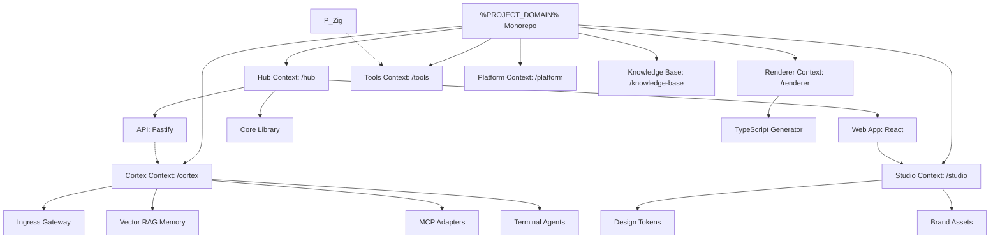

# Bounded Contexts

Utilizamos **PNPM Workspaces** com um layout **Context-Driven Root** para isolar estritamente nossos domínios de negócios. Esta arquitetura garante escalabilidade e clara separação de conceitos ao organizar a base de código em Bounded Contexts distintos na raiz.

---

## Monorepo Structure & Workspace Roles

O monorepo distingue entre diferentes contextos principais. O diagrama a seguir ilustra os contextos do workspace, as relações entre pacotes e o fluxo de dependências:

| Diretório           | Nome do Pacote        | Função             | Responsabilidade                                                                |
| :------------------ | :-------------------- | :----------------- | :------------------------------------------------------------------------------ |
| `hub/services/web`  | `@repo/hub/web`       | **Application**    | Cliente React de portfólio pessoal, blog e painel administrativo.               |
| `hub/services/api`  | `@repo/hub/api`       | **Application**    | API REST em Fastify que serve postagens do blog e manipuladores de formulários. |
| `hub/packages/core` | `@repo/hub/core`      | **Library**        | SSOT para o contexto do Hub (validação Zod, esquemas compartilhados).           |
| `cortex/`           | `@/cortex`            | **Tooling**        | Gateway de IA unificado, adaptadores MCP e executores de agentes.               |
| `renderer/`         | `@/renderer`          | **Application**    | Aplicação TypeScript que compila modelos Markdown e gera SVGs.                  |
| `studio/assets`     | `@repo/studio/assets` | **Library**        | Design tokens, logotipos, SVGs e utilitários de sincronização.                  |
| `tools/`            | `@repo/tools/*`       | **Tooling**        | Controle de versão Git isolado e automação via CLI do GitHub.                   |
| `platform/`         | `@/platform`          | **Infrastructure** | Monitoramento de telemetria e servidores de cache do Turborepo.                 |
| `knowledge-base/`   | `@/knowledge-base`    | **Docs Hub**       | Portal de desenvolvedor Docusaurus autoritativo.                                |

---

## Bounded Context Philosophy

- **Context Isolation**: Cada diretório raiz (`hub/`, `cortex/`, `renderer/`, `studio/`, `tools/`, `platform/`, `knowledge-base/`) representa um contexto de workspace isolado. Tipos, contratos e configurações são encapsulados localmente, referenciando bibliotecas externas apenas através de limites de pacotes.
- **Strict Decoupling**: A lógica de negócios do Developer Hub (`hub/`) é desacoplada do Profile Stats Compiler (`renderer/`) e do hub de processamento de IA (`cortex/`).

---

## Detailed Context Breakdown

### Hub Context (`hub/`)

Gerencia páginas de frontend de portfólio pessoal, operações de blog, persistência de formulários de contato e opções de administrador. Para documentação detalhada, consulte o **[Hub Workspace](/workspaces/hub)**.

### Cortex Context (`cortex/`)

O Bounded Context de IA consolidado. Integra o proxy de gateway de API, índices de memória persistente, adaptadores MCP downstream e sessões de terminal de desenvolvedor de IA em sandbox. Para documentação detalhada, consulte o **[Cortex Workspace](/workspaces/cortex)**.

### Renderer Context (`renderer/`)

Um gerador de assets dinâmico e motor de compilação de documentos extensível construído com TypeScript para compilar modelos markdown e renderizar gráficos SVG. Para documentação detalhada, consulte o **[Renderer Workspace](/workspaces/renderer)**.

### Studio Context (`studio/`)

A única fonte de verdade para identidade visual, ícones e variáveis CSS compartilhadas. Para documentação detalhada, consulte o **[Studio Workspace](/workspaces/studio)**.

### Tools Context (`tools/`)

O workspace de automação de desenvolvedor, isolando ferramentas de linha de comando como Git Flow e GitHub CLI. Para documentação detalhada, consulte o **[Tools Workspace](/workspaces/tools)**.

### Platform Context (`platform/`)

Orquestra pipelines do OpenTelemetry e cache remoto para acelerar os builds do desenvolvedor. Para documentação detalhada, consulte o **[Platform Workspace](/workspaces/platform)**.

### Knowledge Base Context (`knowledge-base/`)

O hub de documentação para desenvolvedores. Para documentação detalhada, consulte o **[Knowledge Base Workspace](/workspaces/knowledge-base)**.
