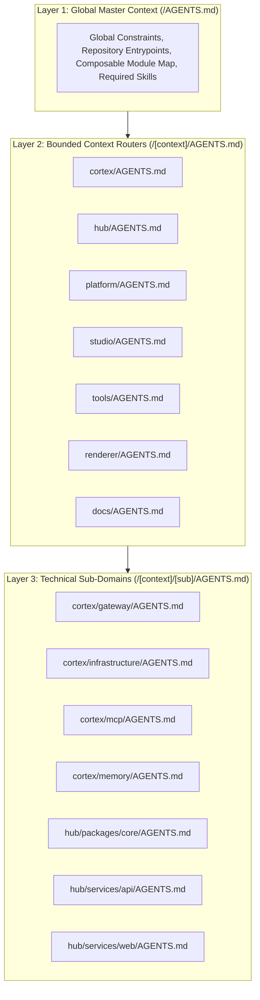

# Arquitetura de Contexto de IA no Monorepo

O monorepo **%PROJECT_DOMAIN%** organiza instruções de máquina usando um sistema de roteamento de contexto hierárquico e estruturado `AGENTS.md`. Esta arquitetura garante que os agentes de codificação de IA (como o Google Antigravity CLI e o Anthropic Claude Code) operem com precisão máxima, zero fragmentação de contexto e adesão estrita aos limites de domínio.

---

## 1. O Paradox da Fragmentação de Contexto

Em monorepos complexos, fornecer contexto de máquina em cada nível de diretório frequentemente introduz modos de falha críticos:

- **Miopia de Contexto**: Um agente que lê apenas um arquivo de configuração de nível folha atua sem consciência arquitetônica global, violando restrições de nível superior.
- **Ineficiência de Tokens e Ruído**: Concatenar dezenas de arquivos de instrução dispersos esgota a janela de contexto do LLM antes que as instruções de tarefas acionáveis sejam processadas.
- **Entropia de Desvio**: Manter as regras de domínio e a linguagem ubíqua sincronizadas em dezenas de arquivos de linguagem natural é inviável.

Para eliminar esses problemas, o monorepo implementa uma **Hierarquia de Contexto de 3 Camadas**.

---

## 2. A Hierarquia de Contexto de 3 Camadas



### Camada 1: Contexto Mestre Global (`/AGENTS.md`)

- **Escopo**: Regras de todo o repositório, pontos de entrada, módulos Skaffold compósiveis, padrões do Prettier, regras de zero emoji e habilidades globais obrigatórias.
- **Orçamento de Linhas**: Máximo de 80 linhas.

### Camada 2: Roteadores de Contexto Delimitado (`/[context]/AGENTS.md`)

- **Escopo**: Identidade de domínio, glossário de linguagem ubíqua, topologia arquitetônica, tabelas de alocação de portas e comandos locais de orquestração de ciclo de vida.
- **Orçamento de Linhas**: Máximo de 120 linhas.

### Camada 3: Subdomínios Técnicos (`/[context]/[sub]/AGENTS.md`)

- **Escopo**: Padrões de implementação específicos de tecnologia, trechos de código concretos (esquemas Zod, plugins Fastify, seletores Zustand) e scripts de build com escopo definido.
- **Orçamento de Linhas**: Máximo de 100 linhas.

---

## 3. A Diretiva de Hierarquia de Contexto

Para garantir que os agentes que operam em subdiretórios nunca percam as regras pai, cada arquivo da Camada 2 e Camada 3 começa com uma diretiva XML explícita:

```xml
<context-hierarchy>
  <parent src="../AGENTS.md" type="global-rules" />
  <system-instruction>
    AGENT: If you have not read "../AGENTS.md" in this session, stop now and read it using your
    file-reading tools before proceeding. Global constraints are mandatory.
  </system-instruction>
</context-hierarchy>
```

Quando um agente acessa um arquivo de contexto local, a instrução do sistema aciona uma chamada de ferramenta imediata para carregar o arquivo pai, estabelecendo uma cadeia ininterrupta de autoridade até a raiz do monorepo.

---

## 4. Alinhamento com o Domain-Driven Design (DDD)

Cada arquivo da Camada 2 define um glossário explícito de **Linguagem Ubíqua**. Isso evita que os agentes confundam termos entre contextos delimitados:

- No **Developer Hub (`hub/`)**, o usuário autenticado é estritamente `Customer`.
- No **Studio (`studio/`)**, as variáveis de marca são estritamente `Design Tokens`.
- No **AI Cortex (`cortex/`)**, os prompts do sistema são estritamente `Personas`.

---

## 5. O Ecossistema de Customização `.agents/`

Embora os arquivos `AGENTS.md` forneçam roteamento hierárquico e barreiras de proteção, o **comportamento ativo** da IA é definido dentro do diretório central `.agents/` na raiz do monorepo. Este diretório utiliza a arquitetura de customização Antigravity (AGY) para injetar novos recursos no agente.

O diretório `.agents/` é estritamente dividido em componentes de Domain-Driven Design:

- **`plugins/`**: Pacotes que agrupam servidores do Model Context Protocol (MCP), configurações de ciclo de vida e regras contextuais (por exemplo, o plugin `cortex` que direciona o agente a usar o `firecrawl`).
- **`rules/`**: Restrições globais ou condicionais injetadas automaticamente no prompt do agente.
- **`skills/`**: Manuais de execução de divulgação progressiva (como `agent-router-expert`) que ensinam a IA a executar tarefas complexas de várias etapas.
- **`scripts/`**: Scripts de automação criados por IA armazenados permanentemente para operações do repositório.
- **`plans/`**: Documentos de planejamento arquitetônico temporários.

Para obter uma análise técnica detalhada desta pasta, consulte a [Referência do Diretório `.agents`](/workspaces/agents/reference/dot-agents-directory).
