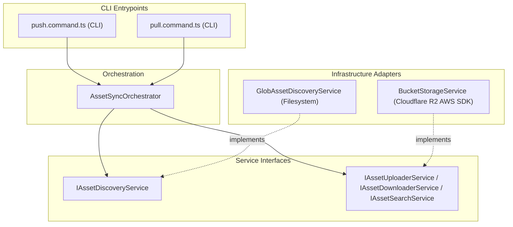

### Cloudflare R2 Storage Infrastructure

O projeto `tupynambalucas.dev` utiliza o Cloudflare R2 Object Storage (um serviço de armazenamento de objetos compatível com S3 e sem taxa de saída) para gerenciar ativos binários, projetos de design de alta fidelidade e a persistência do editor auto-hospedado.

Este documento detalha o nosso ecossistema de buckets, a CLI do motor de sincronização de ativos de design/criativos e a infraestrutura de armazenamento de objetos do editor Penpot.

---

## 1. Buckets Ecosystem

Mantemos três buckets dedicados do Cloudflare R2, cada um atendendo a um domínio distinto em nossa arquitetura:

| Bucket Name              | Access Level       | Purpose & Function                                                                                                                                          | Credentials Location                       |
| :----------------------- | :----------------- | :---------------------------------------------------------------------------------------------------------------------------------------------------------- | :----------------------------------------- |
| **`workspace-assets`**   | Public (CDN)       | Hospeda ativos prontos para a web (imagens otimizadas, SVGs, modelos GLB, arquivos EXR). Servido publicamente para frontends como `downstream consumers`.   | `studio/bucket/.env.studio.bucket`         |
| **`workspace-creative`** | Private            | Repositório para arquivos mestre brutos (Blender `.blend`, Illustrator `.ai`, Photoshop `.psd`, Premiere `.prproj`). Restrito a desenvolvedores principais. | `studio/bucket/.env.studio.bucket`         |
| **`workspace-penpot`**   | Private (Internal) | Armazena uploads de usuários, layouts, bibliotecas de vetores personalizadas e backups de documentos para a ferramenta de design Penpot auto-hospedada.     | `studio/design/infrastructure/docker/.env` |

---

## 2. Asset Synchronizer CLI (`@repo/studio/bucket`)

O pacote `@repo/studio/bucket` é um utilitário de linha de comando em TypeScript que gerencia a sincronização bidirecional (`push` e `pull`) para `workspace-assets` e `workspace-creative`.

### A. Core Software Architecture

O motor de sincronização separa as operações do sistema de arquivos dos provedores de armazenamento por meio de Injeção de dependência, utilizando o SDK do AWS S3 Client e padrões de busca Glob.



- **`AssetSyncOrchestrator`**: Executa as sequências de sincronização, comparando itens do sistema de arquivos local com metadados remotos do S3.
- **`GlobAssetDiscoveryService`**: Examina diretórios em busca de arquivos correspondentes aos padrões definidos no manifesto.
- **`BucketStorageService`**: Envolve o SDK do cliente AWS S3 para ler cabeçalhos de metadados e fazer upload/download de fluxos.

### B. Environment Configuration

Para configurar o sincronizador, defina as variáveis de ambiente dentro de `studio/bucket/.env.studio.bucket`:

```bash
# Cloudflare R2 account identifier
CLOUDFLARE_R2_ACCOUNT_ID=2a6c94a31c5d23bc9d9d1c208036a274

# Public Web Assets Bucket Configuration (CI/CD and CDN Safe)
CLOUDFLARE_R2_ASSETS_ACCESS_KEY_ID=c231f170809523e5497b1284466d95d5
CLOUDFLARE_R2_ASSETS_SECRET_ACCESS_KEY=91a48c17ec116bb500d1b1b2a0219e1f2c973b0a962f2330eae3c44682124d86
CLOUDFLARE_R2_ASSETS_BUCKET_NAME=workspace-assets
CLOUDFLARE_R2_ASSETS_PUBLIC_URL=https://pub-edba48e442fb4916915a399533123daa.r2.dev

# Private Creative/Design Bucket Configuration (Restricted to Designers)
CLOUDFLARE_R2_CREATIVE_ACCESS_KEY_ID=535cfe37f3856a9db34b9ff5b1f23464
CLOUDFLARE_R2_CREATIVE_SECRET_ACCESS_KEY=59fad25126ad07df994e4c71f9176c833bc0bb167bcec68f904923d066d12caf
CLOUDFLARE_R2_CREATIVE_BUCKET_NAME=workspace-creative
```

### C. Optimization and API Safety

Para operar dentro do nível gratuito do Cloudflare R2 (10 GB de armazenamento, 1 milhão de operações de Classe A/mês, 10 milhões de operações de Classe B/mês):

- **Verificação de Hash**: A CLI calcula a soma de verificação MD5 dos arquivos locais e os compara com o ETag do objeto remoto. Ignora as transferências se houver correspondência.
- **Descoberta Dinâmica de Arquivos**: Os arquivos são localizados dinamicamente usando o registro de manifesto `studio/design/assets/assets-manifest.json`.
- **Comando de Sincronização**: Execute `pnpm studio:bucket` a partir da raiz do monorepo para acionar a interface do assistente.

---

## 3. Penpot Objects Storage Bucket

O editor Penpot auto-hospedado usa o bucket `workspace-penpot` para armazenar arquivos de layout, ativos personalizados, imagens e avatares de usuários enviados diretamente na interface do editor.

### A. Infrastructure Configuration

O driver de armazenamento S3 é configurado dentro de `studio/design/infrastructure/docker/compose.yaml` usando variáveis carregadas de `.env`:

```bash
# S3 Bucket Configuration (Cloud)
PENPOT_OBJECTS_STORAGE_BACKEND=s3
PENPOT_OBJECTS_STORAGE_S3_ENDPOINT=https://2a6c94a31c5d23bc9d9d1c208036a274.r2.cloudflarestorage.com
PENPOT_OBJECTS_STORAGE_S3_BUCKET=workspace-penpot
PENPOT_OBJECTS_STORAGE_S3_REGION=auto
PENPOT_OBJECTS_STORAGE_S3_FORCE_PATH_STYLE=false
AWS_ACCESS_KEY_ID=61fa3e1856622b932502c049fbfad4db
AWS_SECRET_ACCESS_KEY=2c61cd452c6f56e6e0321c615b8254703ae03c2550ce5740515c86388d1088a9
```

Essas variáveis vinculam o serviço de backend do Penpot diretamente à nossa conta da Cloudflare, removendo completamente a persistência pesada de binários das camadas de volume locais do Docker.
