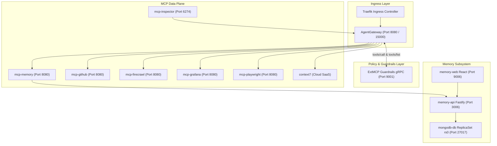

# Bounded Context: AI Cortex Router

This document defines the domain rules, architecture, and workspace navigation for the AI Cortex bounded context in the tupynambalucas.dev monorepo.

---

## 1. Bounded Context Navigation

- **[gateway/](./gateway/AGENTS.md)**: AgentGateway ingress proxy, routing, CORS policies, and administrative telemetry ([gateway/AGENTS.md](./gateway/AGENTS.md)).
- **[infrastructure/](./infrastructure/AGENTS.md)**: Kubernetes manifests, Kustomize overlays, Docker Compose profiles, and environment variables ([infrastructure/AGENTS.md](./infrastructure/AGENTS.md)).
- **[mcp/](./mcp/AGENTS.md)**: Model Context Protocol (MCP) data plane, ExtMCP gRPC guardrails, inspector, and service adapters ([mcp/AGENTS.md](./mcp/AGENTS.md)).
- **[memory/](./memory/AGENTS.md)**: Self-hosted MongoDB Vector RAG memory subsystem, Fastify API, and React Web dashboard ([memory/AGENTS.md](./memory/AGENTS.md)).

---

## 2. Bounded Context Architecture

AI Cortex consolidates ingress routing, runtime policy guardrails, Model Context Protocol (MCP) tool adapters, and persistent vector memory into a unified topology deployed on Kubernetes via Skaffold and Kustomize.

### Port Allocation & Service Mapping

| Service Name     | Internal Port | Host / Forwarded Port | Transport Protocol |
| :--------------- | :------------ | :-------------------- | :----------------- |
| `agentgateway`   | 443 / 15000   | 8080 / 15000          | Streamable HTTP    |
| `mcp-guardrails` | 9001          | 9001                  | gRPC (ExtMCP)      |
| `memory-api`     | 3006          | 3006                  | HTTP / REST        |
| `memory-web`     | 9006          | 9006                  | HTTP (Vite/Nginx)  |
| `mongodb-db`     | 27017         | 27018                 | MongoDB Wire       |
| `mcp-inspector`  | 6274 / 6277   | 6274 / 6277           | HTTP / SSE         |
| `mcp-memory`     | 8080          | 9007 (Compose) / 8080 | Streamable HTTP    |
| `mcp-github`     | 8080          | 8080 (Cluster)        | Streamable HTTP    |
| `mcp-firecrawl`  | 8080          | 8080 (Cluster)        | Streamable HTTP    |
| `mcp-grafana`    | 8080          | 8080 (Cluster)        | Streamable HTTP    |
| `mcp-playwright` | 8080          | 8080 (Cluster)        | Streamable HTTP    |

---

## 3. Operational & Networking Guardrails

- **Host Application Resolution**: When containerized MCP tools (such as Playwright MCP or Firecrawl MCP) access local development applications running on the host machine, agents MUST resolve them using `http://host.docker.internal:<port>`:
  - **docs** (Docusaurus dev server): `http://host.docker.internal:3002`
  - **hub-web** (Vite/React dev server): `http://host.docker.internal:5173`
  - **hub-api** (Fastify REST API): `http://host.docker.internal:3000`
- **Credential Separation**: API keys and tokens MUST be configured via [.env](./infrastructure/.env) and referenced through Kubernetes Secrets (`cortex-secrets`) or Compose environment variables. Hardcoding credentials is strictly forbidden.
- **Fail-Open Policy Resilience**: ExtMCP guardrail handlers MUST catch exceptions and fall back to `{ pass: {} }` to prevent service disruptions when processing untracked methods.
- **Strict Relative Linking**: All Markdown links within this context MUST use relative filesystem paths without backtick wrappers around the link structure.

---

## 4. Local Lifecycle Commands

| Target Runtime            | Purpose                          | Command                 |
| :------------------------ | :------------------------------- | :---------------------- |
| **Kubernetes (Skaffold)** | Start hot-reload dev cluster     | `pnpm cortex:dev`       |
| **Kubernetes (Skaffold)** | Clean cluster resources & cache  | `pnpm cortex:clean`     |
| **Kubernetes (Skaffold)** | Stop all Kubernetes deployments  | `pnpm cortex:stop`      |
| **Docker Compose**        | Boot standalone container stack  | `pnpm cortex:up`        |
| **Docker Compose**        | Stop standalone container stack  | `pnpm cortex:down`      |
| **Docker Compose**        | View container logs in real time | `pnpm cortex:logs`      |
| **Docker Compose**        | Reset containers and re-deploy   | `pnpm cortex:reset`     |
| **Type Checking**         | Verify TypeScript compilation    | `pnpm cortex:typecheck` |
| **Linting**               | Verify ESLint standards          | `pnpm cortex:lint`      |
