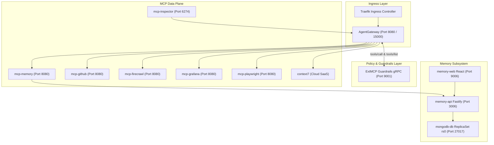

<context-hierarchy>
  <parent src="../AGENTS.md" type="global-rules" />
  <system-instruction>
    AGENT: If you have not read "../AGENTS.md" in this session, stop now and read it using your
    file-reading tools before proceeding. Global constraints are mandatory.
  </system-instruction>
</context-hierarchy>

# Bounded Context: AI Cortex Router

This document defines the domain rules, architecture, and workspace navigation for the AI Cortex bounded context in the tupynambalucas.dev monorepo.

---

## 1. Bounded Context Navigation

- **[gateway/](./gateway/AGENTS.md)**: AgentGateway ingress proxy, routing, CORS policies, and administrative telemetry.
- **[infrastructure/](./infrastructure/AGENTS.md)**: Kubernetes manifests, Kustomize overlays, Docker Compose profiles, and environment variables.
- **[mcp/](./mcp/AGENTS.md)**: Model Context Protocol (MCP) data plane, ExtMCP gRPC guardrails, inspector, and service adapters.
- **[memory/](./memory/AGENTS.md)**: Self-hosted MongoDB Vector RAG memory subsystem, Fastify API, and React Web dashboard.

---

## 1.5. Ubiquitous Language

| Term           | Definition                                                                      | Forbidden Synonyms |
| :------------- | :------------------------------------------------------------------------------ | :----------------- |
| `AgentGateway` | The central MCP ingress proxy routing tool calls to downstream adapters         | API gateway, proxy |
| `MCP Tool`     | A registered function exposed by a downstream MCP service adapter               | endpoint, function |
| `Guardrail`    | The ExtMCP gRPC policy processor validating and mutating tool call payloads     | middleware, filter |
| `Memory`       | The MongoDB Vector RAG subsystem storing episodic and semantic agent data       | database, storage  |
| `Persona`      | A static system prompt configuration defining an agent's behavior and expertise | role, profile      |

---

## 2. Bounded Context Architecture

AI Cortex consolidates ingress routing, runtime policy guardrails, Model Context Protocol (MCP) tool adapters, and persistent vector memory into a unified topology deployed on Kubernetes via Skaffold and Kustomize.

### Port Allocation & Service Mapping

| Service Name     | Internal Port | Host / Forwarded Port | Transport Protocol |
| :--------------- | :------------ | :-------------------- | :----------------- |
| `agentgateway`   | 443 / 15000   | 8080 / 15000          | Streamable HTTP    |
| `mcp-guardrails` | 9001          | 9001                  | gRPC (ExtMCP)      |
| `memory-api`     | 3006          | 3006                  | HTTP / REST        |
| `memory-web`     | 9006          | 9006                  | HTTP (Vite/Nginx)  |
| `mongodb-db`     | 27017         | 27018                 | MongoDB Wire       |
| `mcp-inspector`  | 6274 / 6277   | 6274 / 6277           | HTTP / SSE         |
| `mcp-memory`     | 8080          | 9007 (Compose) / 8080 | Streamable HTTP    |
| `mcp-github`     | 8080          | 8080 (Cluster)        | Streamable HTTP    |
| `mcp-firecrawl`  | 8080          | 8080 (Cluster)        | Streamable HTTP    |
| `mcp-grafana`    | 8080          | 8080 (Cluster)        | Streamable HTTP    |
| `mcp-playwright` | 8080          | 8080 (Cluster)        | Streamable HTTP    |

---

## 3. Operational & Networking Guardrails

- **Host Application Resolution**: Containerized MCP tools accessing host apps MUST use `http://host.docker.internal:<port>` (docs `:3002`, hub-web `:5173`, hub-api `:3000`).
- **Credential Separation**: API keys and tokens MUST be configured via [.env](./infrastructure/.env) and referenced through Kubernetes Secrets (`cortex-secrets`) or Compose variables.
- **Fail-Open Policy Resilience**: ExtMCP guardrail handlers MUST catch exceptions and fall back to `{ pass: {} }` to prevent service disruptions.
- **Strict Relative Linking**: All Markdown links within this context MUST use relative filesystem paths without backtick wrappers.

---

## 3.5. Regras de Memória Cognitiva (Agent Behavior)

To ensure this robust MongoDB Enterprise RAG architecture is used effectively, AI agents MUST follow these autonomous trigger rules:

- **Search-First Policy:** Always use the \`search_knowledge\` MCP tool BEFORE generating new artifacts, answering about domain structure (cortex, platform, studio), or implementing infrastructure configurations. Use dynamic \`filter\` constraints when applicable.
- **Entity Expansion:** If a search result returns an incomplete chunk (e.g. \`doc_chunk\`), use the \`resolve_graph_entity\` tool to traverse the Property Graph (using \`BELONGS_TO\` or \`NEXT_CHUNK\`) and read the full context.
- **State Persistence:** Whenever the user makes an architectural decision, chooses a framework, or alters a business rule, invoke \`store_episodic\` with \`role: 'system'\` to record it for future agent sessions.

---

## 4. Local Lifecycle Commands

| Target Runtime            | Purpose                 | Command                 |
| :------------------------ | :---------------------- | :---------------------- |
| **Kubernetes (Skaffold)** | Start dev cluster       | `pnpm cortex:dev`       |
| **Kubernetes (Skaffold)** | Clean resources & cache | `pnpm cortex:clean`     |
| **Kubernetes (Skaffold)** | Stop deployments        | `pnpm cortex:stop`      |
| **Docker Compose**        | Boot standalone stack   | `pnpm cortex:up`        |
| **Docker Compose**        | Stop standalone stack   | `pnpm cortex:down`      |
| **Docker Compose**        | View container logs     | `pnpm cortex:logs`      |
| **Docker Compose**        | Reset and re-deploy     | `pnpm cortex:reset`     |
| **Code Verification**     | Typecheck and lint      | `pnpm cortex:typecheck` |
