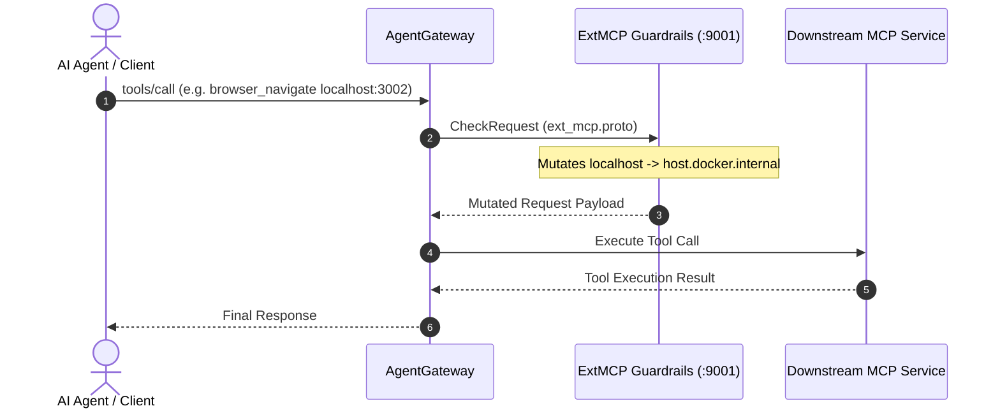

# AgentGateway ExtMCP Guardrail Server

The `cortex/mcp/guardrails` workspace provides the standalone gRPC ExtMCP policy processor (`@tupynambalucas-cortex/mcp-guardrails`) for AgentGateway in the AI Cortex subsystem.

---

## Technology Stack

- **Runtime**: Node.js 22, TypeScript
- **Communication Protocol**: gRPC (`@grpc/grpc-js`, `@grpc/proto-loader`), Protocol Buffers
- **Port**: `9001` (Internal gRPC service)

---

## Architecture Overview

The ExtMCP Guardrail service implements the AgentGateway ExtMCP gRPC protocol to gate, validate, and mutate Model Context Protocol (MCP) method calls before reaching downstream containers or returning to AI agents:

---

## Key Responsibilities

1. **Host URL Mutation**: Intercepts `tools/call` requests (e.g. `browser_navigate`) and transforms `localhost` or `127.0.0.1` targets into `host.docker.internal` for seamless container-to-host connectivity.
2. **Tool Listing Enrichment**: Modifies `tools/list` responses to enrich tool descriptions with operational instructions from each service's `instructions.md`.
3. **Fail-Safe Processing**: Catches internal payload parsing exceptions and gracefully falls back to pass-through behavior (`pass: {}`).

---

## Development Scripts

- `pnpm dev`: Runs TypeScript compiler in watch mode.
- `pnpm build`: Compiles TypeScript source to `dist/`.
- `pnpm start`: Runs production Node.js gRPC server.
- `pnpm typecheck`: Validates TypeScript type compliance.
