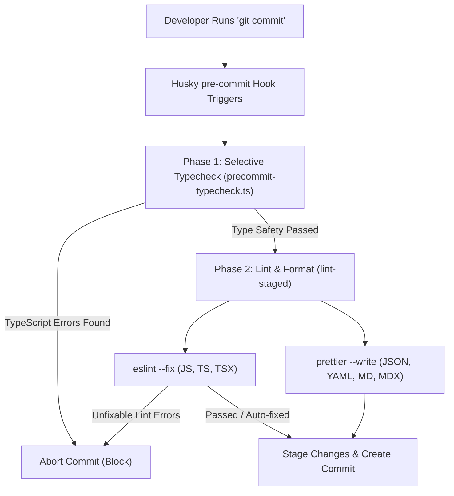

# GitHub Standards

This document outlines the professional branching and release strategy for **Elo Orgânico**, combining the structural discipline of **Git Flow** with the collaboration power of the **GitHub CLI (`gh`)**.

---

## Branching Model

We follow the standard Git Flow model to ensure the stability of our production code, adapted for our monorepo structure.

| Branch          | Purpose                                                | Stability        |
| :-------------- | :----------------------------------------------------- | :--------------- |
| **`main`**      | Production releases. Every commit is a tagged release. | **Ultra Stable** |
| **`develop`**   | Next release development. Integration branch.          | **Stable**       |
| **`feature/*`** | New features or UI changes. Branch off `develop`.      | Experimental     |
| **`bugfix/*`**  | Bug fixes for the next development cycle.              | Experimental     |
| **`release/*`** | Preparation for a new production release.              | Final Polish     |
| **`hotfix/*`**  | Critical bug fixes for the production version.         | Urgent           |
| **`support/*`** | Long-term support branches for older major releases.   | Stable           |

### Git Flow CLI Configuration

Our local repository is configured with the following prefixes and tag rules:

```ini
Branch name for production releases: main
Branch name for "next release" development: develop
Feature branch prefix: feature/
Bugfix branch prefix: bugfix/
Release branch prefix: release/
Hotfix branch prefix: hotfix/
Support branch prefix: support/
Version tag prefix: v
```

---

## Tooling Requirements

To follow this workflow efficiently, we recommend:

1.  **Git Flow CLI (AVH Edition)**: Usually included in Git for Windows or available via `gitflow` package.
2.  **GitHub CLI (`gh`)**: Used for Pull Requests, status monitoring, and official releases.

---

## Commit Standards (Conventional Commits)

To maintain a clean and automated history, all commits must follow the **[Conventional Commits](https://www.conventionalcommits.org/)** specification.

**Format:** `<type>(<scope>): <description>`

### Types

- **feat**: A new feature (correlates with `MINOR` in SemVer).
- **fix**: A bug fix (correlates with `PATCH` in SemVer).
- **docs**: Documentation only changes.
- **style**: Changes that do not affect the meaning of the code (white-space, formatting, etc).
- **refactor**: A code change that neither fixes a bug nor adds a feature.
- **perf**: A code change that improves performance.
- **test**: Adding missing tests or correcting existing tests.
- **chore**: Changes to the build process or auxiliary tools/libraries.

### Monorepo Scopes

Use the context or package name as the scope:

- **`instance`**: Changes to the Community Instance apps or core.
- **`portal`**: Changes to the Global Portal apps or core.
- **`core`**: Changes to shared domain logic.
- **`studio`**: Design tokens, assets, or Penpot configuration.
- **`tools`**: MCP servers, scripts, or infrastructure.
- **`deps`**: Dependency updates (managed via catalogs).

**Example:** `feat(instance): add Pix payment reconciliation to checkout`

---

## Commit Validation & CI Hooks

To maintain code quality, styling consistency, and type safety across the **Elo Orgânico** monorepo, we use an automated pipeline that checks all changes before they are committed locally and before they are merged in the cloud.

### Local Validation Architecture (Pre-commit)

When you execute a `git commit` command, Git automatically intercepts the action and executes a local validation pipeline. If any step in this pipeline fails, the commit is blocked.

The local validation executes in two sequential phases:



---

### Selective Workspace Typechecking

Running a full typecheck across all monorepo packages (`pnpm typecheck`) can take several seconds. To keep the commit process fast, we use a custom script located at [precommit-typecheck.ts](file:///D:/projects/elo-organico/tools/scripts/precommit-typecheck.ts).

#### How it Works

1. The script inspects the currently staged files using `git diff --cached --name-only`.
2. It detects the file extensions: if no JavaScript or TypeScript files have changed, it skips typechecking completely.
3. It maps the changed files to their corresponding monorepo workspaces:
   - Files in `instance/` $\rightarrow$ typecheck `@elo-instance/*` packages.
   - Files in `studio/` $\rightarrow$ typecheck `@elo-studio/assets`.
   - Files in `tools/` $\rightarrow$ typecheck `@elo-organico/tools`.
   - Files in `docs/` $\rightarrow$ typecheck `@elo-organico/docs`.
   - Files in `portal/` $\rightarrow$ typecheck `@elo-portal/*`.
4. If global configuration or root files (e.g. `package.json`, `eslint.config.ts`, `pnpm-workspace.yaml`) are modified, the script runs a full typecheck (excluding `portal` until it is updated).
5. It executes the targeted typecheck in parallel using Turborepo filters (e.g., `npx turbo run typecheck --filter=@elo-instance/*`).

:::tip[Performance Advantage]
If you only modify files in the `tools` workspace, only the tools project is typechecked, which takes less than 1.5 seconds. If you only modify documentation (`.md` or `.mdx` files), the typecheck is skipped entirely.
:::

---

### Linting and Formatting (lint-staged)

Once typechecking passes, Husky triggers `lint-staged`, which runs linters and formatters only on the staged files.

#### Configuration

The rules are declared in the root [package.json](file:///D:/projects/elo-organico/package.json):

```json
  "lint-staged": {
    "**/*.{js,mjs,ts,tsx,mdx}": [
      "eslint --fix"
    ],
    "**/*.{json,yaml,md,css,html}": [
      "prettier --write"
    ]
  }
```

:::note[Prettier Integration]
For JavaScript, TypeScript, and TSX files, we do not run the standalone Prettier CLI. Instead, Prettier runs as an ESLint rule via `eslint-plugin-prettier`. Running `eslint --fix` formats the code according to [shared/config/prettierrc.json](file:///D:/projects/elo-organico/shared/config/prettierrc.json) and checks for code quality issues in a single execution.
:::

---

### Remote Validation (GitHub Actions CI)

Local Git hooks can be bypassed (e.g. using `git commit --no-verify`). To prevent unvalidated code from reaching stable branches, we run a Continuous Integration (CI) workflow in GitHub on every push and Pull Request.

The workflow configuration is defined in [.github/workflows/ci.yaml](file:///D:/projects/elo-organico/.github/workflows/ci.yaml):

- It installs dependencies using `pnpm install --frozen-lockfile`.
- It executes the full typecheck suite: `pnpm typecheck --filter=!@elo-portal/*`.
- It validates code style and quality: `pnpm lint --filter=!@elo-portal/*`.

:::caution[Branch Protection]
Repository administrators must configure branch protection rules on GitHub for `main` and `develop` branches. Enable the option **Require status checks to pass before merging** and select **Validate Types & Lint** to prevent merging PRs with failing builds.
:::

---

## Contribution Workflow

### 1. Starting a New Feature

Always branch off from `develop`. See the [Command Reference](../commands-reference.mdx#git--version-control) for the exact `git flow` command.

### 2. Collaborating and Proposing Changes

Instead of merging locally, we use **Pull Requests** for code review and CI validation.

1.  **Push your branch** to the remote repository.
2.  **Create a Pull Request** targeting `develop` (refer to the [Command Reference](../commands-reference.mdx#git--version-control) for the `gh pr` command).

### 3. Senior Merge Strategy (Squash & Merge)

To keep the `develop` history clean and meaningful, we use **Squash Merges**. This combines all commits from a feature branch into a single, well-described commit in `develop`.

- **Action**: Merge via GitHub UI or CLI using the `squash` method (see the [Command Reference](../commands-reference.mdx#git--version-control) for the exact CLI command).

---

## Release & Versioning Workflow (Changesets)

We use **Changesets** combined with **GitHub Actions** to automate our versioning, changelog compilation, and release Pull Requests. Developers do not bump package versions manually in `package.json` files.

### 1. Generating a Changeset (Local)

When your feature or bug fix is ready and before opening a Pull Request:

1. Run the interactive changeset tool from the repository root (see the [Command Reference](../commands-reference.mdx#git--version-control)).
2. Select the package(s) that were modified using the spacebar.
3. Choose the appropriate SemVer bump level (Major for breaking changes, Minor for new backwards-compatible features, or Patch for bug fixes).
4. Provide a clear, technical description of the change (in English, conforming to our commit standards).
5. A temporary markdown file will be created under the `.changeset/` directory (e.g., `.changeset/warm-dogs-run.md`).
6. Commit this markdown file alongside your code and push it with your feature branch.

:::tip[Keep Changesets Small]
Create one changeset per isolated change. If a feature branch has multiple independent fixes or additions, you can run `pnpm version:changeset` multiple times to generate separate notes for each.
:::

### 2. Automated Versioning Pipeline (GitHub Actions)

Our CI/CD workflow handles the version bumping automatically when code is integrated:

1. **Pull Request & Integration**: Developers open a Pull Request targeting the `develop` branch.
2. **Merge to `develop`**: Once approved and merged into `develop`, the **Manage Version Bumps and Releases** GitHub Action is triggered.
3. **Release PR Generation**:
   - The workflow parses the `.changeset/*.md` files present in the branch.
   - It calculates the new versions, consumes (deletes) the temporary changeset markdown files, bumps the respective `package.json` files, and updates the local package changelogs.
   - It automatically commits these changes and creates (or updates) an open Pull Request on GitHub named `chore(release): version packages` targeting `develop`.

### 3. Finalizing the Release (Maintainers Only)

To publish and finalize the release:

1. Open the automated Pull Request `chore(release): version packages` in GitHub.
2. Review the compiled version changes and changelogs.
3. Merge the Pull Request into `develop`. Because the changeset files have already been consumed and deleted, merging this PR consolidates the bumped package versions in the repository.

:::info[No Manual Version Bumps]
Never edit the `"version"` field in a package's `package.json` manually during a normal feature branch. Always rely on `pnpm version:changeset` and let the GitHub Action pipeline manage the releases.
:::

---

## Critical Fixes (Hotfixes)

If a bug is found in production:

1.  Start and finish a hotfix branch.
2.  See the [Command Reference](../commands-reference.mdx#git--version-control) for the exact `git flow hotfix` commands.
3.  Sync both `main` and `develop`.

---

## GitHub Actions & Workflow Standards

To keep our CI/CD pipelines highly maintainable and efficient, we enforce the following architectural rules for all repository workflows:

- **Reusable CI Modules**: Workflows under `.github/workflows/` must not duplicate environment setup logic. Shared behaviors (such as node execution, PNPM installations, and cache configurations) are extracted into independent **GitHub Composite Actions** in `.github/actions/`.

---

## Prohibited Practices

- **No direct commits to `main` or `develop`**: Always use feature branches and PRs.
- **No Force Pushes**: Unless on your own isolated feature branch and required for a rebase.
- **No Dirty Merges**: Avoid merging `main` back into `feature/*`. Always **rebase** onto `develop` if your feature branch becomes outdated.

---

## Implementation Blueprints

### Reusable CI Component: `.github/actions/setup-pnpm-env/action.yml` (SRP)

Instead of duplicating dependencies setups across GitHub workflows, extract them into a composite action:

```yaml
name: 'Setup PNPM Environment'
description: 'Installs Node, PNPM, and configures dependency caching'

inputs:
  node-version:
    description: 'Node.js version to use'
    required: false
    default: '22'

runs:
  using: 'composite'
  steps:
    - name: Checkout Repository
      uses: actions/checkout@v6
      with:
        fetch-depth: 0

    - name: Install pnpm
      uses: pnpm/action-setup@v6

    - name: Setup Node
      uses: actions/setup-node@v6
      with:
        node-version: ${{ inputs.node-version }}
        cache: 'pnpm'

    - name: Install Dependencies
      shell: bash
      run: pnpm install
```

### Decoupled Script Contract: `sync_repo_secrets_variables.sh` (DIP)

This script depends strictly on environment-injected parameters, completely abstracting physical disk paths on the runner machine:

```bash
#!/usr/bin/env bash

set -euo pipefail

log_info() {
  echo "[GH-CLI INFO] $(date '+%Y-%m-%d %H:%M:%S') - $1"
}

log_error() {
  echo "[GH-CLI ERROR] $(date '+%Y-%m-%d %H:%M:%S') - $1" >&2
}

# Verify dependencies are injected via the environment
if [[ -z "${SECRETS_DIR:-}" ]]; then
  log_error "Required environment variable SECRETS_DIR is undefined."
  exit 1
fi

if [[ -z "${VARIABLES_FILE:-}" ]]; then
  log_error "Required environment variable VARIABLES_FILE is undefined."
  exit 1
fi

log_info "Reading variables from: $VARIABLES_FILE"
log_info "Scanning secrets directory: $SECRETS_DIR"

if [[ ! -f "$VARIABLES_FILE" ]]; then
  log_error "Variables file not found at: $VARIABLES_FILE"
  exit 1
fi

log_info "Synchronization completed successfully."
```

### Decoupled Orchestrator: `compose.yaml` (DIP & ISP)

The orchestrator maps concrete files to the abstract targets required by the container boundary and injects host-level variables loaded automatically from `.env`:

```yaml
services:
  gh-secrets:
    build:
      context: ../../services/gh
      dockerfile: Dockerfile
    container_name: github-gh-secrets
    volumes:
      - ../../:/workspace
    env_file:
      - ../../services/gh/.env.gh
    environment:
      - GH_TOKEN=${GH_TOKEN}
    working_dir: /workspace
    command: ['/workspace/services/gh/src/sync_repo_secrets_variables.sh']
```

---

:::tip[Extensibility Benefits]
Under this layout, adding a new tooling container (e.g., `sentry-uploader` or `sonar-scanner`) is as simple as dropping a directory under `services/`, establishing its `.env` requirements, and registering it in `/infrastructure/docker/compose.yaml`. The existing core actions, workflows, and configuration directories remain locked and completely secure.
:::

---

_Adherence to this workflow ensures a clean history and high-quality software distribution._
