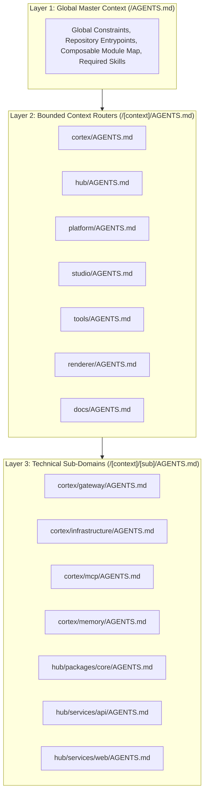

# AI Context Architecture in the Monorepo

The **tupynambalucas.dev** monorepo organizes machine instructions using a structured, hierarchical `AGENTS.md` context routing system. This architecture ensures AI coding agents (such as Google Antigravity CLI and Anthropic Claude Code) operate with maximum accuracy, zero context fragmentation, and strict adherence to domain boundaries.

---

## 1. The Context Fragmentation Paradox

In complex monorepos, providing machine context at every directory depth often introduces critical failure modes:

- **Context Myopia**: An agent reading only a leaf-node configuration file acts without global architectural awareness, violating top-level constraints.
- **Token Inefficiency & Noise**: Concatenating dozens of scattered instruction files exhausts the LLM context window before actionable task instructions are processed.
- **Drift Entropy**: Maintaining domain rules and ubiquitous language in sync across dozens of natural language files is unmanageable.

To eliminate these issues, the monorepo implements a **3-Layer Context Hierarchy**.

---

## 2. The 3-Layer Context Hierarchy



### Layer 1: Global Master Context (`/AGENTS.md`)

- **Scope**: Repository-wide rules, entrypoints, composable Skaffold modules, Prettier standards, zero-emoji rules, and global required skills.
- **Line Budget**: Maximum 80 lines.

### Layer 2: Bounded Context Routers (`/[context]/AGENTS.md`)

- **Scope**: Domain identity, ubiquitous language glossary, architectural topology, port allocation tables, and local lifecycle orchestration commands.
- **Line Budget**: Maximum 120 lines.

### Layer 3: Technical Sub-Domains (`/[context]/[sub]/AGENTS.md`)

- **Scope**: Technology-specific implementation patterns, concrete code snippets (Zod schemas, Fastify plugins, Zustand selectors), and scoped build scripts.
- **Line Budget**: Maximum 100 lines.

---

## 3. The Context Hierarchy Directive

To guarantee that agents operating in sub-directories never miss parent rules, every Layer-2 and Layer-3 file begins with an explicit XML directive:

```xml
<context-hierarchy>
  <parent src="../AGENTS.md" type="global-rules" />
  <system-instruction>
    AGENT: If you have not read "../AGENTS.md" in this session, stop now and read it using your
    file-reading tools before proceeding. Global constraints are mandatory.
  </system-instruction>
</context-hierarchy>
```

When an agent accesses a local context file, the system instruction triggers an immediate tool call to load the parent file, establishing an unbroken chain of authority up to the monorepo root.

---

## 4. Alignment with Domain-Driven Design (DDD)

Each Layer-2 file defines an explicit **Ubiquitous Language** glossary. This prevents agents from conflating terms across bounded contexts:

- In the **Developer Hub (`hub/`)**, the authenticated user is strictly `Customer`.
- In the **Studio (`studio/`)**, brand variables are strictly `Design Tokens`.
- In the **AI Cortex (`cortex/`)**, system prompts are strictly `Personas`.
