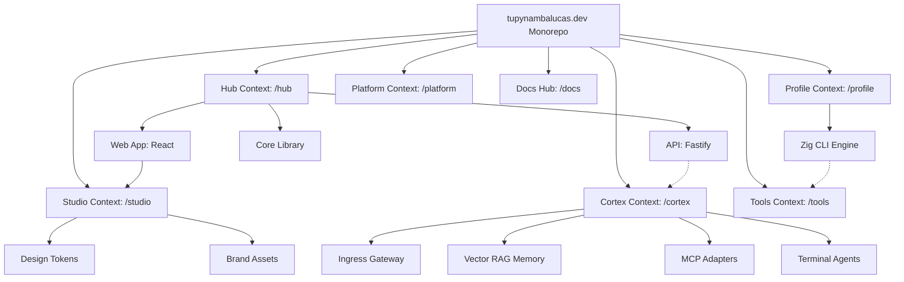

# Bounded Contexts

We use **PNPM Workspaces** with a **Context-Driven Root** layout to strictly isolate our business domains. This architecture ensures scalability and clear separation of concerns by organizing the codebase into distinct Bounded Contexts at the root.

---

## Monorepo Structure & Workspace Roles

The monorepo distinguishes between different core contexts. The following diagram illustrates the workspace contexts, package relationships, and dependency flow:

| Directory           | Package Name                    | Role               | Responsibility                                                  |
| :------------------ | :------------------------------ | :----------------- | :-------------------------------------------------------------- |
| `hub/services/web`  | `@tupynambalucas-hub/web`       | **Application**    | Personal portfolio React client, blog, and admin dashboard.     |
| `hub/services/api`  | `@tupynambalucas-hub/api`       | **Application**    | Fastify REST API serving blog posts and form handlers.          |
| `hub/packages/core` | `@tupynambalucas-hub/core`      | **Library**        | SSOT for the Hub context (Zod validation, shared schemas).      |
| `cortex/`           | `@tupynambalucas/cortex`        | **Tooling**        | Unified AI gateway, MCP adapters, and agent runners.            |
| `profile/`          | `@tupynambalucas/profile`       | **Application**    | Zig CLI application compiling GitHub stats and generating SVGs. |
| `studio/assets`     | `@tupynambalucas-studio/design` | **Library**        | Design tokens, logos, SVGs, and sync utilities.                 |
| `tools/`            | `@tupynambalucas-tools/*`       | **Tooling**        | Isolated Git version control and GitHub CLI automation.         |
| `platform/`         | `@tupynambalucas/platform`      | **Infrastructure** | Telemetry monitoring and Turborepo cache servers.               |
| `docs/`             | `@tupynambalucas/docs`          | **Docs Hub**       | Authoritative Docusaurus developer portal.                      |

---

## Bounded Context Philosophy

- **Context Isolation**: Each root directory (`hub/`, `cortex/`, `profile/`, `studio/`, `tools/`, `platform/`, `docs/`) represents an isolated workspace context. Types, contracts, and configurations are encapsulated locally, referencing external libraries only through package boundaries.
- **Strict Decoupling**: Business logic from the Developer Hub (`hub/`) is decoupled from the Profile Stats Compiler (`profile/`) and the AI processing hub (`cortex/`).

---

## Detailed Context Breakdown

### Hub Context (`hub/`)

Manages personal portfolio frontend pages, blog operations, contact form persistence, and administrator options. For detailed documentation, see the **[Hub Workspace](/workspaces/hub)**.

### Cortex Context (`cortex/`)

The consolidated AI Bounded Context. Integrates the API gateway proxy, persistent memory indexes, downstream MCP adapters, and sandboxed AI developer terminal sessions. For detailed documentation, see the **[Cortex Workspace](/workspaces/cortex)**.

### Renderer Context (`renderer/`)

An extensible Dynamic Asset Generator and Document Compilation Engine built with TypeScript to compile markdown templates and render SVG charts. For detailed documentation, see the **[Renderer Workspace](/workspaces/renderer)**.

### Studio Context (`studio/`)

The single source of truth for visual identity, icons, and shared CSS variables. For detailed documentation, see the **[Studio Workspace](/workspaces/studio)**.

### Tools Context (`tools/`)

The developer automation workspace, isolating command-line tools like Git Flow and GitHub CLI. For detailed documentation, see the **[Tools Workspace](/workspaces/tools)**.

### Platform Context (`platform/`)

Orchestrates OpenTelemetry pipelines and remote caching to accelerate developer builds. For detailed documentation, see the **[Platform Workspace](/workspaces/platform)**.

### Docs Context (`docs/`)

The developer documentation hub. For detailed documentation, see the **[Docs Workspace](/workspaces/docs)**.
