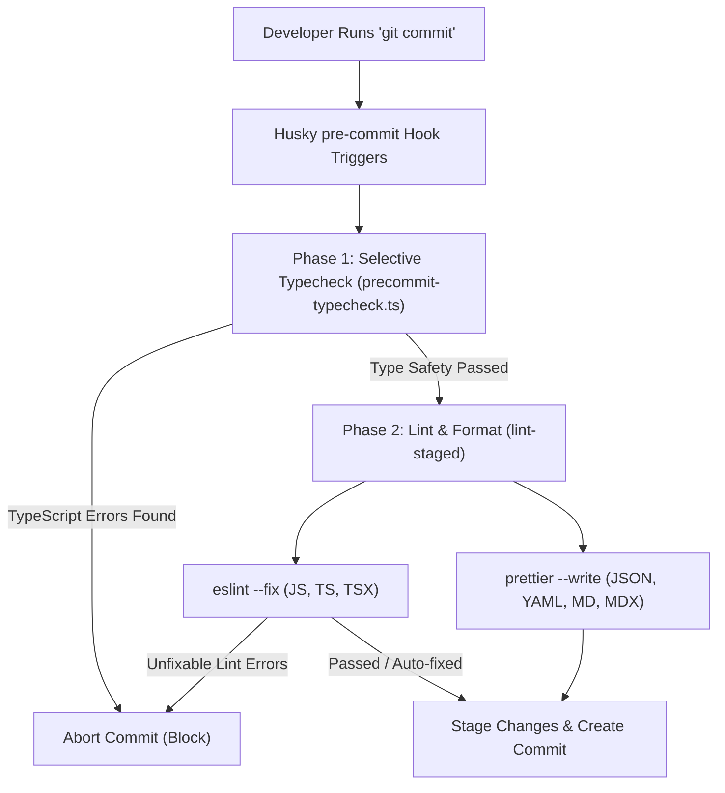

# Commit Conventions & CI

To maintain a clean and automated history, all commits must follow the **[Conventional Commits](https://www.conventionalcommits.org/)** specification.

**Format:** `<type>(<scope>): <description>`

### Types

- **feat**: A new feature (correlates with `MINOR` in SemVer).
- **fix**: A bug fix (correlates with `PATCH` in SemVer).
- **docs**: Documentation only changes.
- **style**: Changes that do not affect the meaning of the code (white-space, formatting, etc).
- **refactor**: A code change that neither fixes a bug nor adds a feature.
- **perf**: A code change that improves performance.
- **test**: Adding missing tests or correcting existing tests.
- **chore**: Changes to the build process or auxiliary tools/libraries.

### Monorepo Scopes

Use the context or package name as the scope:

- **`hub`**: Changes to the Developer Hub apps, api, or core.
- **`cortex`**: Changes to the AI ingress gateway, memory layer, MCP adapters, or agents.
- **`studio`**: Design tokens, assets, or Penpot configuration.
- **`tools`**: Git and GitHub CLI automation.
- **`deps`**: Dependency updates (managed via catalogs).

**Example:** `feat(hub): add Pix payment reconciliation to checkout`

---

## Commit Validation & CI Hooks

To maintain code quality, styling consistency, and type safety across the **tupynambalucas.dev** monorepo, we use an automated pipeline that checks all changes before they are committed locally and before they are merged in the cloud.

### Local Validation Architecture (Pre-commit)

When you execute a `git commit` command, Git automatically intercepts the action and executes a local validation pipeline. If any step in this pipeline fails, the commit is blocked.

The local validation executes in two sequential phases:



---

### Selective Workspace Typechecking

Running a full typecheck across all monorepo packages (`pnpm typecheck`) can take several seconds. To keep the commit process fast, we use a custom script located at [precommit-typecheck.ts](file:///D:/projects/tupynambalucas/tools/scripts/precommit-typecheck.ts).

#### How it Works

1. The script inspects the currently staged files using `git diff --cached --name-only`.
2. It detects the file extensions: if no JavaScript or TypeScript files have changed, it skips typechecking completely.
3. It maps the changed files to their corresponding monorepo workspaces:
   - Files in `hub/` $\rightarrow$ typecheck `@tupynambalucas-hub/*` packages.
   - Files in `cortex/` $\rightarrow$ typecheck `@tupynambalucas/cortex`.
   - Files in `studio/` $\rightarrow$ typecheck `@tupynambalucas-studio/design`.
   - Files in `tools/` $\rightarrow$ typecheck `@tupynambalucas-tools/*`.
   - Files in `docs/` $\rightarrow$ typecheck `@tupynambalucas/docs`.
4. If global configuration or root files (e.g. `package.json`, `eslint.config.ts`, `pnpm-workspace.yaml`) are modified, the script runs a full typecheck.
5. It executes the targeted typecheck in parallel using Turborepo filters (e.g., `npx turbo run typecheck --filter=@tupynambalucas-hub/*`).

:::tip[Performance Advantage]
If you only modify files in the `cortex` workspace, only the cortex project is typechecked, which takes less than 1.5 seconds. If you only modify documentation (`.md` or `.mdx` files), the typecheck is skipped entirely.
:::

---

### Linting and Formatting (lint-staged)

Once typechecking passes, Husky triggers `lint-staged`, which runs linters and formatters only on the staged files.

#### Configuration

The rules are declared in the root [package.json](file:///D:/projects/tupynambalucas/package.json):

```json
  "lint-staged": {
    "**/*.{js,mjs,ts,tsx,mdx}": [
      "eslint --fix"
    ],
    "**/*.{json,yaml,md,css,html}": [
      "prettier --write"
    ]
  }
```

:::note[Prettier Integration]
For JavaScript, TypeScript, and TSX files, we do not run the standalone Prettier CLI. Instead, Prettier runs as an ESLint rule via `eslint-plugin-prettier`. Running `eslint --fix` formats the code according to [shared/config/prettierrc.json](file:///D:/projects/tupynambalucas/shared/config/prettierrc.json) and checks for code quality issues in a single execution.
:::

---

### Remote Validation (GitHub Actions CI)

Local Git hooks can be bypassed (e.g. using `git commit --no-verify`). To prevent unvalidated code from reaching stable branches, we run a Continuous Integration (CI) workflow in GitHub on every push and Pull Request.

The workflow configuration is defined in [.github/workflows/ci.yaml](file:///D:/projects/tupynambalucas/.github/workflows/ci.yaml):

- It installs dependencies using `pnpm install --frozen-lockfile`.
- It executes the full typecheck suite: `pnpm typecheck --filter=!@tupynambalucas-hub/*`.
- It validates code style and quality: `pnpm lint --filter=!@tupynambalucas-hub/*`.

:::caution[Branch Protection]
Repository administrators must configure branch protection rules on GitHub for `main` and `develop` branches. Enable the option **Require status checks to pass before merging** and select **Validate Types & Lint** to prevent merging PRs with failing builds.
:::

---

To keep our CI/CD pipelines highly maintainable and efficient, we enforce the following architectural rules for all repository workflows:

- **Reusable CI Modules**: Workflows under `.github/workflows/` must not duplicate environment setup logic. Shared behaviors (such as node execution, PNPM installations, and cache configurations) are extracted into independent **GitHub Composite Actions** in `.github/actions/`.

---

### Reusable CI Component: `.github/actions/setup-pnpm-env/action.yml` (SRP)

Instead of duplicating dependencies setups across GitHub workflows, extract them into a composite action:

```yaml
name: 'Setup PNPM Environment'
description: 'Installs Node, PNPM, and configures dependency caching'

inputs:
  node-version:
    description: 'Node.js version to use'
    required: false
    default: '22'

runs:
  using: 'composite'
  steps:
    - name: Checkout Repository
      uses: actions/checkout@v6
      with:
        fetch-depth: 0

    - name: Install pnpm
      uses: pnpm/action-setup@v6

    - name: Setup Node
      uses: actions/setup-node@v6
      with:
        node-version: ${{ inputs.node-version }}
        cache: 'pnpm'

    - name: Install Dependencies
      shell: bash
      run: pnpm install
```

### Decoupled Script Contract: `sync_repo_secrets_variables.sh` (DIP)

This script depends strictly on environment-injected parameters, completely abstracting physical disk paths on the runner machine:

```bash
#!/usr/bin/env bash

set -euo pipefail

log_info() {
  echo "[GH-CLI INFO] $(date '+%Y-%m-%d %H:%M:%S') - $1"
}

log_error() {
  echo "[GH-CLI ERROR] $(date '+%Y-%m-%d %H:%M:%S') - $1" >&2
}

# Verify dependencies are injected via the environment
if [[ -z "${SECRETS_DIR:-}" ]]; then
  log_error "Required environment variable SECRETS_DIR is undefined."
  exit 1
fi

if [[ -z "${VARIABLES_FILE:-}" ]]; then
  log_error "Required environment variable VARIABLES_FILE is undefined."
  exit 1
fi

log_info "Reading variables from: $VARIABLES_FILE"
log_info "Scanning secrets directory: $SECRETS_DIR"

if [[ ! -f "$VARIABLES_FILE" ]]; then
  log_error "Variables file not found at: $VARIABLES_FILE"
  exit 1
fi

log_info "Synchronization completed successfully."
```

### Decoupled Orchestrator: `compose.yaml` (DIP & ISP)

The orchestrator maps concrete files to the abstract targets required by the container boundary and injects host-level variables loaded automatically from `.env`:

```yaml
services:
  gh-secrets:
    build:
      context: ../../services/gh
      dockerfile: Dockerfile
    container_name: github-gh-secrets
    volumes:
      - ../../:/workspace
    env_file:
      - ../../services/gh/.env.gh
    environment:
      - GH_TOKEN=${GH_TOKEN}
    working_dir: /workspace
    command: ['/workspace/services/gh/src/sync_repo_secrets_variables.sh']
```

---

:::tip[Extensibility Benefits]
Under this layout, adding a new tooling container (e.g., `sentry-uploader` or `sonar-scanner`) is as simple as dropping a directory under `services/`, establishing its `.env` requirements, and registering it in `/infrastructure/docker/compose.yaml`. The existing core actions, workflows, and configuration directories remain locked and completely secure.
:::

---

_Adherence to this workflow ensures a clean history and high-quality software distribution._
