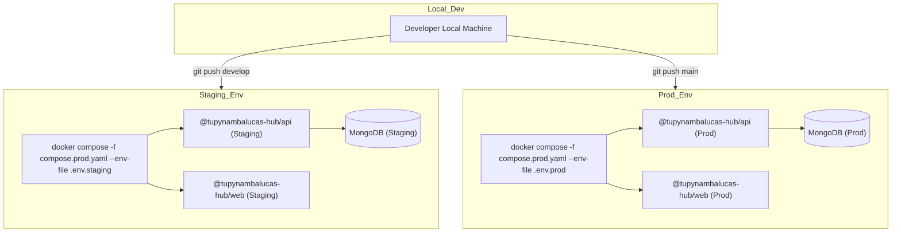

The architecture is built on the standalone dev/staging/production promotion model:

- **Staging (Homologação):** Mirror of the production stack. Runs on a dedicated subdomain connected to a staging database cluster. Used to validate new feature sets and schema migrations.
- **Production (Produção):** The authoritative client-facing environment. Fully locked down and optimized for performance.



---

## 2. Build-Time Compilation & Image Packaging

Our frontend and backend deployment units are fully containerized using optimized Dockerfiles.

### 2.1. Frontend Build Arg Injection

Vite statically bakes public environment variables (prefixed with `VITE_`) into the JavaScript bundles during the compilation phase. For this reason, these parameters must be supplied as Docker build arguments during image generation:

```dockerfile
# Inside Frontend Dockerfile
ARG VITE_TURNSTILE_SITE_KEY
ENV VITE_TURNSTILE_SITE_KEY=$VITE_TURNSTILE_SITE_KEY
RUN pnpm build
```

:::warning[Security Boundary]
Never inject sensitive keys (such as JWT secrets, database credentials, or email credentials) into the frontend build. Frontend environments are fully public. All secrets must be kept strictly on the backend API layer and injected at runtime.
:::

---

## 3. Container Orchestration & Directory Layouts

Workspaces containing Docker configurations are structured in one of two ways based on their
operational domains. Refer to
[Domain-Driven Monorepos](/docs/explanation/domain-driven-monorepo#6-container-layout-patterns-flat-services-vs-layered-domains)
for the design theory behind this choice.

### 3.1. Flat Services Layout

Services are placed inside a flat `services/` folder, with general orchestration configurations
inside `infrastructure/`:

- **Path Schema**:
  - `workspace/services/[service-name]/Dockerfile`
  - `workspace/infrastructure/docker/compose.yaml`
- **Application**: Used in
  [hub](/docs/explanation/domain-driven-monorepo#31-folder-topology) and
  `studio/design`.

### 3.2. Layered Domain Layout

Services are grouped into folders representing distinct architectural layers directly at the root
of the workspace:

- **Path Schema**:
  - `workspace/[domain-layer]/services/[service-name]/Dockerfile`
  - `workspace/infrastructure/docker/compose.yaml`
- **Application**: Used in `cortex` (separating `gateway/`, `mcp/`, and `agents/` planes).

---

## 4. Reverse Proxy & Request Routing

tupynambalucas.dev utilizes a reverse proxy setup (either **Nginx** or **Traefik**) to handle TLS
termination, compression, and request routing.

- **SSL Certificates:** Managed dynamically via Let's Encrypt using automated ACME challenges.
- **Port Mapping:** The public ports `80` (HTTP) and `443` (HTTPS) map to the edge web containers,
  which internally forward requests to the Fastify API or serve the compiled static React assets.

:::info[Zero-Downtime Re-Deploys]
Docker Compose automatically updates containers with minimal downtime when executing `pnpm hub:prod`
with existing containers. To completely eliminate request dropouts, implement a rolling
deployment pattern utilizing an upstream load balancer.
:::

---

## 5. Database Initialization & Schema Migrations

To avoid manual operational overhead during releases, all database preparation is handled
dynamically at the application level.

- **Replica Set Configuration:** During local development and initial staging rollouts, the helper
  container `db-init` automatically ensures the replica set (`rs0`) is established, enabling
  transaction support.
- **Data Seeding (`SeedPlugin`):** The Fastify server features a natively integrated seeding
  plugin. On startup, it triggers an idempotent upsert pattern, creating the default administrator
  user if it does not exist, without risk of duplicate rows.
