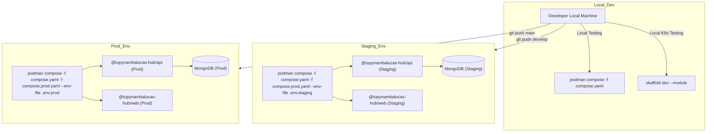
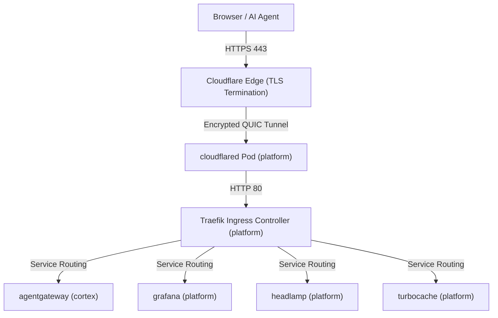

# Infrastructure Reference

This document details the infrastructure design patterns, containerization strategies, and routing architectures used across the monorepo workspaces.

---

## 1. Environment Promotion Model

The architecture is built on a modular dev/staging/production promotion model:

- **Local Dev:** Handled via either **Podman Compose** (for fast microservice iteration) or **Skaffold + Minikube** (for Kubernetes integration validation).
- **Staging (Homologação):** Mirror of the production stack. Runs on a dedicated subdomain connected to a staging database cluster. Used to validate new feature sets and schema migrations.
- **Production (Produção):** The authoritative client-facing environment. Fully locked down and optimized for performance.


```mermaid
graph TD
    direction TB
    subgraph Local_Dev
        Code["Developer Local Machine"]
        LocalCompose["podman compose -f compose.yaml"]
        LocalK8s["skaffold dev --module <name>"]
    end
    subgraph Staging_Env
        StgCompose["podman compose -f compose.yaml -f compose.prod.yaml --env-file .env.staging"]
        StgAPI["@tupynambalucas-hub/api (Staging)"]
        StgWeb["@tupynambalucas-hub/web (Staging)"]
        StgDB[("MongoDB (Staging)")]
    end
    subgraph Prod_Env
        ProdCompose["podman compose -f compose.yaml -f compose.prod.yaml --env-file .env.prod"]
        ProdAPI["@tupynambalucas-hub/api (Prod)"]
        ProdWeb["@tupynambalucas-hub/web (Prod)"]
        ProdDB[("MongoDB (Prod)")]
    end

    Code -->|Local Testing| LocalCompose
    Code -->|Local K8s Testing| LocalK8s
    Code -->|git push develop| Staging_Env
    Code -->|git push main| Prod_Env

    StgCompose --> StgAPI
    StgCompose --> StgWeb
    StgAPI --> StgDB

    ProdCompose --> ProdAPI
    ProdCompose --> ProdWeb
    ProdAPI --> ProdDB
```

---

## 2. Build-Time Compilation & Image Packaging

Our frontend and backend deployment units are fully containerized using optimized Dockerfiles.

### 2.1. Frontend Build Arg Injection

Vite statically bakes public environment variables (prefixed with `VITE_`) into the JavaScript bundles during the compilation phase. For this reason, these parameters must be supplied as Docker build arguments during image generation:

```dockerfile
# Inside Frontend Dockerfile
ARG VITE_TURNSTILE_SITE_KEY
ENV VITE_TURNSTILE_SITE_KEY=$VITE_TURNSTILE_SITE_KEY
RUN pnpm build
```

:::warning[Security Boundary]
Never inject sensitive keys (such as JWT secrets, database credentials, or email credentials) into the frontend build. Frontend environments are fully public. All secrets must be kept strictly on the backend API layer and injected at runtime.
:::

---

## 3. Container Orchestration & Directory Layouts

Workspaces containing Docker and Kubernetes configurations are structured in one of two ways based on their operational domains. Refer to [Domain-Driven Monorepos](/docs/explanation/domain-driven-monorepo) for the design theory behind this choice.

### 3.1. Flat Services Layout

Services are placed inside a flat `services/` folder, with general orchestration configurations inside `infrastructure/`:

- **Path Schema**:
  - `workspace/services/[service-name]/Dockerfile`
  - `workspace/infrastructure/docker/compose.yaml`
- **Application**: Used in `hub` and `studio`.

### 3.2. Layered Domain Layout

Services are grouped into folders representing distinct architectural layers directly at the root of the workspace:

- **Path Schema**:
  - `workspace/[domain-layer]/services/[service-name]/Dockerfile`
  - `workspace/infrastructure/docker/compose.yaml`
- **Application**: Used in `cortex` (separating `gateway/`, `mcp/`, and `agents/` planes).

### 3.3. Kubernetes Manifest Layout

Workspaces that support Kubernetes deployment use a Kustomize-based directory layout mirroring their layered structure:

- **Path Schema**:
  - `workspace/infrastructure/kubernetes/kustomization.yaml` (Aggregator)
  - `workspace/infrastructure/kubernetes/namespace.yaml` (Isolated Namespace)
  - `workspace/infrastructure/kubernetes/[service].yaml` (Deployments + Services)
- **Application**: Used in `cortex` (canonical) and `platform`.

---

## 4. Reverse Proxy & Request Routing

tupynambalucas.dev utilizes an edge-to-cluster reverse proxy architecture to handle TLS termination, Zero Trust security, and request routing across bounded contexts.

### 4.1. Cloudflare Tunnel & Edge Topology

Public access to local and remote Kubernetes development environments is provided via **Cloudflare Tunnel** (`cloudflared`) integrated with **Cloudflare Zero Trust**:


```mermaid
graph TD
    Client["Browser / AI Agent"] -->|HTTPS 443| Edge["Cloudflare Edge (TLS Termination)"]
    Edge -->|Encrypted QUIC Tunnel| TunnelPod["cloudflared Pod (platform)"]
    TunnelPod -->|HTTP 80| Traefik["Traefik Ingress Controller (platform)"]
    Traefik -->|Service Routing| Gateway["agentgateway (cortex)"]
    Traefik -->|Service Routing| Grafana["grafana (platform)"]
    Traefik -->|Service Routing| Headlamp["headlamp (platform)"]
    Traefik -->|Service Routing| TurboCache["turbocache (platform)"]
```

- **Edge TLS Termination:** Cloudflare Edge terminates public HTTPS for `*-dev.tupynambalucas.dev` using single-level wildcard SSL/TLS certificates (`*.tupynambalucas.dev`).
- **Encrypted Tunnel Transport:** Traffic travels from Cloudflare Edge to the cluster via an encrypted QUIC connection handled by the `cloudflared` deployment in the `platform` namespace.
- **Traefik Ingress Controller:** `cloudflared` forwards requests internally to Traefik on port 80 (`http://traefik.platform.svc.cluster.local:80`), which routes HTTP/gRPC payloads to target Services based on standard Kubernetes `Ingress` resources.

### 4.2. Authoritative Development Domain Scheme

All development services adopt a single-level hyphenated subdomain structure (`*-dev.tupynambalucas.dev`) to ensure 100% compatibility with free Universal SSL certificates:

| Domain Host                               | Target Service       | Namespace  | Purpose                                |
| :---------------------------------------- | :------------------- | :--------- | :------------------------------------- |
| `agentgateway-dev.tupynambalucas.dev`     | `agentgateway:15000` | `cortex`   | AgentGateway Admin UI & Control Plane  |
| `agentgateway-mcp-dev.tupynambalucas.dev` | `agentgateway:8080`  | `cortex`   | Direct MCP Ingress Endpoint (`/mcp`)   |
| `grafana-dev.tupynambalucas.dev`          | `grafana:3000`       | `platform` | Grafana Observability Dashboard        |
| `headlamp-dev.tupynambalucas.dev`         | `headlamp:80`        | `platform` | Headlamp Kubernetes Dashboard          |
| `traefik-dev.tupynambalucas.dev`          | `traefik:8082`       | `platform` | Traefik Ingress Dashboard              |
| `turbocache-dev.tupynambalucas.dev`       | `turbocache:3000`    | `platform` | Turborepo Remote Cache Server          |
| `docs.tupynambalucas.dev`                 | Cloudflare Pages     | External   | Docusaurus Technical Documentation Hub |

### 4.3. Cloudflare Access & Zero Trust Policies

To secure development endpoints exposed via Cloudflare Tunnel:

- **Web Dashboards (Grafana, Headlamp, Traefik, AgentGateway Admin):** Protected by Cloudflare Access **Email / One-Time PIN (OTP)** policies. Only authorized developer email addresses receive authentication PINs.
- **AI & MCP Endpoints (`agentgateway-mcp-dev.tupynambalucas.dev`):** Configured with a **Bypass** policy or Service Token authentication in Cloudflare Zero Trust with tunnel routing directed to `/mcp`. This enables non-browser clients (such as AI agents, CLI tools, and automated pipelines) to exchange JSON-RPC / SSE payloads without encountering interactive browser login redirects. Internal security is enforced directly by AgentGateway CEL guardrails and API tokens.

---

## 5. Database Initialization & Schema Migrations

To avoid manual operational overhead during releases, all database preparation is handled dynamically at the application level.

- **Replica Set Configuration:** During local development and initial staging rollouts, the helper container `db-init` automatically ensures the replica set (`rs0`) is established, enabling transaction support.
- **Data Seeding (`SeedPlugin`):** The Fastify server features a natively integrated seeding plugin. On startup, it triggers an idempotent upsert pattern, creating the default administrator user if it does not exist, without risk of duplicate rows.
