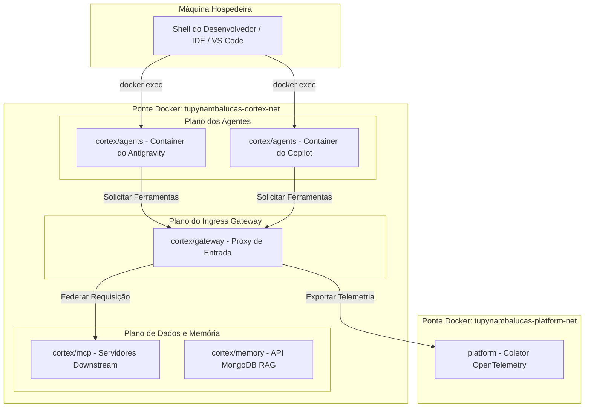

### Arquitetura Unificada de IA

O workspace Cortex consolida todas as operações de inteligência artificial em um Contexto Delimitado único. Ao co-localizar o API Ingress Gateway, a camada de memória persistente, o plano de dados do Model Context Protocol (MCP) e os workspaces de execução de agentes em terminal conteinerizados, o sistema garante previsibilidade de ambiente e segurança.

---

## 1. Topologia de Rede e Isolamento

Para proteger as estações de trabalho dos desenvolvedores, os containers dos agentes de IA executam dentro de uma rede de ponte (bridge) virtual isolada no Docker, impedindo o acesso direto aos recursos da máquina hospedeira (host).



### Planos de Rede

- **Ponte Interna (`tupynambalucas-cortex-net`)**: Rede privada na qual todos os serviços do Cortex se comunicam. Servidores MCP downstream e bancos de dados de memória não expõem portas para o host; eles são acessados exclusivamente por meio do gateway.
- **Ponte Externa (`tupynambalucas-platform-net`)**: Conecta o gateway a serviços globais da plataforma, como o coletor OpenTelemetry, para agregação de telemetria.

---

## 2. Layout de Diretórios e Mapeamentos de Volume

```text
cortex/
├── gateway/                 # Configuração do API Ingress Gateway
├── mcp/                     # Especificações de servidores MCP
├── memory/                  # Workspace de memória RAG MongoDB
└── agents/                  # Configurações do agente de terminal
    ├── compose.yaml         # Orquestração dos containers dos agentes
    ├── mcp_config.json      # Configurações unificadas de MCP
    ├── skills/              # Habilidades de agentes compartilhadas
    ├── copilot/
    │   ├── Dockerfile       # GitHub CLI + Copilot CLI
    │   └── data/            # Tokens de sessão Git-ignored
    └── antigravity/
        ├── Dockerfile       # CLI do Antigravity
        └── data/            # Brain local e logs Git-ignored
```

### Injeção de Configurações

Todas as configurações e credenciais são montadas dinamicamente via volumes bind do Docker no momento da inicialização dos containers. Nenhuma credencial privada é gravada nas camadas de imagem.

| Origem da Montagem     | Destino no Container                 | Finalidade                                      |
| :--------------------- | :----------------------------------- | :---------------------------------------------- |
| `../../`               | `/workspace`                         | Diretório de trabalho do monorepo completo      |
| `./skills/`            | `/workspace/.agents/skills`          | Habilidades compartilhadas visíveis aos agentes |
| `./mcp_config.json`    | `/workspace/.agents/mcp_config.json` | Configurações de endpoints MCP unificados       |
| `./antigravity/data/`  | `/root/.gemini/antigravity-cli/`     | Estado de sessão e dados locais do Antigravity  |
| `./copilot/data/`      | `/root/.copilot/`                    | Tokens de sessão persistentes do Copilot        |
| `/var/run/docker.sock` | `/var/run/docker.sock`               | Orquestração Docker-out-of-Docker               |
| `~/.ssh`               | `/root/.ssh` (read-only)             | Chaves SSH da máquina hospedeira para Git       |
| `~/.gitconfig`         | `/root/.gitconfig` (read-only)       | Perfil Git configurado na máquina hospedeira    |

---

## 3. Roteamento de Entrada e Federação de Ferramentas

O **AgentGateway** atua como o roteador central de todos os agentes clientes, traduzindo chamadas e encaminhando tarefas de forma segura:

- **Proxy de Entrada Unificado**: O proxy atende na porta `8080` (mapeada para a porta `8080` do host). Ele funciona como a única porta de entrada, delegando requisições aos servidores MCP adequados.
- **Federação de MCP**: Dentro dos containers dos agentes, as conexões mapeiam as ferramentas por meio do gateway:
  ```json
  {
    "mcpServers": {
      "github": { "url": "http://agentgateway:8080/mcp/http" },
      "context7": { "url": "http://agentgateway:8080/mcp/http" }
    }
  }
  ```
- **Estabilidade do Stream**: O gateway remove timeouts automáticos e gerencia cabeçalhos CORS de forma global, garantindo que conexões do tipo Server-Sent Events (SSE) permaneçam ativas durante tarefas de longa duração.
