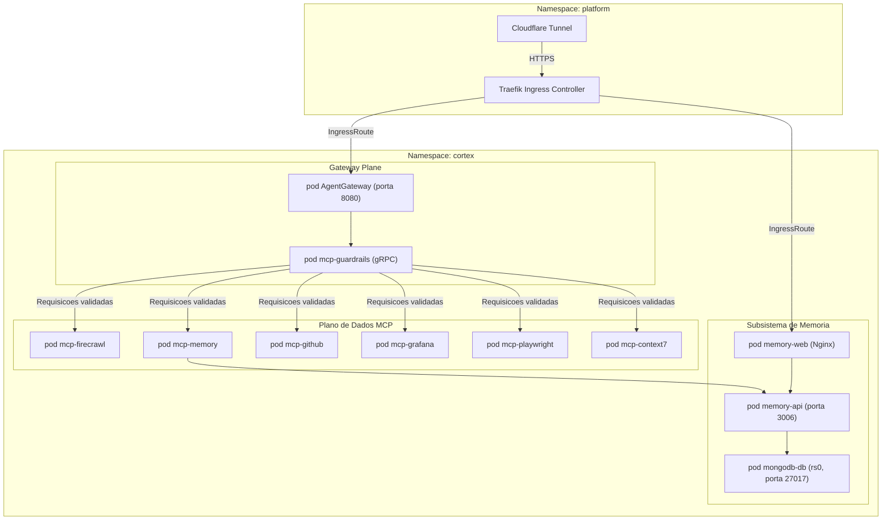

O workspace Cortex consolida todas as operacoes de inteligencia artificial em um
Bounded Context unificado. Ao co-localizar o Gateway de Ingresso de API, a camada
de memoria persistente, o plano de dados MCP e os workspaces de agentes
containerizados em um unico namespace Kubernetes, o sistema garante
previsibilidade de ambiente, isolamento de rede e seguranca.

---

## 1. Topologia de Rede e Isolamento

Todos os servicos Cortex executam dentro do namespace Kubernetes `cortex`. O
trafego de entrada passa pelo Traefik (implantado no namespace `platform`) e e
roteado pelo AgentGateway antes de chegar a qualquer pod MCP downstream ou ao
Subsistema de Memoria.


```mermaid
graph TD
    subgraph platform_ns ["Namespace: platform"]
        Traefik["Traefik Ingress Controller"]
        CF["Cloudflare Tunnel"]
    end

    subgraph cortex_ns ["Namespace: cortex"]
        subgraph gateway_plane ["Gateway Plane"]
            GW["pod AgentGateway (porta 8080)"]
            GR["pod mcp-guardrails (gRPC)"]
        end

        subgraph mcp_plane ["Plano de Dados MCP"]
            MFC["pod mcp-firecrawl"]
            MMEM["pod mcp-memory"]
            MGH["pod mcp-github"]
            MGF["pod mcp-grafana"]
            MPW["pod mcp-playwright"]
            MCT["pod mcp-context7"]
        end

        subgraph memory_plane ["Subsistema de Memoria"]
            MAPI["pod memory-api (porta 3006)"]
            MWEB["pod memory-web (Nginx)"]
            MONGO["pod mongodb-db (rs0, porta 27017)"]
        end
    end

    CF -->|HTTPS| Traefik
    Traefik -->|IngressRoute| GW
    Traefik -->|IngressRoute| MWEB
    GW --> GR
    GR -->|Requisicoes validadas| MFC
    GR -->|Requisicoes validadas| MMEM
    GR -->|Requisicoes validadas| MGH
    GR -->|Requisicoes validadas| MGF
    GR -->|Requisicoes validadas| MPW
    GR -->|Requisicoes validadas| MCT
    MMEM --> MAPI
    MWEB --> MAPI
    MAPI --> MONGO
```

### Modelo de Isolamento

- Toda a comunicacao entre servicos usa nomes DNS do Kubernetes (ex.:
  `memory-api:3006`, `agentgateway:8080`). Nenhum servico expoe uma NodePort
  diretamente ao host, exceto durante sessoes de desenvolvimento locais com
  Skaffold.
- Os pods MCP downstream e os pods do Subsistema de Memoria so sao acessiveis
  pelo AgentGateway ou pelas IngressRoutes do Traefik.
- O namespace `platform` hospeda Traefik, OpenTelemetry Collector e a pilha
  Grafana. Os dados de telemetria fluem dos pods Cortex para o namespace
  platform via OTLP.

---

## 2. Layout de Diretorios

```text
cortex/
├── gateway/                 # Configuracao do AgentGateway (config.yaml, guardrails)
├── mcp/
│   ├── guardrails/          # Processador de politica ExtMCP gRPC
│   ├── inspector/           # MCP Inspector web UI (somente dev)
│   └── services/            # Pacotes adaptadores MCP downstream
│       ├── context7/
│       ├── firecrawl/
│       ├── github/
│       ├── grafana/
│       ├── memory/
│       └── playwright/
├── memory/
│   ├── packages/core/       # Modelos TypeScript e schemas Zod compartilhados
│   └── services/
│       ├── api/             # Backend Fastify memory-api
│       ├── mongodb/         # Scripts de inicializacao do MongoDB 7.0 rs0
│       └── web/             # Dashboard React memory-web
├── infrastructure/
│   └── kubernetes/          # Configuracao Skaffold e manifestos Kustomize
│       ├── base/            # Recursos Kustomize base
│       └── overlays/        # Overlays dev / staging / prod
├── package.json
└── AGENTS.md
```

---

## 3. Roteamento de Ingresso e Federacao de Ferramentas

O **AgentGateway** e o unico ponto de entrada para todas as chamadas de
ferramentas de IA. Ele valida, enriquece e roteia requisicoes pelo seguinte
pipeline:

1. **Cloudflare Tunnel -> Traefik**: O trafego HTTPS publico entra por um
   Cloudflare Tunnel que termina no Ingress Controller Traefik no namespace
   `platform`.
2. **Traefik -> AgentGateway**: Uma IngressRoute encaminha o trafego de API de
   agentes para o pod AgentGateway na porta `8080`.
3. **Guardrails ExtMCP**: O AgentGateway delega toda requisicao `tools/call` e
   `tools/list` ao sidecar gRPC `mcp-guardrails`, que:
   - Reescreve URLs `localhost` / `127.0.0.1` para `host.docker.internal`.
   - Injeta metadados `system_instruction` nas listagens de ferramentas.
   - Retorna `{ pass: {} }` em qualquer excecao de parsing (contrato
     fail-open).
4. **Despacho Downstream**: Requisicoes validadas sao encaminhadas ao pod
   adaptador MCP apropriado (ex.: `mcp-firecrawl`, `mcp-memory`) via DNS de
   servico Kubernetes.

### Configuracao de Ferramentas nos Containers de Agentes

Containers de agentes referenciam o AgentGateway como unico endpoint MCP:

```json
{
  "mcpServers": {
    "cortex": { "url": "http://agentgateway:8080/mcp" }
  }
}
```

O AgentGateway federa a requisicao ao pod MCP downstream correto de forma
transparente. Agentes nao precisam de URLs individuais de servicos.
