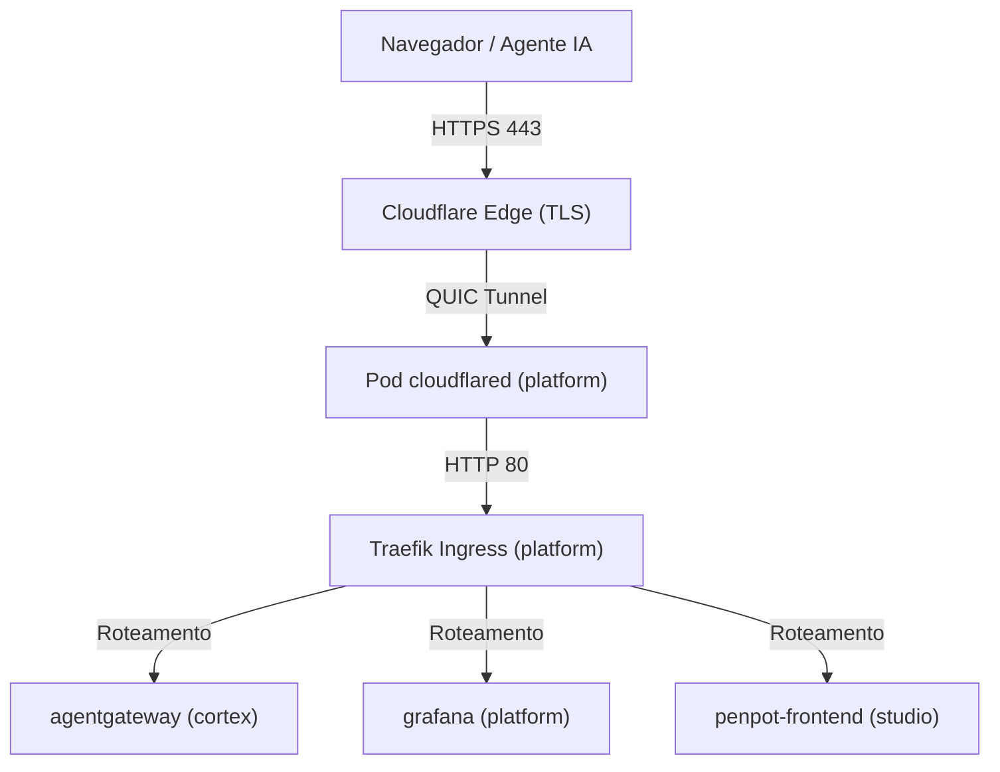

# Arquitetura da Infraestrutura

O ecossistema `%PROJECT_DOMAIN%` usa um pipeline nativo Kubernetes e uma arquitetura de proxy reverso edge-to-cluster para lidar com TLS, segurança Zero Trust e roteamento de solicitações entre contextos delimitados.

---

## 1. Layout dos Manifestos Kubernetes

Workspaces que suportam deploy no Kubernetes usam um layout baseado no Kustomize, espelhando sua estrutura de camadas. Todas as configurações residem dentro do contexto centralizado de `infrastructure`.

- **Padrão de Caminho**:
  - `infrastructure/environments/<env>/<context>` (Overlays do Kustomize)
  - `infrastructure/manifests/<context>.yaml` (Deployments + Services + Ingress)
- **Aplicação**: Usado universalmente em todos os contextos (`platform`, `cortex`, `studio`).

---

## 2. Proxy Reverso e Roteamento

Usamos uma arquitetura do edge ao cluster para rotear as chamadas.

### 2.1. Cloudflare Tunnel & Edge Topology

O acesso público aos ambientes de desenvolvimento é via **Cloudflare Tunnel** (`cloudflared`) integrado ao **Cloudflare Zero Trust**:

- **Terminação TLS na Borda:** A borda da Cloudflare termina as solicitações HTTPS para `*-dev.%PROJECT_DOMAIN%` usando certificados wildcard `*.%PROJECT_DOMAIN%`.
- **Tráfego Criptografado:** Passa pela borda até o cluster em túneis QUIC, interceptado pelo `cloudflared` na namespace `platform`.
- **Traefik Ingress Controller:** O `cloudflared` encaminha o tráfego internamente para o Traefik na porta 80, que roteia payloads HTTP/gRPC baseado em recursos nativos de `Ingress`.

### 2.2. Esquema Autoritativo de Domínios de Desenvolvimento

Para compatibilidade total com os certificados SSL gratuitos Universal, usamos domínios de nível único (`*-dev.%PROJECT_DOMAIN%`):

| Domínio de Hospedagem                   | Serviço Alvo           | Namespace  | Propósito                           |
| :-------------------------------------- | :--------------------- | :--------- | :---------------------------------- |
| `agentgateway-dev.%PROJECT_DOMAIN%`     | `agentgateway:15000`   | `cortex`   | Interface Administrativa do Gateway |
| `agentgateway-mcp-dev.%PROJECT_DOMAIN%` | `agentgateway:8080`    | `cortex`   | Endpoint Ingress MCP (`/mcp`)       |
| `grafana-dev.%PROJECT_DOMAIN%`          | `grafana:3000`         | `platform` | Dashboard Observabilidade Grafana   |
| `headlamp-dev.%PROJECT_DOMAIN%`         | `headlamp:80`          | `platform` | Dashboard do Kubernetes             |
| `traefik-dev.%PROJECT_DOMAIN%`          | `traefik:8082`         | `platform` | Traefik Ingress Dashboard           |
| `penpot-dev.%PROJECT_DOMAIN%`           | `penpot-frontend:8080` | `studio`   | Ferramenta de Design Colaborativo   |
| `memos-dev.%PROJECT_DOMAIN%`            | `memos:5230`           | `studio`   | App de Anotações (Memos)            |
| `docs.%PROJECT_DOMAIN%`                 | Cloudflare Pages       | Externa    | Base de Conhecimento Técnico (Docu) |

### 2.3. Políticas do Cloudflare Zero Trust

Para proteger os endpoints:

- **Dashboards Web:** Protegidos por políticas **Email / One-Time PIN (OTP)**. Apenas e-mails autorizados recebem PINs.
- **Endpoints AI & MCP (`agentgateway-mcp-dev.%PROJECT_DOMAIN%`):** Usam políticas **Bypass** ou **Service Token** com caminho de túnel restrito (`/mcp`), permitindo que agentes de IA enviem requisições sem se depararem com telas interativas de login.
