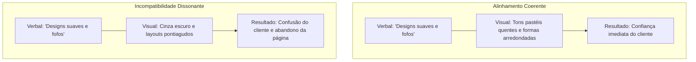

# Explicação de Identidade de Marca

Este documento discute a fundamentação teórica, o alinhamento arquitetônico e os princípios psicológicos do design de identidade visual e verbal de marcas.

---

## 1. A Anatomia de uma Marca: Identidade Interna vs. Externa

Compreender a arquitetura de marca requer separar a identidade estratégica interna dos elementos de identidade externos.

- **Identidade da Marca (A Personalidade)**:
  Representa o núcleo estratégico da organização. É a personalidade interna, missão, visão, valores e a conexão emocional que um negócio mantém com seu público-alvo. É análogo ao caráter, crenças e padrões de fala de uma pessoa.
- **Identidade Visual (A Apresentação)**:
  Esta é a expressão externa do núcleo da marca. Consiste em cores, formas, tipografia, layouts e imagens. É análogo ao estilo de roupa, cabelo, postura e aparência visual de uma pessoa.

A identidade visual não pode operar de forma eficaz de maneira isolada. As decisões de design devem ser orientadas pela estratégia da marca; caso contrário, os elementos visuais correm o risco de parecer arbitrários ou passageiros, perdendo seu significado ao longo do tempo.

---

## 2. Coerência Cognitiva: A Psicologia do Alinhamento

O sucesso de uma marca depende fortemente da coerência cognitiva—o alinhamento de todas as entradas sensoriais. Quando a identidade visual de uma marca corresponde à sua identidade verbal, ela reforça a mensagem e constrói a confiança do cliente.

### O Custo da Dissonância Cognitiva

Se a mensagem verbal de uma marca contradiz seu estilo visual, ela desencadeia dissonância cognitiva no cérebro do usuário.

- **Exemplo Desalinhado**: Considere uma startup de roupas de bebê. Se o texto usa uma linguagem suave e reconfortante descrevendo fibras naturais e cortes fofos, mas o site apresenta layouts cinza-escuro, formas geométricas vetoriais pontiagudas e fotografia severa em preto e branco, o cérebro do cliente experimenta fricção.
- **O Resultado**: O cliente sente um mal-estar, luta para processar os benefícios do produto e abandona a página. Para startups de tecnologia, essa incompatibilidade geralmente assume a forma de um linguajar técnico complexo ("tech-speak") emparelhado com ilustrações excessivamente divertidas, o que dilui a percepção de confiabilidade corporativa.

---

## 3. A Estratégia de Marca como Fundação

Cada decisão de branding deve se originar da estratégia da marca. Um exercício de estratégia padrão estabelece:

1. **Público-Alvo**: A demografia e a psicografia do cliente ideal.
2. **Cenário Competitivo**: Lacunas nas mensagens dos concorrentes que permitem a diferenciação.
3. **Arquétipo Central da Marca**: O arquétipo de personagem (ex: Criador, Rebelde, Aliado, Sábio) que define a voz e a aparência.

Sem essa base estratégica, os designers são forçados a confiar em tendências do momento. As tendências têm vida curta, levando a rebrandings frequentes que confundem os clientes e diluem o valor da marca.

---

## 4. Equilibrando Consistência e Flexibilidade

Um erro comum é assumir que uma identidade de marca forte exige que tudo pareça e soe idêntico em todas as plataformas. Um sistema de identidade robusto deve equilibrar consistência com flexibilidade.

- **Consistência (A Âncora)**:
  A consistência garante que o caráter central da marca seja instantaneamente reconhecível em todos os pontos de contato. Um usuário que encontra a marca em um feed do Instagram, em uma notificação de e-mail do sistema ou em uma embalagem de produto físico deve reconhecer a mesma personalidade subjacente.
- **Flexibilidade (A Variável)**:
  A flexibilidade permite que o design e o texto se adaptem às restrições de diferentes canais. Por exemplo:
  - _Mídias Sociais (Instagram/TikTok)_: O tom pode mudar em direção à descontração e apelo visual.
  - _Alertas do Sistema (Uptime/Segurança)_: O tom deve mudar para uma clareza técnica concisa e séria.
  - _Botões de UI/Microtexto_: O espaço visual é limitado, exigindo textos curtos em formato de frase (_sentence case_) e cores de destaque de alto contraste.

---

## 5. Armadilhas Comuns no Desenvolvimento de Marcas

- **Projetar Antes de Planejar a Estratégia**:
  Iniciar o design de logotipo e grades de layout antes de definir a missão principal e o público-alvo leva a sistemas visuais genéricos que falham em se conectar com os usuários.
- **Dependência de Jargões**:
  Startups de tecnologia frequentemente dependem de palavras da moda do setor (ex: "sinergia", "próxima geração", "mudança de paradigma"). Isso esconde os benefícios reais do produto e afasta partes interessadas não técnicas.
- **Seguir Tendências de Design**:
  Adotar tendências de estilo passageiras (ex: fundos com gradientes exagerados ou logotipos de texto minimalistas genéricos) faz com que uma marca pareça idêntica aos seus concorrentes e leva à obsolescência visual rápida.
- **Ignorar Restrições do Mundo Real**:
  Desenhar layouts visuais complexos que parecem lindos em monitores de alta resolução de computadores desktop, mas que falham ao renderizar em telas de celulares de baixo contraste ou quando impressos em papelão, resulta em uma péssima experiência de usuário.
