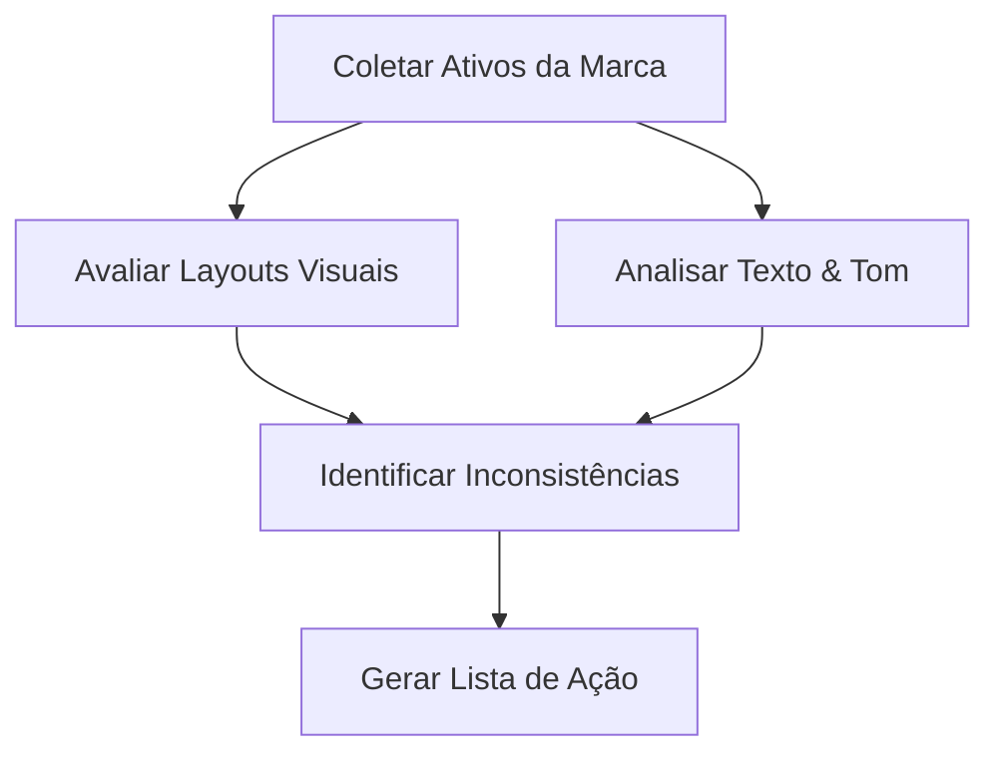

# Guias de Como Fazer de Identidade de Marca

Este documento fornece guias práticos passo a passo baseados em objetivos para resolver tarefas específicas de implementação e manutenção de identidade de marca.

---

## Como Documentar um Guia de Estilo de Marca

Um guia de estilo de marca garante que colaboradores externos e equipes internas apliquem os elementos da marca de forma consistente. Use este processo para construir e documentar um guia.

### Passo 1: Criar a Estrutura do Documento

Organize seu guia de estilo de marca em quatro seções lógicas:

1. **Estratégia Central**: Missão, visão, propósito e adjetivos de personalidade.
2. **Identidade Verbal**: Princípios de tom de voz, pilares de mensagens e gramática de marca.
3. **Identidade Visual**: Uso de logotipo, especificações de cores, hierarquia tipográfica e regras de imagens.
4. **Diretório de Ativos**: Links para arquivos vetoriais oficiais, modelos e pacotes de fontes.

### Passo 2: Definir Restrições do Logotipo

Documente regras claras para evitar a distorção do seu logotipo. Inclua exemplos que mostrem:

- **Área de Proteção Mínima**: Defina o espaçamento ao redor do logotipo usando uma unidade relativa (ex: "metade da altura do ícone do logotipo").
- **Modificações Proibidas**: Mostre exemplos visuais de uso incorreto, como esticar, rotacionar, alterar cores fora da paleta oficial ou colocar o logotipo em fundos de baixo contraste ou poluídos.
- **Limites de Tamanho Mínimo**: Especifique o menor tamanho no qual o logotipo pode ser impresso ou exibido em telas.

### Passo 3: Especificar Valores de Cores Técnicos

Para cada cor na paleta da sua marca, documente os códigos de cores exatos para diferentes formatos de mídia:

- **Códigos HEX**: Para desenvolvimento web e arquivos CSS (ex: `#0F172A`).
- **Valores RGB**: Para exibições em telas digitais e produção de vídeo.
- **Valores CMYK**: Para materiais de impressão comercial padrão.
- **Pantone (PMS)**: Para correspondência de cores precisa em embalagens profissionais e sinalização física.

---

## Como Estabelecer um Guia Gramatical da Marca

Um guia gramatical de marca define regras de linguagem técnicas para garantir que a escrita permaneça consistente em todas as interfaces de produtos e canais de marketing.

### Passo 1: Escolher uma Base Regional de Inglês

Padronize em um único dicionário regional e manual de estilo dependendo do seu mercado-alvo principal:

- **Inglês Americano (US)**: Padrão para o AP Stylebook ou Chicago Manual of Style. Use grafias como _optimize_, _color_ e _modeling_.
- **Inglês Britânico (UK)**: Padrão para o Oxford Style Manual. Use grafias como _optimise_, _colour_ e _modelling_.

### Passo 2: Estabelecer Regras de Capitalização para Cabeçalhos

Defina padrões de uso de maiúsculas para títulos, botões e textos do sistema para manter a consistência visual:

- **Title Case**: Capitalize a primeira letra da maioria das palavras (ex: "The Complete Guide to Brand Design"). Use isso para títulos principais de páginas de destino e cabeçalhos de blogs.
- **Sentence Case**: Capitalize apenas a primeira palavra (ex: "Get started with your integration"). Use isso para parágrafos de descrição, campos de entrada e rótulos de botões.

### Passo 3: Definir o Uso de Contrações e Pronomes

Selecione sua posição sobre contrações com base no nível de formalidade desejado:

- **Tom Conversacional**: Use contrações (_we're_, _it's_, _you'll_) e pronomes de tratamento direto (_you_, _our_) para soar amigável e acessível.
- **Tom Formal**: Evite contrações (_we are_, _it is_, _you will_) e use pronomes neutros para manter um distanciamento profissional.

---

## Como Realizar uma Auditoria de Identidade de Marca

Execute uma auditoria de identidade semestralmente para identificar e corrigir inconsistências visuais e desvios no tom verbal.

### Passo 1: Compilar Ativos de Marca entre Canais

Reúna capturas de tela e amostras de texto de todos os canais ativos voltados para o cliente:

- Páginas iniciais e landing pages do site.
- Telas de interface do usuário de aplicativos móveis e desktop.
- Perfis de mídia social e feeds de postagens.
- E-mails de sistema automatizados e modelos de chat de atendimento ao cliente.

### Passo 2: Auditar a Conformidade Visual

Compare os ativos coletados com o manual oficial de identidade visual da marca:

- Verifique se apenas os arquivos e variantes oficiais do logotipo estão em uso.
- Teste a consistência das cores verificando os valores hexadecimais do CSS em relação às diretrizes da marca.
- Verifique se há fontes não compatíveis e problemas de alinhamento de layout.

### Passo 3: Auditar o Alinhamento Verbal

Analise amostras de texto para verificar desvios no tom de voz:

- Avalie se o texto está alinhado com os adjetivos de personalidade definidos para a marca.
- Verifique se os textos do sistema e notificações cumprem as diretrizes gramaticais (ex: capitalização adequada, regras de contração).
- Identifique e marque qualquer uso de jargão excessivo, clichês ou frases excessivamente casuais.

### Passo 4: Gerar o Backlog de Correções

Consolide todas as descobertas em uma lista de problemas priorizada. Agrupe os problemas por gravidade (ex: cores de marca incorretas na página de preços representam gravidade alta, problemas de tamanho de fonte no arquivo do blog são gravidade baixa) e atribua-os aos backlogs de design e desenvolvimento.

---

## Como Adaptar Elementos Visuais e Texto para Extensões de Produto

Ao lançar novas linhas de produtos, use este fluxo de trabalho para estender seu sistema de identidade visual e verbal sem quebrar o reconhecimento da marca-mãe.

### Passo 1: Identificar os Identificadores Centrais da Marca (Âncoras Visuais)

Isole os elementos visuais que devem permanecer idênticos em todas as linhas de produtos para preservar o reconhecimento da marca-mãe:

- **Tipografia**: Mantenha consistentes as combinações de fontes primárias e secundárias.
- **Sistema de Layout**: Mantenha as mesmas grades de espaçamento, estruturas de cartões e proporções de espaço limpo visual.
- **Símbolo da Marca**: Sempre exiba o logotipo principal ou o ícone da marca em uma posição fixa (ex: cabeçalho superior esquerdo).

### Passo 2: Definir os Identificadores de Extensão (Variáveis Visuais)

Selecione os elementos visuais que podem ser personalizados para diferenciar a nova linha de produtos:

- **Cor de Destaque**: Introduza uma nova cor de destaque para representar a extensão (ex: Klarna usando rosa para finanças do consumidor, enquanto introduz tons secundários para páginas de parceiros comerciais).
- **Imagens Secundárias**: Desenhe padrões distintos ou ilustrações especificamente para o tema do novo produto, mantendo o mesmo estilo, peso de traço e pinceladas.

### Passo 3: Alinhar e Ajustar o Tom do Texto

Ajuste a identidade verbal para se adequar ao público-alvo específico do novo produto, mantendo os princípios de voz fundamentais:

- **Mantenha a Voz**: Mantenha as características de voz subjacentes consistentes (ex: clareza, autenticidade).
- **Ajuste o Registro**: Ajuste o nível de formalidade dependendo do contexto. Por exemplo, uma marca que vende óleo de pimenta orgânico (ex: Himalayan Harvest) deve manter seu tom rústico, mas pode usar uma linguagem culinária mais rica ao introduzir uma linha de mel doce, mantendo a simplicidade da estrutura das frases.
- **Mantenha a Gramática**: Não altere as regras básicas da marca, como padrões de ortografia regionais (US/UK), estilos de capitalização ou o uso de contrações.
