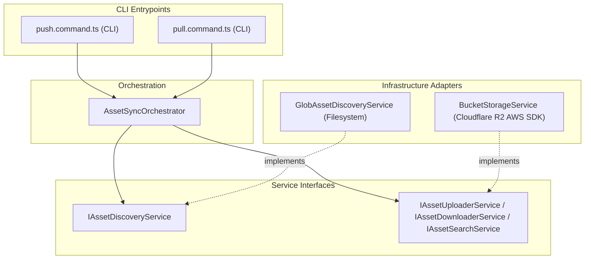

### Infraestrutura de Armazenamento Cloudflare R2

O projeto `tupynambalucas.dev` utiliza o Cloudflare R2 Object Storage (um serviço de armazenamento de objetos compatível com S3 e com tarifa zero de egresso) para gerenciar ativos binários, arquivos mestre de design de alta fidelidade e persistência do editor self-hosted.

Este documento detalha nosso ecossistema de buckets, o sincronizador CLI de ativos de criação/produção e a infraestrutura de armazenamento de objetos do editor Penpot.

---

## 1. Ecossistema de Buckets

Mantemos três buckets dedicados no Cloudflare R2, cada um atendendo a um domínio específico em nossa arquitetura:

| Nome do Bucket                | Nível de Acesso   | Propósito & Função                                                                                                                                                 | Origem das Credenciais                     |
| :---------------------------- | :---------------- | :----------------------------------------------------------------------------------------------------------------------------------------------------------------- | :----------------------------------------- |
| **`tupynambalucas-assets`**   | Público (CDN)     | Hospeda ativos prontos para a web (imagens otimizadas, SVGs, modelos GLB, arquivos EXR). Servido publicamente para frontends como `@tupynambalucas/hub`.           | `studio/bucket/.env.studio.bucket`         |
| **`tupynambalucas-creative`** | Privado           | Cofre para arquivos de origem originais (Blender `.blend`, Illustrator `.ai`, Photoshop `.psd`, Premiere `.prproj`). Acesso restrito a desenvolvedores principais. | `studio/bucket/.env.studio.bucket`         |
| **`tupynambalucas-penpot`**   | Privado (Interno) | Armazena uploads de usuários, layouts, bibliotecas de vetores customizadas e backups de documentos para o editor self-hosted Penpot.                               | `studio/design/infrastructure/docker/.env` |

---

## 2. Sincronizador de Ativos CLI (`@tupynambalucas-studio/bucket`)

O pacote `@tupynambalucas-studio/bucket` é um utilitário de linha de comando em TypeScript responsável pelo gerenciamento de sincronização bidirecional (`push` e `pull`) para `tupynambalucas-assets` e `tupynambalucas-creative`.

### A. Arquitetura de Software Core

O motor de sincronização isola as operações do sistema de arquivos dos provedores de armazenamento através de injeção de dependência, utilizando o SDK do AWS S3 Client e buscas com padrões glob.



- **`AssetSyncOrchestrator`**: Executa as sequências de sincronização, comparando itens locais do disco com os metadados remotos no S3.
- **`GlobAssetDiscoveryService`**: Varre diretórios procurando arquivos que correspondam aos padrões configurados no manifesto de ativos.
- **`BucketStorageService`**: Envolve o SDK do cliente AWS S3 para ler cabeçalhos de metadados e enviar/baixar fluxos de dados.

### B. Configuração de Ambiente

Para configurar o sincronizador, defina as variáveis de ambiente dentro do arquivo `studio/bucket/.env.studio.bucket`:

```bash
# Identificador da conta Cloudflare R2
CLOUDFLARE_R2_ACCOUNT_ID=2a6c94a31c5d23bc9d9d1c208036a274

# Configuração do Bucket de Ativos Públicos Web (Seguro para CI/CD e CDN)
CLOUDFLARE_R2_ASSETS_ACCESS_KEY_ID=c231f170809523e5497b1284466d95d5
CLOUDFLARE_R2_ASSETS_SECRET_ACCESS_KEY=91a48c17ec116bb500d1b1b2a0219e1f2c973b0a962f2330eae3c44682124d86
CLOUDFLARE_R2_ASSETS_BUCKET_NAME=tupynambalucas-assets
CLOUDFLARE_R2_ASSETS_PUBLIC_URL=https://pub-edba48e442fb4916915a399533123daa.r2.dev

# Configuração do Bucket Privado de Design/Criação (Restrito a Designers)
CLOUDFLARE_R2_CREATIVE_ACCESS_KEY_ID=535cfe37f3856a9db34b9ff5b1f23464
CLOUDFLARE_R2_CREATIVE_SECRET_ACCESS_KEY=59fad25126ad07df994e4c71f9176c833bc0bb167bcec68f904923d066d12caf
CLOUDFLARE_R2_CREATIVE_BUCKET_NAME=tupynambalucas-creative
```

### C. Otimizações e Limites de API

Para manter a operação dentro da camada gratuita do Cloudflare R2 (10GB de espaço, 1M de chamadas Class A/mês e 10M Class B/mês):

- **Verificação de Hash**: O CLI calcula o hash MD5 local e o compara com o ETag remoto. A transferência só ocorre se houver diferença.
- **Descoberta Dinâmica**: Os arquivos sincronizados são descritos sob demanda através do arquivo centralizador `studio/design/assets/assets-manifest.json`.
- **Execução**: Execute `pnpm studio:bucket` no terminal raiz do projeto para abrir o menu do assistente interativo.

---

## 3. Armazenamento de Objetos do Penpot

O editor Penpot self-hosted utiliza o bucket `tupynambalucas-penpot` para salvar maquetes, bibliotecas vetoriais customizadas, avatares de usuários e documentos inseridos diretamente na interface de design.

### A. Configurações de Infraestrutura

O driver de armazenamento S3 é parametrizado em `studio/design/infrastructure/docker/compose.yaml` com base em variáveis carregadas de `.env`:

```bash
# S3 Bucket Configuration (Cloud)
PENPOT_OBJECTS_STORAGE_BACKEND=s3
PENPOT_OBJECTS_STORAGE_S3_ENDPOINT=https://2a6c94a31c5d23bc9d9d1c208036a274.r2.cloudflarestorage.com
PENPOT_OBJECTS_STORAGE_S3_BUCKET=tupynambalucas-penpot
PENPOT_OBJECTS_STORAGE_S3_REGION=auto
PENPOT_OBJECTS_STORAGE_S3_FORCE_PATH_STYLE=false
AWS_ACCESS_KEY_ID=61fa3e1856622b932502c049fbfad4db
AWS_SECRET_ACCESS_KEY=2c61cd452c6f56e6e0321c615b8254703ae03c2550ce5740515c86388d1088a9
```

Essas variáveis conectam o container de backend do Penpot diretamente ao nosso serviço de nuvem, removendo a persistência de binários pesados de dentro dos volumes locais do Docker.
