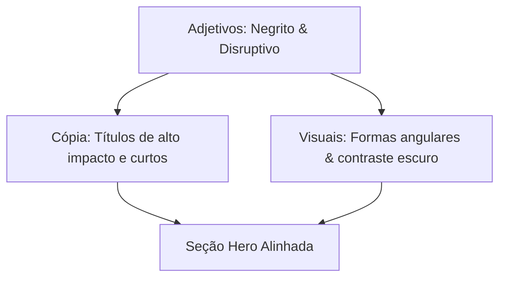

# Tutoriais de Identidade de Marca

Este documento fornece lições passo a passo orientadas ao aprendizado para a construção de frameworks de identidade de marca visual e verbal. Siga estas lições para construir um sistema de marca coeso a partir do zero.

---

## Tutorial 1: Projetando um Sistema de Identidade Visual

Este tutorial guia você através da criação de um sistema de identidade visual fundamental. Ao final desta lição, você terá um vocabulário visual definido para sua marca.

### Passo 1: Estabelecer um Painel de Inspiração (Mood Board)

Reunir inspiração visual ajuda a traduzir valores estratégicos abstratos em formas, cores e layouts concretos.

- **Selecionar Plataformas**: Use ferramentas como Pinterest, Behance ou Dribbble para curar imagens.
- **Coletar Amostras**: Colecione de 20 a 30 imagens, incluindo fotografias, layouts de interface, espécimes tipográficos, padrões e amostras de cores.
- **Identificar Temas**: Analise a coleção para localizar padrões repetitivos, como formas orgânicas, linhas nítidas, tons suaves ou interfaces de alto contraste.

### Passo 2: Definir a Paleta de Cores

Desenvolva uma paleta que consista em uma cor de marca principal, cores de suporte secundárias e tons de fundo neutros. Aplique a **regra 60-30-10**:

- **60% de Tom Dominante**: Tipicamente uma cor neutra (fundo de modo claro ou escuro) que define a tela geral.
- **30% de Tom Secundário da Marca**: Usado para elementos estruturais, botões secundários e cabeçalhos.
- **10% de Tom de Destaque**: Uma cor de alto contraste usada exclusivamente para chamadas primárias para ação (CTAs) e pontos focais de atenção.

### Passo 3: Estabelecer Regras de Tipografia

Escolha no máximo duas famílias de fontes para garantir clareza no layout e renderização digital rápida:

- **Fonte de Título**: Um tipo de letra que reflita a personalidade da marca (ex: uma serifada clássica para formalidade ou uma sem serifa geométrica para tecnologia moderna).
- **Fonte de Corpo**: Um tipo de letra sem serifa altamente legível, otimizado para legibilidade em tamanhos pequenos em várias resoluções de tela.
- **Definição de Escala**: Documente pares claros de tamanho e peso (ex: `h1` em 32px negrito, corpo em 16px regular).

### Passo 4: Estabelecer Critérios de Design do Logo

Crie um logotipo vetorial que seja renderizado de forma limpa em várias aplicações digitais e físicas:

- **Mantenha-o Simples**: Use formas geométricas simples e limite o design a uma ou duas cores.
- **Variantes Responsivas**: Defina um logo principal (wordmark e símbolo combinados), um logo secundário (layout horizontal) e um ícone mínimo (isótipo) para favicons e avatares pequenos.
- **Teste de Legibilidade**: Verifique se o logotipo permanece legível quando reduzido a uma grade de 16x16 pixels.

---

## Tutorial 2: Criando um Framework de Identidade Verbal

Este tutorial descreve o processo para definir a voz de comunicação da marca, os pilares de mensagens e os padrões editoriais.

### Passo 1: Identificar Adjetivos de Personalidade da Marca

Determine as características principais do estilo de comunicação da sua marca:

- Selecione três adjetivos principais que representem como sua marca se expressa (ex: autoritário, inovador, confiável).
- Garanta que esses adjetivos estejam alinhados diretamente com a estratégia geral da marca.

### Passo 2: Formular Princípios de Voz "Isto, mas não Aquilo"

Crie barreiras de proteção para sua voz para evitar que escritores adotem estilos extremos ou inadequados:

- Defina o limite positivo para cada adjetivo de personalidade.
- **Exemplo de Formulação**:
  - "Somos _inovadores_, mas não _prometemos demais_."
  - "Somos _autoritários_, mas não _sem graça_."
  - "Somos _descontraídos_, mas não _antiprofissionais_."

### Passo 3: Escrever as Declarações Estratégicas Centrais

Escreva declarações claras que descrevam o que você faz, para onde está indo e por que existe:

- **Declaração de Missão**: Foco na proposta de valor atual. Defina _o que_ você faz, _para quem_ e _como_.
- **Declaração de Visão**: Foco no objetivo aspiracional de médio prazo. Defina o estado futuro pretendido para motivar as equipes.
- **Declaração de Propósito**: Foco na razão profunda de existir. Defina o impacto positivo que você busca causar no setor ou na sociedade.

### Passo 4: Definir Pilares de Mensagem da Marca

Defina três temas centrais que estruturam toda a comunicação de marketing e de produto:

- Identifique os recursos exclusivos da sua solução.
- Para cada recurso, extraia o benefício direto para o usuário.
- **Estrutura**: Crie um título curto, seguido por uma promessa voltada para o usuário de uma única frase.

---

## Tutorial 3: Alinhando Identidades Visual e Verbal

Este tutorial detalha um exercício prático para alinhar layouts visuais com mensagens verbais para a seção hero de um site.

### Passo 1: Definir o Cenário

Imagine que você está criando uma página de produto para uma ferramenta de desenvolvedor de alta performance. A estratégia da marca define a personalidade como _ousada_, _eficiente_ e _técnica_.

### Passo 2: Rascunhar os Ativos Verbais

- **Título**: Escreva um título curto em voz ativa usando recursos retóricos como tricolons (ex: "Construa. Teste. Implante.") ou antíteses (ex: "Configuração zero. Escala infinita.").
- **Subtítulo**: Limite a duas frases. Foque no benefício principal para o usuário (ex: "Automatize todo o seu fluxo de implantação sem sair do terminal.").
- **Botão de Ação (CTA)**: Escreva um texto focado em ação (ex: "Comece gratuitamente").

### Passo 3: Selecionar Ativos Visuais Correspondentes

- **Escolha de Cores**: Use um fundo de modo escuro (60%), um cinza frio neutro para textos secundários (30%) e um verde neon vibrante ou azul elétrico para o destaque (10%) no botão de ação.
- **Tipografia**: Aplique uma fonte monoespaçada limpa para os títulos para reforçar o tema técnico e uma sem serifa geométrica neutra para o texto de corpo.
- **Imagens**: Apresente uma captura de tela limpa da interface de linha de comando ou um diagrama de fluxo vetorial simplificado em vez de fotografias genéricas de banco de imagens de estilo de vida.

### Passo 4: Verificação

Revise o layout completo. Se o texto for técnico e direto, mas o fundo usar círculos rosa pastel suaves e tipografia cursiva com serifa, os elementos visuais e verbais estão em contradição. Substitua-os por elementos de grade estruturados e de alto contraste para restaurar a coerência.
