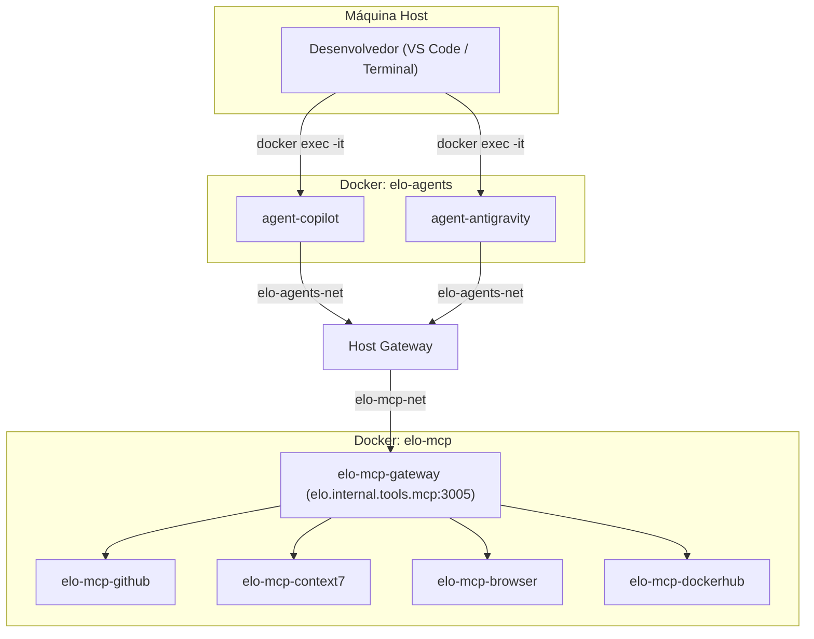

### Agentes de IA Conteinerizados

O workspace `tools/agents` provisiona as CLIs do GitHub Copilot e do Google Antigravity como serviços Docker de longa execução. Isso elimina as instalações manuais de CLI nas máquinas host dos desenvolvedores e garante a paridade de ambiente entre estações de trabalho locais e VMs na nuvem.

#### Visão Geral da Arquitetura

Os containers de agentes são executados dentro da mesma rede bridge `elo-mcp-net` que o gateway MCP, comunicando-se com ele por meio de roteamento de DNS interno. Nenhuma exposição de porta no nível do host é necessária para a comunicação entre serviços.



#### Estrutura de Diretórios

```
tools/agents/
├── .env.agents.example     # Modelo de variáveis de ambiente (rastreado)
├── .env.agents             # Segredos (ignorado pelo Git)
├── compose.yaml            # Orquestração para ambos os containers de agentes
├── mcp_config.json         # Configuração MCP unificada (injetada em ambos os containers)
├── skills/                 # Skills de agentes compartilhadas (injetadas em ambos os containers)
│   ├── code-expert/
│   └── doc-expert/
├── copilot/
│   ├── Dockerfile          # GitHub CLI + Copilot CLI + Docker CLI
│   ├── data/               # Ignorado pelo Git: estado da sessão do Copilot e tokens de autenticação
│   └── gh-config/          # Ignorado pelo Git: credenciais e extensões da CLI do GitHub
└── antigravity/
    ├── Dockerfile          # Antigravity CLI + Docker CLI
    ├── data/               # Ignorado pelo Git: conversas, estado do cérebro, buffers de log
    ├── settings.json       # Configurações da TUI controladas por versão (caminhos do container)
    ├── statusline.sh       # Script da barra de status da CLI
    └── title.sh            # Script do título da janela da CLI
```

#### Estratégia de Injeção de Configuração

Todas as configurações são injetadas via montagens bind do Docker na inicialização do container. Nenhum arquivo é embutido nas camadas de imagem, garantindo que as alterações de configuração tenham efeito sem a necessidade de reconstruir as imagens.

| Origem da Montagem            | Destino no Container                          | Objetivo                                          |
| :---------------------------- | :-------------------------------------------- | :------------------------------------------------ |
| `../../`                      | `/workspace`                                  | Diretório de trabalho completo do monorepo        |
| `./skills/`                   | `/workspace/.agents/skills`                   | Skills compartilhadas visíveis para ambas as CLIs |
| `./mcp_config.json`           | `/workspace/.agents/mcp_config.json`          | Configuração unificada de endpoint MCP            |
| `./antigravity/data/`         | `/root/.gemini/antigravity-cli/`              | Dados dinâmicos de tempo de execução persistentes |
| `./antigravity/settings.json` | `/root/.gemini/antigravity-cli/settings.json` | Configurações da TUI controladas por versão       |
| `./copilot/data/`             | `/root/.copilot/`                             | Estado de sessão persistente do Copilot           |
| `./copilot/gh-config/`        | `/root/.config/gh/`                           | Credenciais persistentes da CLI do GitHub         |
| `/var/run/docker.sock`        | `/var/run/docker.sock`                        | Orquestração Docker-out-of-Docker                 |
| `~/.ssh`                      | `/root/.ssh` (somente leitura)                | Chaves SSH do host para operações Git             |
| `~/.gitconfig`                | `/root/.gitconfig` (somente leitura)          | Identidade Git do host                            |

#### Conectividade de Rede MCP

Dentro dos containers de agentes, os serviços MCP são resolvidos por meio do gateway do host usando o alias personalizado `elo.internal.tools.mcp` mapeado para `host-gateway` na porta `3005`. Isso permite que a stack de agentes seja iniciada de forma totalmente independente da stack MCP.

```json
{
  "mcpServers": {
    "github": { "url": "http://elo.internal.tools.mcp:3005/github/sse" },
    "context7": { "url": "http://elo.internal.tools.mcp:3005/context7/sse" },
    "browser": { "url": "http://elo.internal.tools.mcp:3005/browser/sse" },
    "dockerhub": { "url": "http://elo.internal.tools.mcp:3005/dockerhub/sse" }
  }
}
```

:::info[Sequência de Inicialização Independente]
As stacks de agentes e MCP são desacopladas ao nível de rede. Qualquer uma das stacks pode ser iniciada ou parada de forma independente. Os agentes se conectarão automaticamente ao gateway MCP assim que a stack MCP estiver em execução.
:::

#### Comandos de Ciclo de Vida

| Comando                 | Ação                                                                                           |
| :---------------------- | :--------------------------------------------------------------------------------------------- |
| `pnpm agents:up`        | Compilar as imagens (se necessário) e iniciar ambos os containers de agentes em modo detached. |
| `pnpm agents:down`      | Parar e remover os containers de agentes.                                                      |
| `pnpm agents:reset`     | Remoção completa com exclusão de volumes, seguida de compilação limpa e reinicialização.       |
| `pnpm antigravity:auth` | Executar o fluxo de autenticação Google OAuth na janela de terminal activa.                    |
| `pnpm copilot:auth`     | Executar o fluxo de autenticação GitHub OAuth device na janela de terminal ativa.              |

#### Integração de Tarefas do VS Code

As CLIs de agentes são invocados por meio de tarefas `docker exec` registradas em `.vscode/tasks.json`. As tarefas são rotuladas com o prefixo `[Docker]` ou `[Host]` para distinguir a execução conteinerizada das instalações globais da máquina host.

| Rótulo da Tarefa           | Alvo de Execução                        |
| :------------------------- | :-------------------------------------- |
| `[Docker] Antigravity CLI` | `docker exec -it agent-antigravity agy` |
| `[Docker] Copilot CLI`     | `docker exec -it agent-copilot copilot` |
| `[Host] Antigravity CLI`   | Instalação global do `agy` no host      |
| `[Host] Copilot CLI`       | Instalação global do `copilot` no host  |

#### Autenticação e Persistência de Sessão

Ambas as CLIs usam autenticação OAuth device-flow. Para autenticar os agentes conteinerizados, execute os scripts de autenticação direta (`pnpm copilot:auth` ou `pnpm antigravity:auth`) no seu terminal ativo. A CLI exibe uma URL e um código de verificação. O desenvolvedor abre a URL no navegador do host, conclui o fluxo de autorização e os tokens resultantes são gravados no diretório home do container.

##### Armazenamento Persistente e Arquitetura Sem Reconstrução

Como os diretórios de credenciais são montados via bind mount para o host:

- `agent-copilot` monta `./copilot/data/` para `/root/.copilot/` e `./copilot/gh-config/` para `/root/.config/gh/`
- `agent-antigravity` monta `./antigravity/data/` para `/root/.gemini/antigravity-cli/`

Qualquer token de autenticação gerado durante a configuração inicial é gravado diretamente nesses diretórios do host em tempo real. Como resultado:

- **Nenhuma reconstrução de container é necessária:** Reconstruir ou reiniciar o container não apaga as credenciais, pois o container lê os tokens dinamicamente dos volumes montados no host.
- **Isolamento do Host:** Embora o container esteja autenticado, essas credenciais não vazam para as pastas globais do usuário no host (ex: `~/.gemini` ou `~/.config/gh`), garantindo uma separação limpa entre a stack de containers e as instalações globais de CLI do host.
- **Acesso Sincronizado Automático:** Assim que o usuário conclui o fluxo de autorização do dispositivo, as credenciais tornam-se imediatamente ativas e funcionais. Nenhuma cópia manual de arquivos ou reinicialização é necessária.

:::note
Os diretórios `data/` e `gh-config/` são ignorados pelo Git. Eles existem apenas na máquina local do desenvolvedor e nunca são commitados no repositório.
:::
