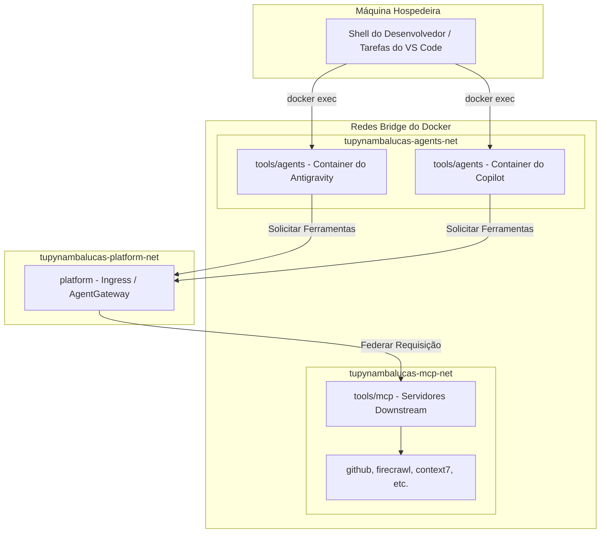

### Agentes de IA Containerizados

O workspace `tools/agents` provisiona as CLIs do GitHub Copilot e Google Antigravity como serviços Docker de longa duração. Isso elimina a instalação manual de CLIs nas máquinas hospedeiras dos desenvolvedores e garante a paridade de ambiente entre estações de trabalho locais e VMs na nuvem.

---

## Visão Geral da Arquitetura

Os containers de agentes rodam dentro de um namespace de rede isolado, comunicando-se com segurança com o **AgentGateway** unificado (rodando no workspace `/platform`) via roteamento de rede bridge. Nenhuma exposição de porta no nível do hospedeiro é necessária para a comunicação entre serviços.



---

## Estrutura de Diretórios

```text
tools/agents/
├── .env.agents.example     # Modelo de arquivo de variáveis de ambiente (rastreado)
├── .env.agents             # Segredos (ignorado pelo Git)
├── compose.yaml            # Orquestração para ambos os containers de agentes
├── mcp_config.json         # Configuração MCP unificada (injetada em ambos os containers)
├── skills/                 # Habilidades de agentes compartilhadas (injetadas em ambos)
│   ├── code-expert/
│   └── doc-expert/
├── copilot/
│   ├── Dockerfile          # CLI do GitHub + CLI do Copilot + CLI do Docker
│   ├── data/               # Ignorado pelo Git: estado da sessão do Copilot e tokens de autenticação
│   └── gh-config/          # Ignorado pelo Git: credenciais e extensões da CLI do GitHub
└── antigravity/
    ├── Dockerfile          # CLI do Antigravity + CLI do Docker
    ├── data/               # Ignorado pelo Git: conversas, cérebro, buffers de log
    ├── settings.json       # Configurações de TUI controladas por versão (caminhos do container)
    ├── statusline.sh       # Script de barra de status da CLI
    └── title.sh            # Script de título da janela da CLI
```

---

## Estratégia de Injeção de Configurações

Toda a configuração é injetada via montagens de volume (bind mounts) do Docker na inicialização do container. Nenhum arquivo é gravado permanentemente nas camadas da imagem, garantindo que as alterações de configuração tenham efeito sem a necessidade de reconstruir as imagens.

| Origem do Volume              | Destino no Container                          | Propósito                                              |
| :---------------------------- | :-------------------------------------------- | :----------------------------------------------------- |
| `../../`                      | `/workspace`                                  | Diretório de trabalho completo do monorepo             |
| `./skills/`                   | `/workspace/.agents/skills`                   | Habilidades compartilhadas visíveis para ambas as CLIs |
| `./mcp_config.json`           | `/workspace/.agents/mcp_config.json`          | Configuração unificada do endpoint do MCP              |
| `./antigravity/data/`         | `/root/.gemini/antigravity-cli/`              | Dados persistentes de execução do Antigravity          |
| `./antigravity/settings.json` | `/root/.gemini/antigravity-cli/settings.json` | Configurações da TUI controladas por versão            |
| `./copilot/data/`             | `/root/.copilot/`                             | Estado de sessão persistente do Copilot                |
| `./copilot/gh-config/`        | `/root/.config/gh/`                           | Credenciais persistentes da CLI do GitHub              |
| `/var/run/docker.sock`        | `/var/run/docker.sock`                        | Orquestração Docker-out-of-Docker                      |
| `~/.ssh`                      | `/root/.ssh` (somente leitura)                | Chaves SSH do hospedeiro para operações do Git         |
| `~/.gitconfig`                | `/root/.gitconfig` (somente leitura)          | Identidade Git da máquina hospedeira                   |

---

## Conectividade de Rede MCP

Dentro dos containers de agentes, os serviços MCP são resolvidos através do **AgentGateway** central baseado em Go (apelidado e roteado na rede virtual `tupynambalucas-platform-net`). Isso desacopla os containers de agentes das configurações de ferramentas individuais.

```json
{
  "mcpServers": {
    "github": { "url": "http://agentgateway:3005/github/sse" },
    "context7": { "url": "http://agentgateway:3005/context7/sse" },
    "browser": { "url": "http://agentgateway:3005/browser/sse" }
  }
}
```

:::info[Sequência de Inicialização Independente]
As stacks de agentes, plataforma e MCP são desacopladas. Qualquer uma das stacks pode ser iniciada ou parada de forma independente. Os agentes se conectarão automaticamente ao `AgentGateway` da plataforma assim que ele estiver ativo.
:::

---

## Comandos de Ciclo de Vida

Execute estes scripts a partir da raiz do repositório:

| Comando                 | Ação                                                                                               |
| :---------------------- | :------------------------------------------------------------------------------------------------- |
| `pnpm agents:up`        | Constrói imagens (se necessário) e inicia os containers de agentes em modo detached.               |
| `pnpm agents:down`      | Interrompe e remove os containers de agentes.                                                      |
| `pnpm agents:reset`     | Desativação completa com remoção de volumes, seguida por uma reconstrução limpa e reinicialização. |
| `pnpm antigravity:auth` | Executa o fluxo de autenticação do Google OAuth na janela do terminal ativo.                       |
| `pnpm copilot:auth`     | Executa o fluxo de autenticação do dispositivo GitHub OAuth na janela do terminal ativo.           |

---

## Integração de Tarefas do VS Code

As CLIs dos agentes são invocadas através de tarefas do tipo `docker exec` registradas em `.vscode/tasks.json`. As tarefas são rotuladas com o prefixo `[Docker]` ou `[Host]` para distinguir a execução em container de instalações globais no sistema hospedeiro.

| Rótulo da Tarefa           | Alvo de Execução                                     |
| :------------------------- | :--------------------------------------------------- |
| `[Docker] Antigravity CLI` | `docker exec -it agent-antigravity agy`              |
| `[Docker] Copilot CLI`     | `docker exec -it agent-copilot copilot`              |
| `[Host] Antigravity CLI`   | Instalação global do `agy` na máquina hospedeira     |
| `[Host] Copilot CLI`       | Instalação global do `copilot` na máquina hospedeira |

---

## Autenticação e Persistência de Sessão

Ambas as CLIs usam autenticação OAuth baseada em dispositivo (device-flow). Para autenticar os agentes containerizados, execute os scripts de autenticação direta (`pnpm copilot:auth` ou `pnpm antigravity:auth`) no terminal ativo. A CLI gerará uma URL e um código de verificação. O desenvolvedor abre a URL no navegador do hospedeiro, conclui o fluxo de autorização e os tokens resultantes são gravados no diretório home do container.

### Armazenamento Persistente & Arquitetura Sem Reconstrução

Como os diretórios de credenciais são montados como volumes (bind mounts) a partir do hospedeiro:

- O `agent-copilot` monta `./copilot/data/` em `/root/.copilot/` e `./copilot/gh-config/` em `/root/.config/gh/`
- O `agent-antigravity` monta `./antigravity/data/` em `/root/.gemini/antigravity-cli/`

Qualquer token de autenticação gerado durante a primeira configuração é gravado diretamente nesses diretórios do hospedeiro em tempo real. Como resultado:

- **Nenhuma reconstrução de container é necessária**: Reconstruir ou reiniciar o container não apaga as credenciais, pois o container lê os tokens dinamicamente dos volumes montados do hospedeiro.
- **Isolamento do Hospedeiro**: Embora o container esteja autenticado, essas credenciais não vazam para as pastas globais do usuário do hospedeiro (ex: `~/.gemini` ou `~/.config/gh`), garantindo uma separação limpa entre a stack de containers e as instalações locais.
- **Acesso Sincronizado Automatizado**: Assim que o usuário conclui o fluxo de autorização do dispositivo, as credenciais tornam-se imediatamente ativas e funcionais. Nenhuma cópia manual de arquivos ou reinicialização é necessária.

:::note
Os diretórios `data/` e `gh-config/` são ignorados pelo Git. Eles existem apenas na máquina local do desenvolvedor e nunca são enviados para o repositório.
:::
