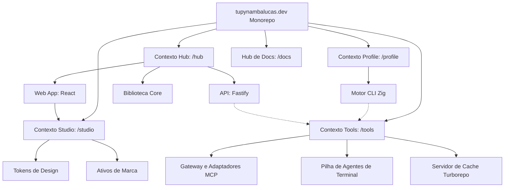

# Contextos Delimitados

Utilizamos **PNPM Workspaces** com um layout de **Context-Driven Root** para isolar estritamente nossos domínios de negócio. Esta arquitetura garante escalabilidade e uma separação clara de responsabilidades organizando a base de código em Contextos Delimitados distintos na raiz.

---

## Estrutura do Monorepo & Papéis dos Workspaces

O monorepo distingue entre diferentes contextos principais. O diagrama a seguir ilustra os contextos dos workspaces, as relações entre os pacotes e o fluxo de dependências:

| Diretório           | Nome do Pacote                  | Papel           | Responsabilidade                                                       |
| :------------------ | :------------------------------ | :-------------- | :--------------------------------------------------------------------- |
| `hub/services/web`  | `@tupynambalucas-hub/web`       | **Aplicação**   | Cliente React de portfólio pessoal, blog e painel administrativo.      |
| `hub/services/api`  | `@tupynambalucas-hub/api`       | **Aplicação**   | API REST Fastify servindo posts de blog e manipuladores de formulário. |
| `hub/packages/core` | `@tupynambalucas-hub/core`      | **Biblioteca**  | SSOT para o contexto Hub (validação Zod, esquemas compartilhados).     |
| `profile/`          | `@tupynambalucas/profile`       | **Aplicação**   | Aplicação CLI Zig compilando estatísticas do GitHub e gerando SVGs.    |
| `studio/assets`     | `@tupynambalucas-studio/assets` | **Biblioteca**  | Tokens de design, logotipos, SVGs e utilitários de sincronia S3.       |
| `tools/`            | `@tupynambalucas-tools/*`       | **Ferramenta**  | Gateway MCP, contêineres dockerizados de desenvolvedor e cache.        |
| `docs/`             | `@tupynambalucas/docs`          | **Hub de Docs** | Portal do desenvolvedor oficial em Docusaurus.                         |

---

## Filosofia de Contexto Delimitado (Bounded Context)

- **Isolamento de Contexto**: Cada diretório raiz (`hub/`, `profile/`, `studio/`, `tools/`, `docs/`) representa um contexto de workspace isolado. Tipos, contratos e configurações são encapsulados localmente, referenciando bibliotecas externas apenas através de fronteiras de pacotes.
- **Acoplamento Estrito**: A lógica de negócios do Developer Hub (`hub/`) é desacoplada do Compilador de Estatísticas de Perfil (`profile/`).

---

## Detalhamento Detalhado dos Contextos

### Contexto Hub (hub/)

Gerencia as páginas frontend do portfólio pessoal, operações do blog, persistência do formulário de contato e opções do administrador. Para documentação detalhada, consulte o **[Workspace Hub](/workspaces/hub)**.

- **`@tupynambalucas-hub/web`**: Cliente visual React 19.
- **`@tupynambalucas-hub/api`**: Backend de API REST Fastify 5.
- **`@tupynambalucas-hub/core`**: Contratos de dados e definições de verificação.

### Contexto Profile (profile/)

Um motor de estatísticas independente construído com Zig para compilar métricas de perfil. Para documentação detalhada, consulte o **[Workspace Profile](/workspaces/profile)**.

- **`@tupynambalucas/profile`**: Compilador Zig otimizado para performance gerando gráficos SVG.

### Contexto Studio (studio/)

A fonte única de verdade para a identidade visual, ícones e variáveis CSS compartilhadas. Para documentação detalhada, consulte o **[Workspace Studio](/workspaces/studio)**.

- **Design Tokens**: Variáveis de cor CSS padronizadas e constantes de tipografia.
- **Brand Assets**: Logotipos e ícones exportados como componentes React.

### Contexto Tools (tools/)

O workspace de automação de desenvolvedores. Para documentação detalhada, consulte o **[Workspace Tools](/workspaces/tools)**.

- **MCP Gateway**: Proxy de gateway Fastify servindo endpoints Model Context Protocol.
- **Agentes de IA**: Ambientes de shell de desenvolvimento conteinerizados.
- **Cache Remoto**: Sincronização de cache do Turborepo.

### Contexto Docs (docs/)

O hub de documentação do desenvolvedor. Para documentação detalhada, consulte o **[Workspace Docs](/workspaces/docs)**.
