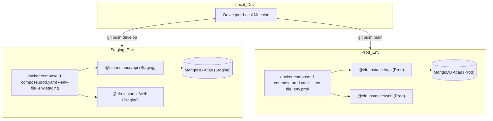

# Guia de Implantação

Para garantir alta disponibilidade, segurança e ambientes reproduzíveis, o **Elo Orgânico** utiliza um modelo de implantação moderno e auto-hospedado (self-hosted) projetado para máquinas virtuais na **Hetzner Cloud**. Este guia descreve nossa estratégia de implantação, sincronização de ambientes e procedimentos operacionais.

---

## 1. Topologia e Promoção de Ambientes

A arquitetura é construída com base no modelo **"Singleton Platform / Multi-Tenant Instance"**. Cada ambiente de implantação consiste em um limite de execução específico:

- **Staging (Homologação):** Espelho do ambiente de produção. Executa em um subdomínio dedicado conectado a um cluster de banco de dados de homologação no MongoDB Atlas. Usado para validar novos recursos e migrações de esquema.
- **Production (Produção):** O ambiente definitivo voltado para o cliente. Totalmente protegido e otimizado para alta performance.



---

## 2. Compilação em Tempo de Build & Empacotamento de Imagem

Nossas unidades de implantação frontend e backend são totalmente conteinerizadas usando Dockerfiles otimizados.

### 2.1. Injeção de Argumentos de Build no Frontend

O Vite injeta estaticamente variáveis de ambiente públicas (prefixadas com `VITE_`) nos pacotes JavaScript compilados durante a fase de build. Por este motivo, esses parâmetros devem ser fornecidos como argumentos de build do Docker (`ARG`) durante a geração da imagem:

```dockerfile
# Inside Frontend Dockerfile
ARG VITE_TURNSTILE_SITE_KEY
ENV VITE_TURNSTILE_SITE_KEY=$VITE_TURNSTILE_SITE_KEY
RUN pnpm build
```

:::warning[Segurança e Escopo]
Nunca injete chaves sensíveis (como segredos JWT, credenciais de banco de dados ou credenciais de e-mail) no frontend. Os ambientes frontend são totalmente públicos. Todos os segredos devem ser mantidos estritamente na camada da API (backend) e injetados apenas em tempo de execução.
:::

---

## 3. Sequências de Comandos de Implantação

As implantações são executadas diretamente na máquina servidora utilizando nossos scripts unificados de CLI na raiz.

Consulte a [Referência de Comandos](../commands-reference.mdx#instance-community) para a lista completa de comandos de implantação e passos sequenciais de lançamento.

---

## 4. Proxy Reverso e Terminação SSL

O Elo Orgânico utiliza uma configuração de proxy reverso (como **Nginx** ou **Traefik**) para lidar com terminação TLS, compressão e roteamento de requisições.

- **Certificados SSL:** Gerenciados dinamicamente via Let's Encrypt usando desafios ACME automatizados.
- **Mapeamento de Portas:** As portas públicas `80` (HTTP) e `443` (HTTPS) mapeiam para os containers web de borda, que internamente encaminham as requisições para a API Fastify ou servem os arquivos estáticos compilados do React.

:::info[Re-implantações Sem Tempo de Inatividade]
O Docker Compose atualiza automaticamente os containers com impacto mínimo de indisponibilidade ao executar `pnpm instance:prod` com containers já existentes. Para eliminar completamente quedas de requisições, configure um padrão de implantação rotativo utilizando um balanceador de carga a montante.
:::

---

## 5. Inicialização do Banco de Dados e Migrações de Esquema

Para evitar trabalho operacional manual durante os lançamentos, toda a preparação do banco de dados é tratada dinamicamente no nível da aplicação.

- **Configuração do Replica Set:** No desenvolvimento local e lançamentos iniciais em staging, o container auxiliar `db-init` garante que o replica set (`rs0`) seja estabelecido, habilitando suporte a transações ACID.
- **Semeamento de Dados (`SeedPlugin`):** O servidor Fastify possui um plugin de seeding integrado de forma nativa. Na inicialização do servidor, ele aciona um padrão de upsert idempotente, criando o usuário administrador padrão e as configurações estáticas básicas se não existirem, sem qualquer risco de duplicação de dados.

---

## 6. Logs e Manutenção

Para realizar manutenções ou diagnosticar problemas em tempo real, utilize as ferramentas padrão do Docker.

Consulte a [Referência de Comandos](../commands-reference.mdx#docker--infrastructure) para os comandos exatos de acompanhamento de logs em tempo real ou inspeção de containers específicos.

---

_Última Atualização: Junho de 2026_
