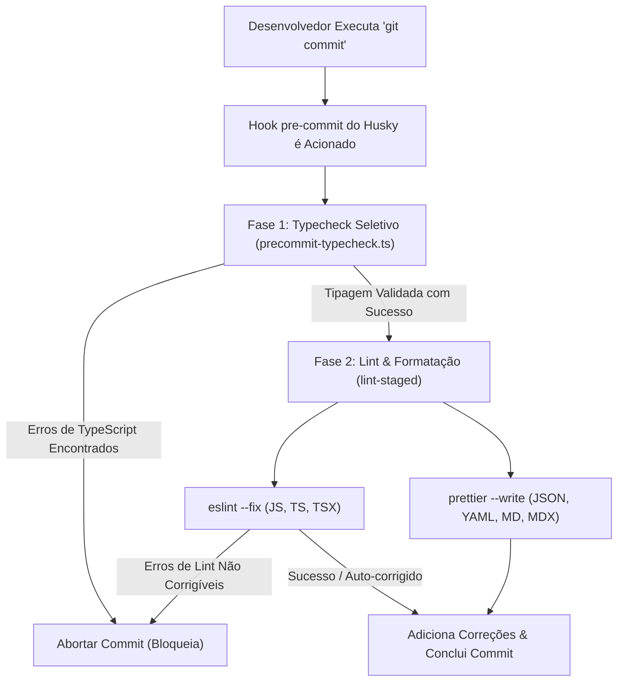

# Padrões do GitHub

Este documento descreve a estratégia profissional de ramificação e lançamento para o **Elo Orgânico**, combinando a disciplina estrutural do **Git Flow** com o poder de colaboração da **GitHub CLI (`gh`)**.

---

## Modelo de Ramificação (Branching)

Seguimos o modelo padrão Git Flow para garantir a estabilidade do nosso código de produção, adaptado para nossa estrutura de monorepo.

| Branch          | Propósito                                                          | Estabilidade      |
| :-------------- | :----------------------------------------------------------------- | :---------------- |
| **`main`**      | Lançamentos de produção. Cada commit é uma release tagueada.       | **Ultra Estável** |
| **`develop`**   | Desenvolvimento da próxima release. Branch de integração.          | **Estável**       |
| **`feature/*`** | Novas funcionalidades ou mudanças de UI. Ramifica de `develop`.    | Experimental      |
| **`bugfix/*`**  | Correções de bugs para o próximo ciclo de desenvolvimento.         | Experimental      |
| **`release/*`** | Preparação para uma nova release de produção.                      | Polimento Final   |
| **`hotfix/*`**  | Correções de bugs críticos para a versão de produção.              | Urgente           |
| **`support/*`** | Ramificações de suporte de longo prazo para versões major antigas. | Estável           |

### Configuração da CLI do Git Flow

Nosso repositório local está configurado com os seguintes prefixos e regras de tag:

```ini
Branch name for production releases: main
Branch name for "next release" development: develop
Feature branch prefix: feature/
Bugfix branch prefix: bugfix/
Release branch prefix: release/
Hotfix branch prefix: hotfix/
Support branch prefix: support/
Version tag prefix: v
```

---

## Requisitos de Ferramental

Para seguir este fluxo de trabalho de forma eficiente, recomendamos:

1.  **Git Flow CLI (Edição AVH)**: Geralmente incluído no Git for Windows ou disponível via pacote `gitflow`.
2.  **GitHub CLI (`gh`)**: Utilizada para Pull Requests, monitoramento de status e releases oficiais.

---

## Padrões de Commit (Conventional Commits)

Para manter um histórico limpo e automatizado, todos os commits devem seguir a especificação **[Conventional Commits](https://www.conventionalcommits.org/)**.

**Formato:** `<tipo>(<escopo>): <descrição>`

### Tipos

- **feat**: Uma nova funcionalidade (correlaciona-se com `MINOR` no SemVer).
- **fix**: Uma correção de bug (correlaciona-se com `PATCH` no SemVer).
- **docs**: Mudanças apenas na documentação.
- **style**: Mudanças que não afetam o significado do código (espaço em branco, formatação, etc).
- **refactor**: Uma alteração de código que não corrige um bug nem adiciona uma funcionalidade.
- **perf**: Uma alteração de código que melhora a performance.
- **test**: Adição de testes ausentes ou correção de testes existentes.
- **chore**: Mudanças no processo de build ou ferramentas/bibliotecas auxiliares.

### Escopos do Monorepo

Use o contexto ou nome do pacote como escopo:

- **`instance`**: Mudanças nos apps ou core da Instância da Comunidade.
- **`portal`**: Mudanças nos apps ou core do Portal Global.
- **`core`**: Mudanças na lógica de domínio compartilhada.
- **`studio`**: Tokens de design, ativos ou configuração do Penpot.
- **`tools`**: Servidores MCP, scripts ou infraestrutura.
- **`deps`**: Atualizações de dependências (gerenciadas via catalogs).

**Exemplo:** `feat(instance): add Pix payment reconciliation to checkout`

---

## Validação de Commits & Hooks de CI

Para manter a qualidade do código, a consistência de estilo e a segurança de tipos em todo o monorepo **Elo Orgânico**, utilizamos um fluxo automatizado que valida todas as alterações antes que elas sejam salvas localmente e antes de sofrerem merge na nuvem.

### Arquitetura de Validação Local (Pre-commit)

Ao executar o comando `git commit`, o Git intercepta a ação automaticamente e executa um pipeline de validação local. Se qualquer etapa deste pipeline falhar, o commit é impedido.

A validação local executa em duas fases sequenciais:



---

### Validação Seletiva de Tipos por Workspace

Rodar a checagem completa de tipos em todas as aplicações (`pnpm typecheck`) a cada commit pode ser lento. Para otimizar esse fluxo, desenvolvemos um script inteligente em [precommit-typecheck.ts](file:///D:/projects/elo-organico/tools/scripts/precommit-typecheck.ts).

#### Como Funciona

1. O script inspeciona os arquivos preparados na staging area usando o comando `git diff --cached --name-only`.
2. Identifica as extensões: se nenhum arquivo de código (JavaScript ou TypeScript) foi alterado, ele pula a checagem de tipos inteiramente.
3. Mapeia os arquivos modificados para seus respectivos pacotes do monorepo:
   - Alterações em `instance/` $\rightarrow$ typecheck de `@elo-instance/*`.
   - Alterações em `studio/` $\rightarrow$ typecheck de `@elo-studio/assets`.
   - Alterações em `tools/` $\rightarrow$ typecheck de `@elo-organico/tools`.
   - Alterações em `docs/` $\rightarrow$ typecheck de `@elo-organico/docs`.
   - Alterações em `portal/` $\rightarrow$ typecheck de `@elo-portal/*`.
4. Se arquivos de configuração global ou de raiz (como `package.json`, `eslint.config.ts`, `pnpm-workspace.yaml`) forem alterados, o script executa um typecheck completo (excluindo `portal` temporariamente).
5. Executa as validações filtradas em paralelo utilizando o Turborepo (ex: `npx turbo run typecheck --filter=@elo-instance/*`).

:::tip[Vantagem de Performance]
Se você alterar apenas arquivos do workspace `tools`, somente o projeto `tools` será checado (levando menos de 1,5 segundos). Se alterar apenas documentação (arquivos `.md` ou `.mdx`), a tipagem é ignorada por completo.
:::

---

### Linter e Formatação (lint-staged)

Após o typecheck passar com sucesso, o Husky chama o `lint-staged` para analisar e formatar apenas os arquivos preparados para o commit.

#### Configuração

As regras de filtros estão declaradas no arquivo [package.json](file:///D:/projects/elo-organico/package.json) raiz:

```json
  "lint-staged": {
    "**/*.{js,mjs,ts,tsx,mdx}": [
      "eslint --fix"
    ],
    "**/*.{json,yaml,md,css,html}": [
      "prettier --write"
    ]
  }
```

:::note[Integração do Prettier]
Para arquivos de código JavaScript e TypeScript, não rodamos o Prettier como ferramenta separada. Ele é executado de forma embutida como uma regra do ESLint (`eslint-plugin-prettier`). Assim, o comando `eslint --fix` formata o arquivo conforme o [shared/config/prettierrc.json](file:///D:/projects/elo-organico/shared/config/prettierrc.json) e valida as regras de código de uma só vez.
:::

---

### Validação Remota (GitHub Actions CI)

Como os ganchos locais de commit podem ser burlados (usando a flag `--no-verify`), mantemos um workflow de Integração Contínua (CI) na nuvem que valida todas as branches em Pull Requests e pushes diretos.

O workflow de validação está configurado em [.github/workflows/ci.yaml](file:///D:/projects/elo-organico/.github/workflows/ci.yaml):

- Instala as dependências utilizando o `pnpm install --frozen-lockfile`.
- Valida a tipagem completa do monorepo: `pnpm typecheck --filter=!@elo-portal/*`.
- Valida o linter e o estilo de formatação: `pnpm lint --filter=!@elo-portal/*`.

:::caution[Proteção de Branches]
Administradores do repositório devem ativar regras de Branch Protection no GitHub para as branches `main` e `develop`. Marque a opção **Require status checks to pass before merging** e adicione a verificação **Validate Types & Lint** para bloquear merges de PRs que falharem na build.
:::

---

## Fluxo de Contribuição

### 1. Iniciando uma Nova Funcionalidade

Sempre ramifique a partir de `develop`. Consulte a [Referência de Comandos](../commands-reference.mdx#git--version-control) para o comando `git flow` exato.

### 2. Colaborando e Propondo Mudanças

Em vez de realizar o merge localmente, usamos **Pull Requests** para revisão de código e validação de CI.

1.  **Envie sua branch** para o repositório remoto.
2.  **Crie um Pull Request** direcionado à `develop` (consulte a [Referência de Comandos](../commands-reference.mdx#git--version-control) para o comando `gh pr`).

### 3. Estratégia de Merge Sênior (Squash & Merge)

Para manter o histórico da `develop` limpo e significativo, usamos **Squash Merges**. Isso combina todos os commits de uma branch de funcionalidade em um único commit bem descrito na `develop`.

- **Ação**: Merge via interface do GitHub ou CLI usando o método `squash` (consulte a [Referência de Comandos](../commands-reference.mdx#git--version-control) para o comando CLI exato).

---

## Fluxo de Release & Versionamento (Changesets)

Utilizamos o **Changesets** combinado com o **GitHub Actions** para automatizar o nosso versionamento, compilação de changelogs e criação de Pull Requests de release. Os desenvolvedores não alteram manualmente as versões dos pacotes nos arquivos `package.json`.

### 1. Gerando um Changeset (Local)

Quando sua funcionalidade ou correção de bug estiver pronta e antes de abrir um Pull Request:

1. Execute a ferramenta interativa de changeset a partir da raiz do repositório (consulte a [Referência de Comandos](../commands-reference.mdx#git--version-control)).
2. Selecione o(s) pacote(s) que foram modificados utilizando a barra de espaço.
3. Escolha o nível de SemVer apropriado (Major para alterações que quebram compatibilidade, Minor para novas funcionalidades retrocompatíveis ou Patch para correções de bugs).
4. Forneça uma descrição técnica e clara da alteração (em inglês, em conformidade com nossos padrões de commit).
5. Um arquivo markdown temporário será criado no diretório `.changeset/` (por exemplo, `.changeset/warm-dogs-run.md`).
6. Comite esse arquivo markdown junto com seu código e envie-o com sua branch de funcionalidade.

:::tip[Mantenha os Changesets Pequenos]
Crie um changeset por alteração isolada. Se uma branch de funcionalidade contiver várias correções ou adições independentes, você pode executar `pnpm version:changeset` múltiplas vezes para gerar notas separadas para cada uma.
:::

### 2. Pipeline de Versionamento Automatizado (GitHub Actions)

Nosso workflow de CI/CD gerencia o bump de versão de forma automatizada quando o código é integrado:

1. **Pull Request & Integração**: Os desenvolvedores abrem um Pull Request direcionado à branch `develop`.
2. **Merge para `develop`**: Uma vez aprovado e mesclado na `develop`, o workflow de GitHub Actions **Manage Version Bumps and Releases** é acionado automaticamente.
3. **Geração do PR de Release**:
   - O pipeline analisa os arquivos `.changeset/*.md` presentes na branch.
   - Ele calcula as novas versões, consome (deleta) os arquivos markdown temporários de changeset, faz o bump dos respectivos arquivos `package.json` e atualiza os arquivos de changelog de cada pacote.
   - Ele comita essas mudanças automaticamente e abre (ou atualiza) um Pull Request no GitHub intitulado `chore(release): version packages` com destino à branch `develop`.

### 3. Finalizando a Release (Apenas Mantenedores)

Para publicar e consolidar a release:

1. Abra o Pull Request automatizado `chore(release): version packages` no GitHub.
2. Revise as alterações de versão e changelogs gerados.
3. Faça o merge do Pull Request na branch `develop`. Como os arquivos de changeset já foram consumidos e removidos, mesclar este PR consolida as novas versões de pacotes no repositório.

:::info[Sem Bumps de Versão Manuais]
Nunca edite o campo `"version"` no `package.json` de um pacote manualmente durante o desenvolvimento de uma branch. Sempre use `pnpm version:changeset` e permita que o pipeline do GitHub Actions gerencie os lançamentos.
:::

---

## Correções Críticas (Hotfixes)

Se um bug for encontrado em produção:

1.  Inicie e finalize uma branch de hotfix.
2.  Consulte a [Referência de Comandos](../commands-reference.mdx#git--version-control) para os comandos exatos do `git flow hotfix`.
3.  Sincronize tanto a `main` quanto a `develop`.

---

## Padrões de GitHub Actions & Workflows

Para manter nossos pipelines de CI/CD altamente mantíveis e eficientes, aplicamos as seguintes regras arquiteturais para todos os fluxos de trabalho do repositório:

- **Módulos de CI Reutilizáveis**: Os fluxos de trabalho sob `.github/workflows/` não devem duplicar a lógica de configuração do ambiente. Comportamentos compartilhados (como execução do node, instalações do PNPM e configurações de cache) são extraídos em **GitHub Composite Actions** independentes em `.github/actions/`.

---

## Práticas Proibidas

- **Sem commits diretos na `main` ou `develop`**: Sempre use branches de funcionalidade e PRs.
- **Sem Force Pushes**: A menos que seja em sua própria branch de funcionalidade isolada e necessário para um rebase.
- **Sem Dirty Merges**: Evite fazer merge da `main` de volta para `feature/*`. Sempre faça **rebase** sobre a `develop` se sua branch de funcionalidade ficar desatualizada.

---

## Modelos de Implementação

### Componente de CI Reutilizável: `.github/actions/setup-pnpm-env/action.yml` (SRP)

Em vez de duplicar configurações de dependências nos workflows do GitHub, extraia-os em uma ação composta:

```yaml
name: 'Setup PNPM Environment'
description: 'Installs Node, PNPM, and configures dependency caching'

inputs:
  node-version:
    description: 'Node.js version to use'
    required: false
    default: '22'

runs:
  using: 'composite'
  steps:
    - name: Checkout Repository
      uses: actions/checkout@v6
      with:
        fetch-depth: 0

    - name: Install pnpm
      uses: pnpm/action-setup@v6

    - name: Setup Node
      uses: actions/setup-node@v6
      with:
        node-version: ${{ inputs.node-version }}
        cache: 'pnpm'

    - name: Install Dependencies
      shell: bash
      run: pnpm install
```

### Contrato de Script Desacoplado: `sync_repo_secrets_variables.sh` (DIP)

Este script depende estritamente de parâmetros injetados pelo ambiente, abrindo mão totalmente dos caminhos físicos de disco na máquina executora:

```bash
#!/usr/bin/env bash

set -euo pipefail

log_info() {
  echo "[GH-CLI INFO] $(date '+%Y-%m-%d %H:%M:%S') - $1"
}

log_error() {
  echo "[GH-CLI ERROR] $(date '+%Y-%m-%d %H:%M:%S') - $1" >&2
}

# Verifica se as dependências foram injetadas via ambiente
if [[ -z "${SECRETS_DIR:-}" ]]; then
  log_error "A variável de ambiente obrigatória SECRETS_DIR não está definida."
  exit 1
fi

if [[ -z "${VARIABLES_FILE:-}" ]]; then
  log_error "A variável de ambiente obrigatória VARIABLES_FILE não está definida."
  exit 1
fi

log_info "Lendo variáveis de: $VARIABLES_FILE"
log_info "Escaneando diretório de segredos: $SECRETS_DIR"

if [[ ! -f "$VARIABLES_FILE" ]]; then
  log_error "Arquivo de variáveis não encontrado em: $VARIABLES_FILE"
  exit 1
fi

log_info "Sincronização concluída com sucesso."
```

### Orquestrador Desacoplado: `compose.yaml` (DIP & ISP)

O orquestrador mapeia arquivos físicos locais para os alvos abstratos exigidos pelo limite do container e injeta as variáveis do host carregadas automaticamente do `.env`:

```yaml
services:
  gh-secrets:
    build:
      context: ../../services/gh
      dockerfile: Dockerfile
    container_name: github-gh-secrets
    volumes:
      - ../../:/workspace
    env_file:
      - ../../services/gh/.env.gh
    environment:
      - GH_TOKEN=${GH_TOKEN}
    working_dir: /workspace
    command: ['/workspace/services/gh/src/sync_repo_secrets_variables.sh']
```

---

:::tip[Benefícios de Extensibilidade]
Sob este layout, adicionar um novo container de ferramentas (por exemplo, `sentry-uploader` ou `sonar-scanner`) é tão simples quanto colocar uma pasta sob `services/`, estabelecer seus requisitos de `.env` e registrá-lo em `/infrastructure/docker/compose.yaml`. As ações de core, fluxos de trabalho e diretórios de configuração existentes permanecem bloqueados e completamente seguros.
:::

---

_A adesão a este fluxo de trabalho garante um histórico limpo e uma distribuição de software de alta qualidade._
