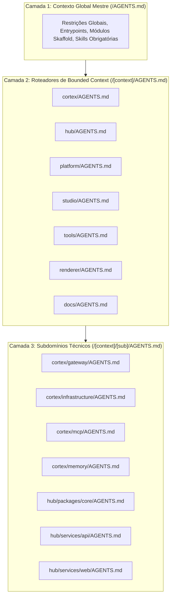

# Arquitetura de Contexto IA no Monorepo

O monorepo **tupynambalucas.dev** organiza instruções para modelos de linguagem através de um sistema estruturado e hierárquico de roteamento de contexto em arquivos `AGENTS.md`. Essa arquitetura garante que agentes de codificação operem com máxima precisão, sem fragmentação de contexto e com estrita observância às fronteiras de domínio.

---

## 1. O Paradoxo da Fragmentação de Contexto

Em monorepos complexos, fornecer contexto de máquina em todas as profundidades de diretório introduz falhas críticas:

- **Miopia de Contexto**: Um agente que lê apenas um arquivo isolado perde as regras globais e a visão da arquitetura.
- **Ineficiência de Tokens e Ruído**: Concatenar dezenas de arquivos esparsos esgota a janela de contexto antes do processamento das instruções reais da tarefa.
- **Entropia de Manutenção**: Manter regras de domínio e linguagem ubíqua sincronizadas em dezenas de arquivos é insustentável.

Para solucionar esses problemas, o monorepo adota a **Hierarquia de Contexto em 3 Camadas**.

---

## 2. A Hierarquia de Contexto em 3 Camadas



### Camada 1: Contexto Global Mestre (`/AGENTS.md`)

- **Escopo**: Regras globais, entrypoints, módulos Skaffold, padrões Prettier e declaração de skills obrigatórias.
- **Orçamento de Linhas**: Máximo de 80 linhas.

### Camada 2: Roteadores de Bounded Context (`/[context]/AGENTS.md`)

- **Escopo**: Identidade de domínio, glossário de Linguagem Ubíqua, topologia de arquitetura, tabela de portas e comandos locais.
- **Orçamento de Linhas**: Máximo de 120 linhas.

### Camada 3: Subdomínios Técnicos (`/[context]/[sub]/AGENTS.md`)

- **Escopo**: Padrões técnicos de implementação, trechos de código concretos (schemas Zod, plugins Fastify, seletores Zustand) e scripts de build.
- **Orçamento de Linhas**: Máximo de 100 linhas.

---

## 3. Diretiva de Hierarquia de Contexto

Para assegurar que agentes em subdiretórios nunca ignorem regras superiores, todo arquivo de Camada 2 e Camada 3 inicia com uma diretiva XML explícita:

```xml
<context-hierarchy>
  <parent src="../AGENTS.md" type="global-rules" />
  <system-instruction>
    AGENT: If you have not read "../AGENTS.md" in this session, stop now and read it using your
    file-reading tools before proceeding. Global constraints are mandatory.
  </system-instruction>
</context-hierarchy>
```

---

## 4. Alinhamento com Domain-Driven Design (DDD)

Cada arquivo de Camada 2 define um glossário de **Linguagem Ubíqua**, prevenindo o uso de termos conflitantes entre domínios:

- No **Developer Hub (`hub/`)**, o usuário autenticado é estritamente `Customer`.
- No **Studio (`studio/`)**, variáveis de design são estritamente `Design Tokens`.
- No **AI Cortex (`cortex/`)**, prompts de sistema são estritamente `Personas`.
