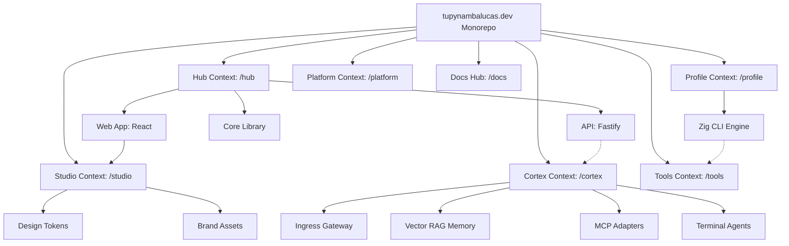

# Contextos Delimitados

Utilizamos **PNPM Workspaces** com um layout de **Raiz Orientada a Contextos** para isolar rigidamente nossos domínios de negócios. Esta arquitetura assegura escalabilidade e separação limpa de conceitos, organizando a base de código em Contextos Delimitados (Bounded Contexts) distintos no nível da raiz.

---

## Estrutura do Monorepo e Papéis das Workspaces

O monorepo faz distinções entre diferentes contextos principais. O diagrama a seguir ilustra as conexões de workspaces, relacionamentos de pacotes e fluxo de dependências:

| Diretório           | Nome do Pacote                  | Papel              | Responsabilidade                                                    |
| :------------------ | :------------------------------ | :----------------- | :------------------------------------------------------------------ |
| `hub/services/web`  | `@tupynambalucas-hub/web`       | **Aplicação**      | Cliente React do portfólio pessoal, blog e painel de administração. |
| `hub/services/api`  | `@tupynambalucas-hub/api`       | **Aplicação**      | Backend Fastify REST API servindo posts de blog e formulários.      |
| `hub/packages/core` | `@tupynambalucas-hub/core`      | **Biblioteca**     | SSOT para o contexto Hub (validação Zod, esquemas compartilhados).  |
| `cortex/`           | `@tupynambalucas/cortex`        | **Ferramental**    | Gateway unificado de IA, adaptadores MCP e executores de agentes.   |
| `profile/`          | `@tupynambalucas/profile`       | **Aplicação**      | Aplicação CLI em Zig compilando métricas do GitHub e gerando SVGs.  |
| `studio/assets`     | `@tupynambalucas-studio/design` | **Biblioteca**     | Tokens de design, logos, SVGs e utilitários de sincronização.       |
| `tools/`            | `@tupynambalucas-tools/*`       | **Ferramental**    | Controle de versão Git e automação do GitHub CLI isolados.          |
| `platform/`         | `@tupynambalucas/platform`      | **Infraestrutura** | Monitoramento de telemetria e servidores de cache Turborepo.        |
| `docs/`             | `@tupynambalucas/docs`          | **Docs Hub**       | Portal do desenvolvedor Docusaurus autoritativo.                    |

---

## Filosofia de Contextos Delimitados

- **Isolamento de Contexto**: Cada diretório raiz (`hub/`, `cortex/`, `profile/`, `studio/`, `tools/`, `platform/`, `docs/`) representa um contexto isolado. Tipos, contratos e configurações são encapsulados localmente, referenciando bibliotecas externas apenas por fronteiras de pacotes.
- **Desacoplamento Estrito**: As regras de negócio do Developer Hub (`hub/`) são completamente desacopladas do compilador de estatísticas do perfil (`profile/`) e do hub de IA (`cortex/`).

---

## Detalhamento de Contextos Específicos

### Contexto Hub (`hub/`)

Gerencia páginas web do portfólio, operações do blog, formulários de contato e opções do administrador. Para documentação detalhada, consulte o **[Workspace Hub](/workspaces/hub)**.

### Contexto Cortex (`cortex/`)

O Bounded Context consolidado de IA. Integra o gateway proxy de API, índices de memória vetorial persistente, adaptadores MCP downstream e terminais de execução de agentes conteinerizados. Para documentação detalhada, consulte o **[Workspace Cortex](/workspaces/cortex)**.

### Contexto Renderer (`renderer/`)

Um motor de compilação de documentos e geração de ativos dinâmicos construído em TypeScript para compilar templates markdown e renderizar gráficos SVG. Para documentação detalhada, consulte o **[Workspace Renderer](/workspaces/renderer)**.

### Contexto Studio (`studio/`)

Fronteira para a identidade visual da marca, ícones e variáveis CSS globais do monorepo. Para documentação detalhada, consulte o **[Workspace Studio](/workspaces/studio)**.

### Contexto Tools (`tools/`)

O workspace de automação de ferramentas de desenvolvimento, isolando utilitários como Git Flow e GitHub CLI. Para documentação detalhada, consulte o **[Workspace Tools](/workspaces/tools)**.

### Contexto Platform (`platform/`)

Orquestra pipelines do OpenTelemetry e servidores de cache Turborepo para acelerar o desenvolvimento local. Para documentação detalhada, consulte o **[Workspace Platform](/workspaces/platform)**.

### Contexto Docs (`docs/`)

O portal de documentação técnica do desenvolvedor. Para documentação detalhada, consulte o **[Workspace Docs](/workspaces/docs)**.
