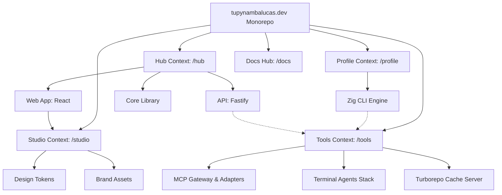

# Bounded Context

We use **PNPM Workspaces** with a **Context-Driven Root** layout to strictly isolate our business domains. This architecture ensures scalability and clear separation of concerns by organizing the codebase into distinct Bounded Contexts at the root.

---

## Monorepo Structure & Workspace Roles

The monorepo distinguishes between different core contexts. The following diagram illustrates the workspace contexts, package relationships, and dependency flow:

| Directory           | Package Name                    | Role            | Responsibility                                                   |
| :------------------ | :------------------------------ | :-------------- | :--------------------------------------------------------------- |
| `hub/services/web`  | `@tupynambalucas-hub/web`       | **Application** | Personal portfolio React client, blog, and admin dashboard.      |
| `hub/services/api`  | `@tupynambalucas-hub/api`       | **Application** | Fastify REST API serving blog posts and form handlers.           |
| `hub/packages/core` | `@tupynambalucas-hub/core`      | **Library**     | SSOT for the Hub context (Zod validation, shared schemas).       |
| `profile/`          | `@tupynambalucas/profile`       | **Application** | Zig CLI application compiling GitHub stats and generating SVGs.  |
| `studio/assets`     | `@tupynambalucas-studio/design` | **Library**     | Design tokens, logos, SVGs, and S3 sync utilities.               |
| `tools/`            | `@tupynambalucas-tools/*`       | **Tooling**     | MCP gateway, dockerized developer containers, and cache servers. |
| `docs/`             | `@tupynambalucas/docs`          | **Docs Hub**    | Authoritative Docusaurus developer portal.                       |

---

## Bounded Context Philosophy

- **Context Isolation**: Each root directory (`hub/`, `profile/`, `studio/`, `tools/`, `docs/`) represents an isolated workspace context. Types, contracts, and configurations are encapsulated locally, referencing external libraries only through package boundaries.
- **Strict Decoupling**: Business logic from the Developer Hub (`hub/`) is decoupled from the Profile Stats Compiler (`profile/`).

---

## Detailed Context Breakdown

### Hub Context (hub/)

Manages personal portfolio frontend pages, blog operations, contact form persistence, and administrator options. For detailed documentation, see the **[Hub Workspace](/workspaces/hub)**.

- **`@tupynambalucas-hub/web`**: React 19 visual client.
- **`@tupynambalucas-hub/api`**: Fastify 5 REST API backend.
- **`@tupynambalucas-hub/core`**: Data contracts and verification definitions.

### Contexto Renderer (renderer/)

Um motor extensível de compilação de documentos e geração de ativos dinâmicos construído em TypeScript para compilar templates markdown e renderizar gráficos SVG. Para documentação detalhada, consulte o **[Workspace Renderer](/workspaces/renderer)**.

- **`@tupynambalucas/renderer`**: Compilador de pipelines extensível em TypeScript para renderização de cartões visuais SVG separados por temas.

### Studio Context (studio/)

The single source of truth for visual identity, icons, and shared CSS variables. For detailed documentation, see the **[Studio Workspace](/workspaces/studio)**.

- **Design Tokens**: Standardized CSS color variables and typography constants.
- **Brand Assets**: Logotypes and icons exported as React components.

### Tools Context (tools/)

The developer automation workspace. For detailed documentation, see the **[Tools Workspace](/workspaces/tools)**.

- **MCP Gateway**: Fastify gateway proxy serving Model Context Protocol endpoints.
- **AI Agents**: Containerized development shell environments.
- **Remote Cache**: Turborepo cache synchronization.

### Docs Context (docs/)

The developer documentation hub. For detailed documentation, see the **[Docs Workspace](/workspaces/docs)**.
