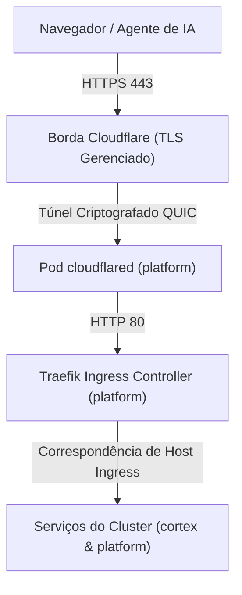

# Configuração de Cloudflare Tunnel & Access

Este guia detalha como configurar o **Cloudflare Tunnel** (`cloudflared`) e o **Cloudflare Zero Trust Access** para expor ambientes de desenvolvimento Kubernetes locais e remotos de forma segura sobre HTTPS confiável pelo navegador, sem modificar arquivos `/etc/hosts` ou abrir portas de roteador.

---

## Visão Geral da Arquitetura

O tráfego de entrada público é roteado através da rede global de borda da Cloudflare diretamente para o cluster por meio de um túnel criptografado QUIC:



---

## 1. Criando o Cloudflare Tunnel

1. Faça login no [Cloudflare Zero Trust Dashboard](https://one.dash.cloudflare.com/).
2. Navegue até **Networks** -\> **Tunnels** e clique em **Add a Tunnel**.
3. Selecione **Cloudflared** como tipo de conector e nomeie o túnel como `tupynambalucas-minikube`.
4. Selecione **Docker** como tipo de ambiente e copie o `TUNNEL_TOKEN` gerado (uma string codificada em base64).

---

## 2. Rotas de Hostnames Públicos

Na aba **Public Hostnames** da configuração do seu túnel, registre as seguintes rotas apontando para o Serviço interno do Traefik Ingress Controller (`http://traefik.platform.svc.cluster.local:80`):

| Subdomínio             | Domínio              | Tipo de Serviço | URL do Serviço                          | Caminho |
| :--------------------- | :------------------- | :-------------- | :-------------------------------------- | :------ |
| `agentgateway-dev`     | `tupynambalucas.dev` | `HTTP`          | `traefik.platform.svc.cluster.local:80` | `/`     |
| `agentgateway-mcp-dev` | `tupynambalucas.dev` | `HTTP`          | `traefik.platform.svc.cluster.local:80` | `/mcp`  |
| `grafana-dev`          | `tupynambalucas.dev` | `HTTP`          | `traefik.platform.svc.cluster.local:80` | `/`     |
| `headlamp-dev`         | `tupynambalucas.dev` | `HTTP`          | `traefik.platform.svc.cluster.local:80` | `/`     |
| `traefik-dev`          | `tupynambalucas.dev` | `HTTP`          | `traefik.platform.svc.cluster.local:80` | `/`     |
| `turbocache-dev`       | `tupynambalucas.dev` | `HTTP`          | `traefik.platform.svc.cluster.local:80` | `/`     |

:::tip[Alternativa com Hostname Wildcard Único]
Em vez de criar hostnames públicos individuais, você pode registrar um único hostname público wildcard `*.development` apontando para `http://traefik.platform.svc.cluster.local:80`.
:::

---

## 3. Configurando Segredos do Cluster & Implantação

1. Adicione o token do túnel ao arquivo de ambiente da plataforma (`platform/infrastructure/.env`):
   ```env
   CLOUDFLARE_TUNNEL_TOKEN=eyJ2Ijoi...
   ```
2. O deployment do `cloudflared` em `platform/infrastructure/kubernetes/cloudflared.yaml` lê este segredo e conecta automaticamente:
   ```bash
   pnpm k8s:up
   ```
3. Verifique se o pod do túnel está conectado:
   ```bash
   kubectl get pods -n platform -l app=cloudflared
   kubectl logs -n platform -l app=cloudflared --tail=20
   ```

---

## 4. Políticas do Cloudflare Zero Trust Access

Para proteger os endpoints de desenvolvimento contra acesso público não autorizado:

### Interfaces de Usuário Web (Grafana, Headlamp, Traefik, AgentGateway Admin)

1. No Cloudflare Zero Trust, navegue até **Access** -\> **Applications** -\> **Add an Application** -\> **Self-hosted**.
2. Atribua o domínio público (ex: `grafana.development.tupynambalucas.dev`).
3. Adicione uma política de **Allow** restringindo o acesso a endereços de e-mail de desenvolvedores autorizados via **One-Time PIN (OTP)**.

### Ingress de Agentes de IA & MCP (`agentgateway-mcp-dev.tupynambalucas.dev`)

:::warning[Prevenindo Redirecionamentos de Login em Clientes Automatizados]
Agentes de IA (como Antigravity, Cursor e ferramentas CLI) se comunicam via streams JSON-RPC / SSE e não conseguem processar redirecionamentos interativos de login web no navegador.
:::

1. Para `agentgateway-mcp-dev.tupynambalucas.dev`, configure uma Política de Acesso com **Action: Bypass** ou atribua um **Service Token** e defina o caminho da rota do túnel para `/mcp`.
2. Isso garante que clientes automatizados troquem payloads diretamente, enquanto a segurança interna é mantida pelas guardrails CEL do AgentGateway e tokens de API.
