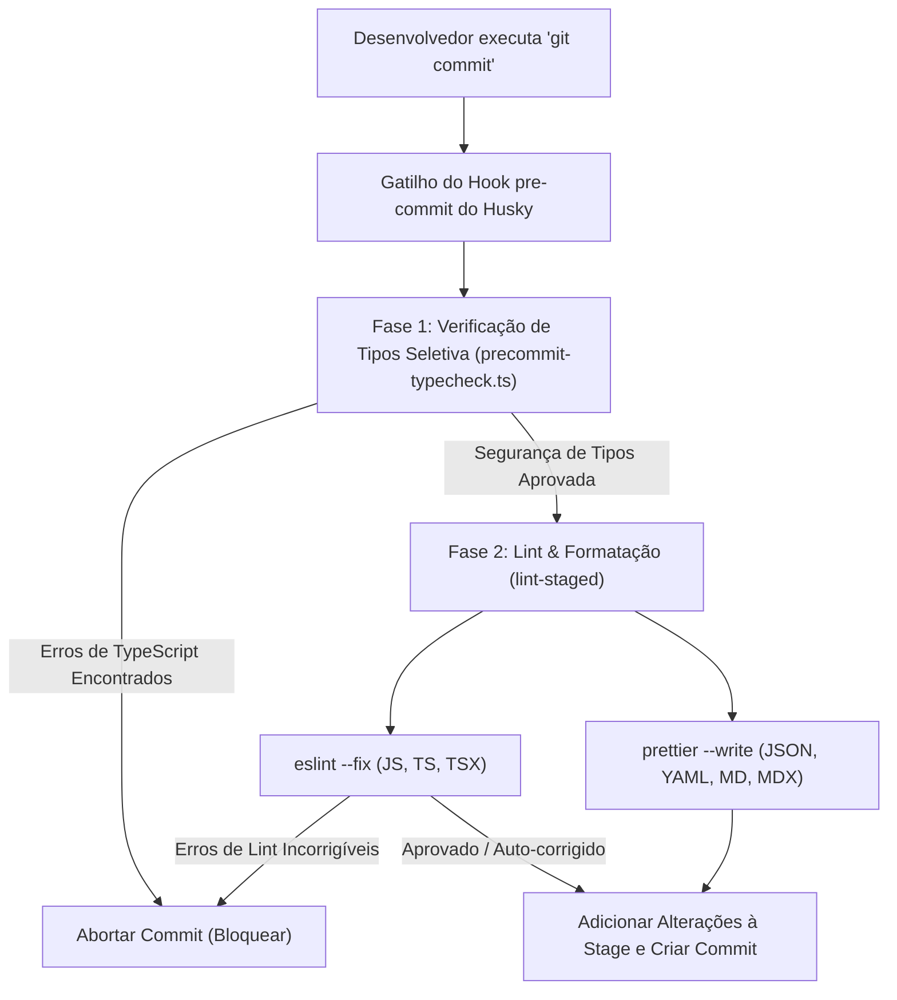

# Convenções de Commit & CI

Para manter um histórico limpo e automatizado, todos os commits devem seguir a especificação dos **[Commits Convencionais (Conventional Commits)](https://www.conventionalcommits.org/)**.

**Formato:** `<tipo>(<escopo>): <descrição>`

### Tipos

- **feat**: Uma nova funcionalidade (correlaciona-se com `MINOR` no SemVer).
- **fix**: Uma correção de bug (correlaciona-se com `PATCH` no SemVer).
- **docs**: Alterações apenas na documentação.
- **style**: Alterações que não afetam o significado do código (espaço em branco, formatação, etc.).
- **refactor**: Uma alteração de código que não corrige um bug nem adiciona uma funcionalidade.
- **perf**: Uma alteração de código que melhora o desempenho.
- **test**: Adição de testes ausentes ou correção de testes existentes.
- **chore**: Alterações no processo de compilação (build) ou ferramentas/bibliotecas auxiliares.

### Escopos do Monorepo

Use o contexto ou o nome do pacote como o escopo:

- **`hub`**: Alterações nos aplicativos, API ou núcleo (core) do Developer Hub.
- **`cortex`**: Alterações no gateway de entrada da IA (AI ingress gateway), camada de memória, adaptadores MCP ou agentes.
- **`studio`**: Tokens de design, assets ou configuração do Penpot.
- **`tools`**: Automação de CLI do Git e GitHub.
- **`deps`**: Atualizações de dependência (gerenciadas via catálogos).

**Exemplo:** `feat(hub): add Pix payment reconciliation to checkout`

---

## Validação de Commit & Hooks de CI

Para manter a qualidade do código, a consistência de estilo e a segurança de tipos no monorepo **tupynambalucas.dev**, usamos um pipeline automatizado que verifica todas as alterações antes que elas sejam commitadas localmente e antes de serem mescladas na nuvem.

### Arquitetura de Validação Local (Pre-commit)

Quando você executa um comando `git commit`, o Git intercepta automaticamente a ação e executa um pipeline de validação local. Se qualquer etapa desse pipeline falhar, o commit é bloqueado.

A validação local é executada em duas fases sequenciais:



---

### Verificação de Tipos Seletiva de Workspace

Executar uma verificação de tipos completa em todos os pacotes do monorepo (`pnpm typecheck`) pode levar vários segundos. Para manter o processo de commit rápido, usamos um script personalizado localizado em [precommit-typecheck.ts](file:///D:/projects/tupynambalucas/tools/scripts/precommit-typecheck.ts).

#### Como Funciona

1. O script inspeciona os arquivos atualmente preparados na stage usando `git diff --cached --name-only`.
2. Ele detecta as extensões dos arquivos: se nenhum arquivo JavaScript ou TypeScript foi alterado, ele ignora a verificação de tipos completamente.
3. Ele mapeia os arquivos alterados para seus respectivos workspaces do monorepo:
   - Arquivos em `hub/` $\rightarrow$ verificação de tipos dos pacotes `@tupynambalucas-hub/*`.
   - Arquivos em `cortex/` $\rightarrow$ verificação de tipos de `@tupynambalucas/cortex`.
   - Arquivos em `studio/` $\rightarrow$ verificação de tipos de `@tupynambalucas-studio/design`.
   - Arquivos em `tools/` $\rightarrow$ verificação de tipos de `@tupynambalucas-tools/*`.
   - Arquivos em `docs/` $\rightarrow$ verificação de tipos de `@tupynambalucas/docs`.
4. Se arquivos de configuração global ou da raiz (ex.: `package.json`, `eslint.config.ts`, `pnpm-workspace.yaml`) forem modificados, o script executa uma verificação de tipos completa.
5. Ele executa a verificação de tipos direcionada em paralelo usando filtros do Turborepo (ex.: `npx turbo run typecheck --filter=@tupynambalucas-hub/*`).

:::tip[Vantagem de Desempenho]
Se você modificar apenas arquivos no workspace `cortex`, apenas o projeto cortex será verificado, o que leva menos de 1,5 segundos. Se você modificar apenas a documentação (arquivos `.md` ou `.mdx`), a verificação de tipos é totalmente ignorada.
:::

---

### Linting e Formatação (lint-staged)

Assim que a verificação de tipos é aprovada, o Husky aciona o `lint-staged`, que executa linters e formatadores apenas nos arquivos preparados na stage.

#### Configuração

As regras são declaradas no [package.json](file:///D:/projects/tupynambalucas/package.json) da raiz:

```json
  "lint-staged": {
    "**/*.{js,mjs,ts,tsx,mdx}": [
      "eslint --fix"
    ],
    "**/*.{json,yaml,md,css,html}": [
      "prettier --write"
    ]
  }
```

:::note[Integração do Prettier]
Para arquivos JavaScript, TypeScript e TSX, não executamos a CLI do Prettier de forma independente. Em vez disso, o Prettier é executado como uma regra do ESLint via `eslint-plugin-prettier`. Executar `eslint --fix` formata o código de acordo com o [shared/config/prettierrc.json](file:///D:/projects/tupynambalucas/shared/config/prettierrc.json) e verifica problemas de qualidade do código em uma única execução.
:::

---

### Validação Remota (GitHub Actions CI)

Os hooks locais do Git podem ser ignorados (ex.: usando `git commit --no-verify`). Para evitar que código não validado chegue às branches estáveis, executamos um fluxo de trabalho de Integração Contínua (CI) no GitHub a cada push e Pull Request.

A configuração do fluxo de trabalho é definida em [.github/workflows/ci.yaml](file:///D:/projects/tupynambalucas/.github/workflows/ci.yaml):

- Instala dependências usando `pnpm install --frozen-lockfile`.
- Executa a suíte completa de verificação de tipos: `pnpm typecheck --filter=!@tupynambalucas-hub/*`.
- Valida o estilo e a qualidade do código: `pnpm lint --filter=!@tupynambalucas-hub/*`.

:::caution[Proteção de Branch]
Os administradores do repositório devem configurar regras de proteção de branch no GitHub para as branches `main` e `develop`. Ative a opção **Require status checks to pass before merging** (Exigir que as verificações de status passem antes de mesclar) e selecione **Validate Types & Lint** para evitar a mesclagem de PRs com compilações que falharam.
:::

---

Para manter nossos pipelines de CI/CD altamente fáceis de manter e eficientes, impomos as seguintes regras arquiteturais para todos os fluxos de trabalho do repositório:

- **Módulos de CI Reutilizáveis**: Os fluxos de trabalho sob `.github/workflows/` não devem duplicar a lógica de configuração do ambiente. Os comportamentos compartilhados (como execução do node, instalações do PNPM e configurações de cache) são extraídos em **GitHub Composite Actions** independentes em `.github/actions/`.

---

### Componente de CI Reutilizável: `.github/actions/setup-pnpm-env/action.yml` (SRP)

Instala Node, PNPM e configura o cache de dependências de forma reutilizável:

```yaml
name: 'Setup PNPM Environment'
description: 'Installs Node, PNPM, and configures dependency caching'

inputs:
  node-version:
    description: 'Node.js version to use'
    required: false
    default: '22'

runs:
  using: 'composite'
  steps:
    - name: Checkout Repository
      uses: actions/checkout@v6
      with:
        fetch-depth: 0

    - name: Install pnpm
      uses: pnpm/action-setup@v6

    - name: Setup Node
      uses: actions/setup-node@v6
      with:
        node-version: ${{ inputs.node-version }}
        cache: 'pnpm'

    - name: Install Dependencies
      shell: bash
      run: pnpm install
```

### Contrato de Script Desacoplado: `sync_repo_secrets_variables.sh` (DIP)

Este script depende estritamente de parâmetros injetados no ambiente, abstraindo completamente caminhos de disco físicos na máquina de execução:

```bash
#!/usr/bin/env bash

set -euo pipefail

log_info() {
  echo "[GH-CLI INFO] $(date '+%Y-%m-%d %H:%M:%S') - $1"
}

log_error() {
  echo "[GH-CLI ERROR] $(date '+%Y-%m-%d %H:%M:%S') - $1" >&2
}

# Verify dependencies are injected via the environment
if [[ -z "${SECRETS_DIR:-}" ]]; then
  log_error "Required environment variable SECRETS_DIR is undefined."
  exit 1
fi

if [[ -z "${VARIABLES_FILE:-}" ]]; then
  log_error "Required environment variable VARIABLES_FILE is undefined."
  exit 1
fi

log_info "Reading variables from: $VARIABLES_FILE"
log_info "Scanning secrets directory: $SECRETS_DIR"

if [[ ! -f "$VARIABLES_FILE" ]]; then
  log_error "Variables file not found at: $VARIABLES_FILE"
  exit 1
fi

log_info "Synchronization completed successfully."
```

### Orquestrador Desacoplado: `compose.yaml` (DIP & ISP)

O orquestrador mapeia arquivos concretos para os alvos abstratos exigidos pelo limite do container e injeta variáveis de nível de host carregadas automaticamente a partir de `.env`:

```yaml
services:
  gh-secrets:
    build:
      context: ../../services/gh
      dockerfile: Dockerfile
    container_name: github-gh-secrets
    volumes:
      - ../../:/workspace
    env_file:
      - ../../services/gh/.env.gh
    environment:
      - GH_TOKEN=${GH_TOKEN}
    working_dir: /workspace
    command: ['/workspace/services/gh/src/sync_repo_secrets_variables.sh']
```

---

:::tip[Benefícios de Extensibilidade]
Sob este layout, adicionar um novo container de ferramentas (ex.: `sentry-uploader` ou `sonar-scanner`) é tão simples quanto soltar um diretório sob `services/`, estabelecer seus requisitos de `.env` e registrá-lo em `/infrastructure/docker/compose.yaml`. As ações principais, fluxos de trabalho e diretórios de configuração existentes permanecem bloqueados e completamente seguros.
:::

---

_A adesão a este fluxo de trabalho garante um histórico limpo e uma distribuição de software de alta qualidade._
